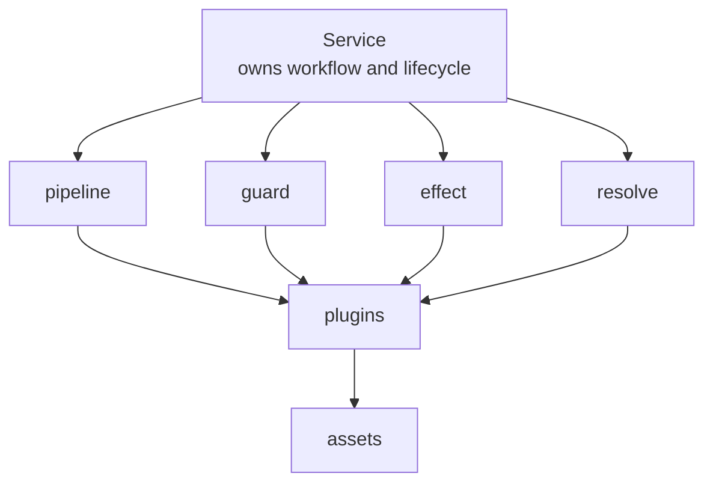

# Authorization and Plugin Integration

This page describes the current implementation rather than an abstract draft.

## Authorization Flow

The authorization path spans:

- UI management for grouped permissions
- API routes for reading and updating auth-related state
- runtime policy evaluation inside chat channel handling
- storage-backed config and observed user/chat metadata

At a high level:

```text
incoming platform message
  -> channel adapter
    -> observe auth metadata
    -> load auth config
    -> evaluate allow/block
    -> enqueue normalized message if allowed
```

## How auth attaches now

- `chat.observePrincipal`
  auth records observed user/chat metadata here
- `chat.authorizeIncoming`
  auth decides whether the message may enter the main flow
- `chat.resolveUserRole`
  auth returns the current user role here

So authorization is part of the chat workflow, while the concrete policy logic is supplied by the auth plugin.

## How voice attaches now

- `chat.augmentInbound`
  voice performs transcription directly here and merges transcript content back into inbound message sections

So voice now behaves as a message-content middleware plugin rather than a separate voice-provider point.

## The Real Plugin Boundary

- services define workflow and point names
- the runtime defines the four execution semantics
- plugins implement those points
- assets provide the dependency layer

## Current Model



## Why capability is no longer the core abstraction

- it hides the real lifecycle points owned by services
- it makes plugins look like the owners of invocation semantics
- it mixes workflow extension with generic explicit ability calls
- it is less precise than the current four semantics

The current four semantics are clearer:

- `pipeline` for transformation
- `guard` for blocking
- `effect` for side effects
- `resolve` for single-owner value resolution
