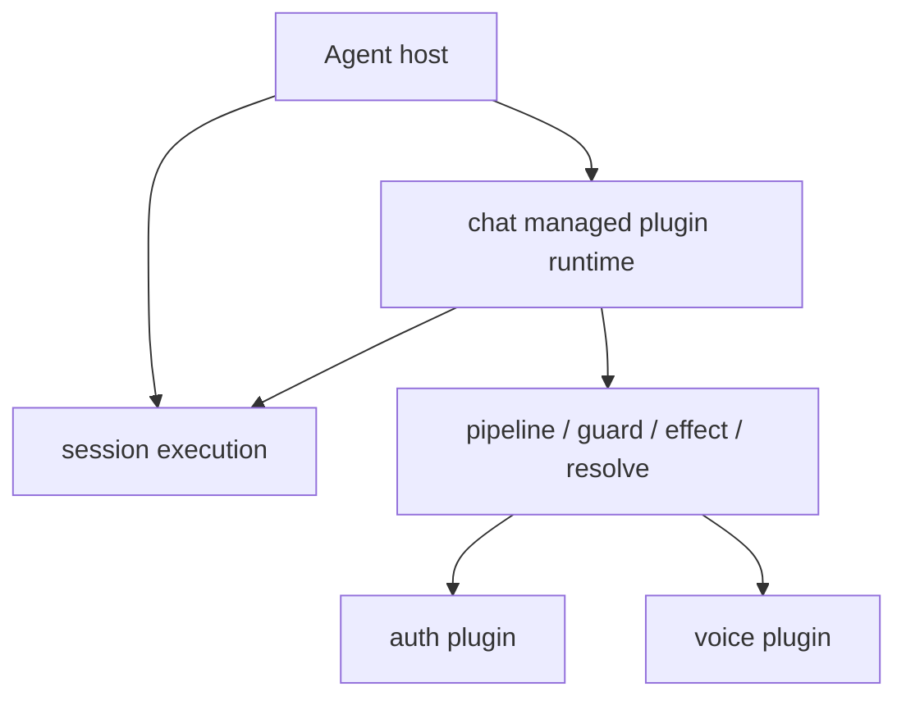

# Authorization and Plugin Integration

This page describes the current implementation rather than an old draft model.

## Authorization flow

The authorization path spans:

- UI-side permission management
- API routes for auth state
- runtime policy checks in chat ingress
- storage-backed observed principal metadata

At a high level:

```text
incoming platform message
  -> chat ingress
    -> observe principal metadata
    -> load auth config
    -> evaluate allow / block
    -> enqueue normalized message if allowed
```

## How auth attaches now

- `chat.observePrincipal`
- `chat.authorizeIncoming`
- `chat.resolveUserRole`

That means authorization is part of chat runtime behavior, while the concrete policy logic is supplied by the auth plugin.

## How voice attaches now

- `chat.augmentInbound`

Voice now behaves as inbound message augmentation, not as a separate top-level workflow owner.

## The real plugin boundary

- session still owns execution
- managed plugins may own runtime modules
- hooks express augmentation
- explicit plugin actions expose callable capability

## Current mental model



## Why this matters

The old split-layer language hides the real execution axis.

The current model is clearer:

- session executes
- chat owns one managed runtime path
- plugins augment or expose capability
