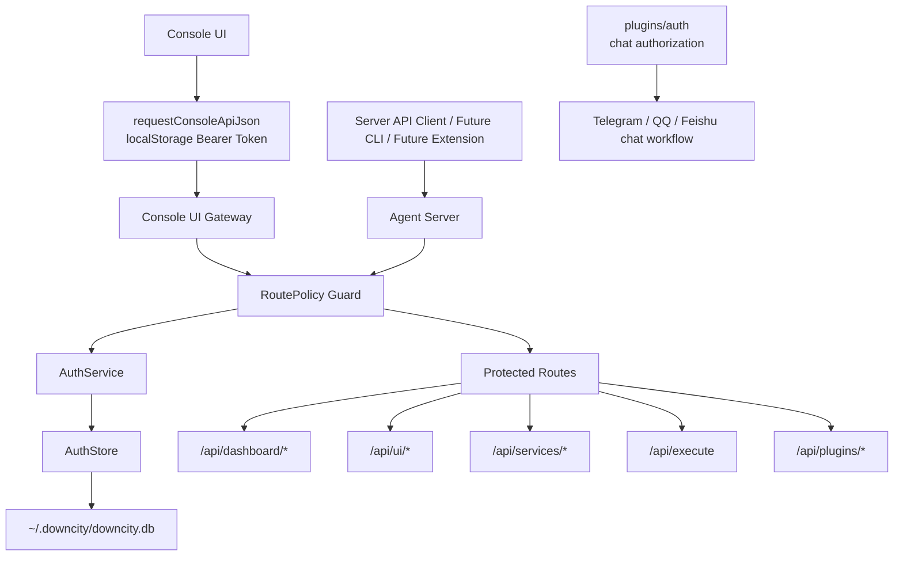
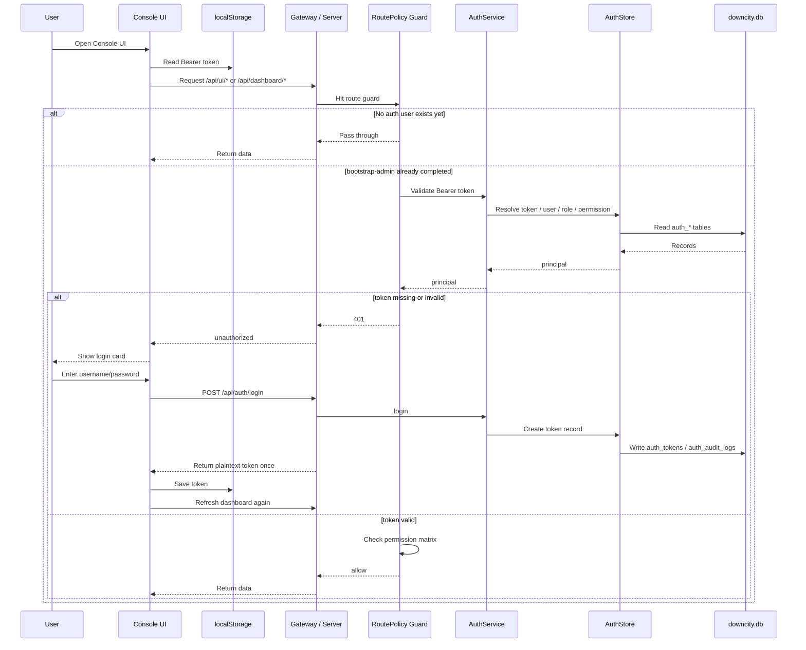

# Unified Auth Current State

This page describes the codebase as it exists now, not the target design.

## End-to-End View

### Layer Diagram

### Current Runtime Sequence

## What is already implemented

- Console SQLite now includes `auth_users`, `auth_roles`, `auth_permissions`, `auth_user_roles`, `auth_role_permissions`, `auth_tokens`, and `auth_audit_logs`
- `packages/downcity/src/main/auth/` now exists with `AuthStore`, `AuthService`, `AuthRoutes`, `AuthMiddleware`, `RoutePolicy`, and `TokenService`
- These auth endpoints are live:
  - `POST /api/auth/bootstrap-admin`
  - `POST /api/auth/login`
  - `GET /api/auth/me`
  - `GET /api/auth/token/list`
  - `POST /api/auth/token/create`
  - `POST /api/auth/token/revoke`
- The main server and console-ui gateway both apply a unified auth guard
- Console UI now has a login state and Bearer token injection

## Current behavior

The system does not yet enforce auth in a fully absolute way.

Current rule set:

1. If there is no unified auth user yet, protected routes still pass through
2. Once `bootstrap-admin` has been completed, protected routes require a Bearer token
3. If a route is in the permission matrix, the request must also satisfy the required permission

That bootstrap-before-lock behavior is an intentional transition layer so first deployment does not deadlock the control plane.

## Routes already inside the permission matrix

- `/api/execute` -> `agent.execute`
- `/api/services/list` -> `service.read`
- `/api/services/control` -> `service.write`
- `/api/services/command` -> `service.write`
- `/api/plugins/list` -> `plugin.read`
- `/api/plugins/availability` -> `plugin.read`
- `/api/plugins/action` -> `plugin.write`
- `/api/dashboard/authorization` -> `auth.read`
- `/api/dashboard/authorization/config` -> `auth.write`
- `/api/dashboard/authorization/action` -> `auth.write`

In addition:

- `/api/dashboard/*`
- `/api/ui/*`

are already behind login, but many of those routes are still protected at a coarse level rather than a fully split read/write matrix.

## Console UI state

Console UI can now:

- read a Bearer token from local storage
- inject `Authorization: Bearer ...`
- switch to a login card on `401`
- persist the token after login and continue refreshing the dashboard
- show the current user in the header and allow logout

So the control plane is no longer assuming anonymous trust.

## What is still missing

The main remaining gaps are:

- `/api/ui/*` permission granularity is still incomplete
- `/api/dashboard/*` permission granularity is still incomplete
- CLI is not fully migrated to unified auth login/token flows
- Chrome Extension is not yet connected to unified auth
- user / role / permission / audit management surfaces are still missing

## One boundary that must stay clear

There are currently two auth systems in the repo:

1. `packages/downcity/src/main/auth/`
   - unified account auth
   - for console / server / ui / api clients
2. `packages/downcity/src/plugins/auth/`
   - chat authorization
   - for Telegram / QQ / Feishu users entering the chat workflow

They coexist. They are not the same system yet.

## Recommended next order

1. Split `/api/ui/*` into a real read/write permission matrix
2. Split `/api/dashboard/*` into session/task/model/env/shell level permissions
3. Add unified login and token storage to CLI
4. Add token support to Chrome Extension
5. Only then decide whether unified auth and chat authorization should converge into a higher-level access model
