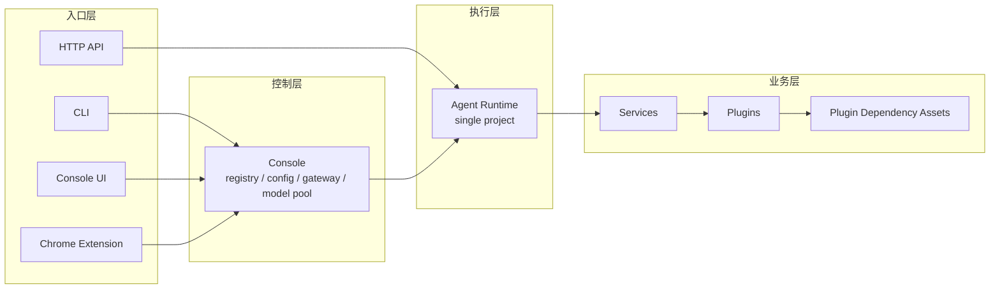
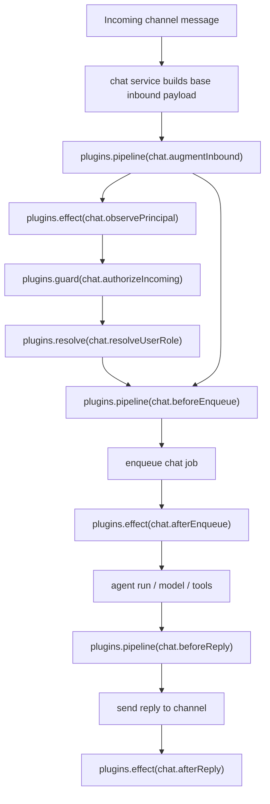

# 系统架构逻辑

这一页回答的是“系统怎么运转”，而不是“目录里有哪些文件”。

## 总体分层

Downcity 可以先粗分成四层：

1. 入口层：CLI、Console UI、Chrome Extension、HTTP API
2. 控制层：console
3. 执行层：agent runtime
4. 业务层：services / plugins / plugin dependency assets

## 为什么要分 console 和 agent

### Console

Console 是全局控制面，负责：

- 管理多个 agent 项目
- 维护 registry
- 管理全局模型池、共享 env、配置状态
- 给 Console UI 和扩展提供统一入口

### Agent

Agent 是单项目执行面，负责：

- 加载当前项目配置
- 提供当前项目的 HTTP runtime
- 驱动上下文、对话、任务、日志与服务

## 业务层为什么再分 service / plugin / asset

这不是为了抽象而抽象，而是为了回答三个不同问题。

### Service

“谁拥有主业务流程，并且会主动参与 agent 运行周期？”

典型特征：

1. 有生命周期
2. 与当前 agent 状态强相关
3. 会主动进入 agent 执行周期
4. 承接一整段业务流程

例子：

- `chat`
- `task`
- `memory`
- `shell`

### Plugin

“谁以扩展方式接入主流程？”

典型特征：

1. 没有独立生命周期
2. 不主动参与 agent 周期
3. 不维护自己的 runtime 状态机
4. 通过 service 预先定义好的点接入

在当前实现里，plugin 点统一收敛为四种语义：

- `pipeline`：串行改写值
- `guard`：串行校验，抛错即中断
- `effect`：只做副作用，不返回值
- `resolve`：单点单实现，返回确定结果

所以当前系统不再以 `capability` 作为插件系统中心，而是：

- service 定义点名
- runtime 统一定义执行语义
- plugin 负责实现

### Asset

“底层依赖的资源如何安装、检查、使用？”

例如：

- 模型
- CLI 工具
- 第三方依赖

也就是说，asset 最好理解成 plugin dependency，而不是和 service / plugin 并列的第三个 workflow owner。

## 当前真实落地的 chat plugin 点

当前 `chat` service 已经定义并实际使用以下 plugin 点：

- `chat.augmentInbound`：`pipeline`
- `chat.observePrincipal`：`effect`
- `chat.authorizeIncoming`：`guard`
- `chat.resolveUserRole`：`resolve`
- `chat.beforeEnqueue`：`pipeline`
- `chat.afterEnqueue`：`effect`
- `chat.beforeReply`：`pipeline`
- `chat.afterReply`：`effect`

## chat 真实流程图

## 当前代码中的核心对象

- `HookRegistry`：注册并执行四种 plugin 点
- `PluginRegistry`：注册 plugin、运行 action、检查 availability
- `PluginPoints.ts`：由具体 service 定义稳定点名
- `PluginRuntime`：由 service 在业务流程里调用 plugin 点

这四层组合起来，才是现在真实的 plugin 架构。
