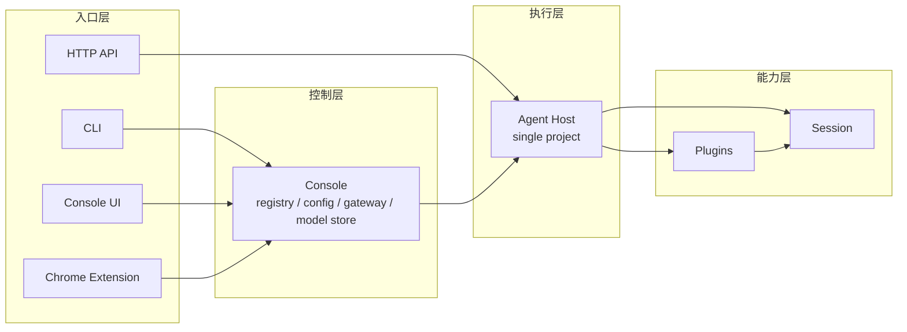
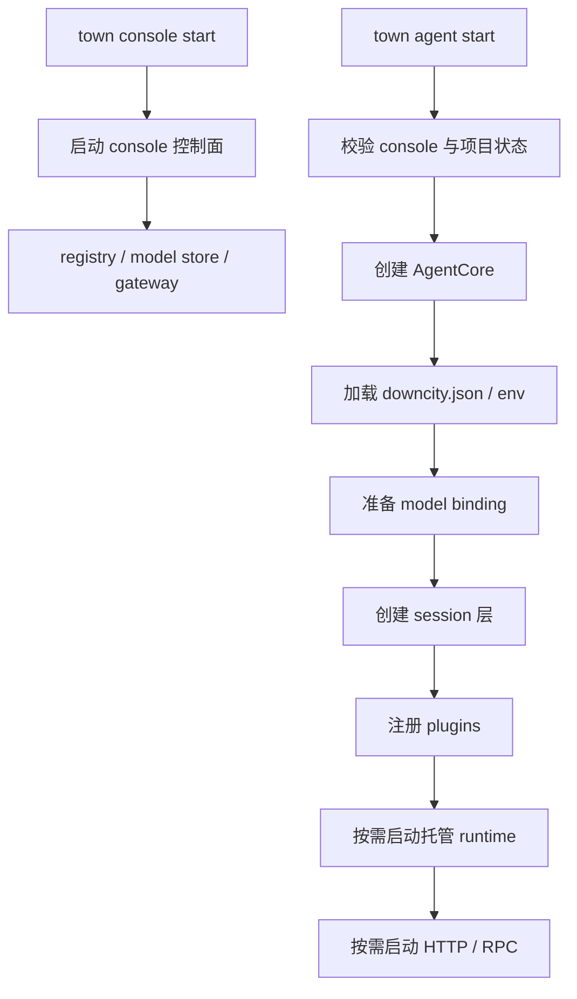
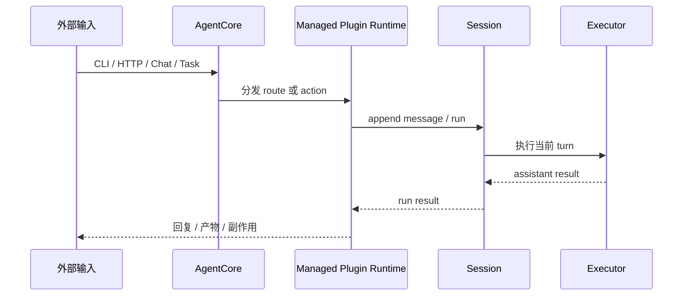

# 系统架构逻辑

这页讲的是当前系统到底怎么跑。

## 总体分层

Downcity 现在最适合按四层理解：

1. 入口层：CLI、Console UI、Chrome Extension、HTTP API
2. 控制层：console
3. 执行层：agent host
4. 能力层：session 与 plugins

## 为什么要分 console 和 agent

### Console

console 是全局控制面。它负责：

- 管多个项目 agent
- 维护 registry 与共享状态
- 协调模型池与 gateway
- 给 UI 与扩展提供统一入口

### Agent host

agent host 是单项目执行面。它负责：

- 加载项目配置
- 创建 `AgentCore`
- 按需暴露 HTTP / RPC runtime
- 协调 session 执行和托管 plugin runtime

## 当前运行时中心

真正的中心对象是 `AgentCore`。

它持有：

- config 与 env
- plugin registry 访问
- session 创建与读取能力
- 宿主集成端口
- 统一的 `AgentContext`

## 为什么要分 session 和 plugin

### Session

session 回答：

- 当前输入属于哪个 `sessionId`
- 历史怎样持久化
- 什么时候进入模型循环
- 结果如何收束

### Plugin

plugin 回答：

- 暴露什么能力面
- 增强哪个运行时点
- 哪些模块需要跟着 host 一起存活

当前稳定的 hook 语义是：

- `pipeline`
- `guard`
- `effect`
- `resolve`

## 启动主链

## 执行主链

