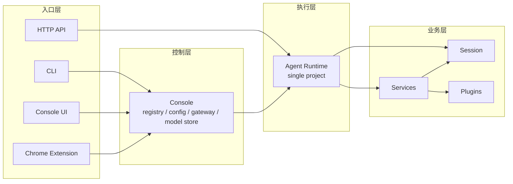
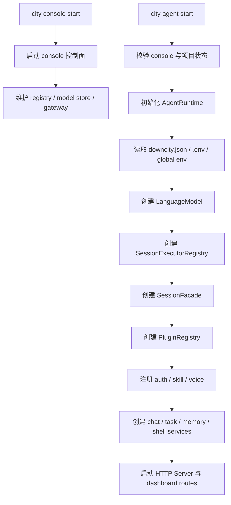
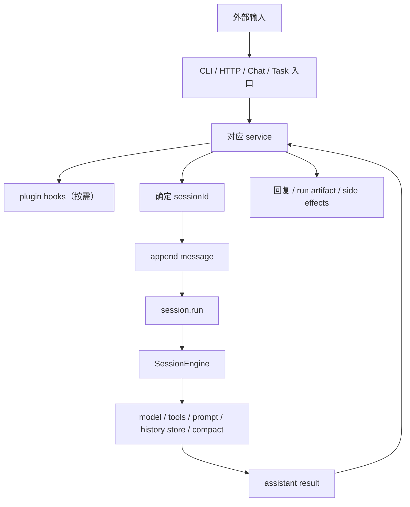

# 系统架构逻辑

这一页回答的是：

- 当前系统到底怎么运转

不是旧概念图里的抽象推演，而是和现在 package 对齐的真实主链。

## 总体分层

Downcity 当前可以先粗分成四层：

1. 入口层：CLI、Console UI、Chrome Extension、HTTP API
2. 控制层：console
3. 执行层：agent runtime
4. 业务层：session / services / plugins



## 为什么要分 console 和 agent

### Console

Console 是全局控制面，负责：

- 管理多个 agent 项目
- 维护 registry
- 管理全局模型配置、共享 env、控制状态
- 给 Console UI 和扩展提供统一入口

### Agent

Agent 是单项目执行面，负责：

- 加载当前项目配置
- 提供当前项目的 HTTP runtime
- 持有 `AgentRuntime`
- 驱动 session、services、plugins

## 当前真正的运行时中心

当前代码里，最重要的中心对象是：

- `AgentRuntime`

它不是旧文档里那种泛化的 “host runtime” 概念，而是实际存在的运行时对象。

它持有：

- `config`
- `env`
- `systems`
- `model`
- `sessionFacade`
- `services`
- `pluginRegistry`

所以从代码视角看，当前最真实的主链是：

```text
console 管多个 agent
agent 用 AgentRuntime 持有当前项目运行时
AgentRuntime 再挂 session / services / plugins
```

## 业务层为什么要分 session / service / plugin

这不是为了抽象漂亮，而是因为它们回答的是不同问题。

### Session

Session 回答：

- 输入最终归到哪个 `sessionId`
- 消息如何持久化
- 什么时候进入模型执行
- 执行结果如何写回

Session 的真实对象包括：

- `SessionFacade`
- `SessionExecutorRegistry`
- `LocalSessionExecutor`
- `SessionEngine`
- `JsonlSessionHistoryStore`

### Service

Service 回答：

- 哪类输入由谁承接
- 主业务流程怎么走
- 哪一步进入 session
- 哪些节点开放给 plugin

当前 service 包括：

- `chat`
- `task`
- `memory`
- `shell`

### Plugin

Plugin 回答：

- 在不改主流程所有权的前提下，如何增强系统

它的典型能力包括：

- action
- system 注入
- hooks

当前 hooks 的统一语义是：

- `pipeline`
- `guard`
- `effect`
- `resolve`

## 启动主链



## 执行主链



## 当前 chat plugin 点

当前 `chat` service 已定义并实际使用这些 plugin 点：

- `chat.augmentInbound`
- `chat.observePrincipal`
- `chat.authorizeIncoming`
- `chat.resolveUserRole`
- `chat.beforeEnqueue`
- `chat.afterEnqueue`
- `chat.beforeReply`
- `chat.afterReply`

这些点由 chat service 定义，plugin 负责实现部分逻辑。

关键点：

- plugin 点不是 plugin 自己命名自己的私有协议
- 而是 service 对外暴露的稳定扩展点

## 当前代码中的核心对象

- `AgentRuntime`：单项目 runtime 中心
- `AgentContext`：统一能力面
- `SessionFacade`：统一会话门面
- `SessionEngine`：模型执行内核
- `PluginRegistry`：plugin 注册与调度
- `BaseService`：service 实例基类

## 一句话总结

```text
Downcity 当前的真实系统逻辑，是 console 管多个 agent，agent 用 AgentRuntime 持有 session、services、plugins，再通过统一 session 内核承接 chat、task、api 等多入口执行。
```
