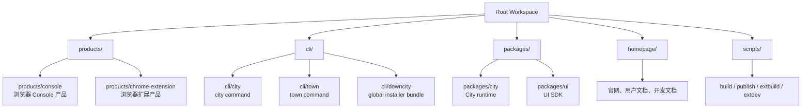
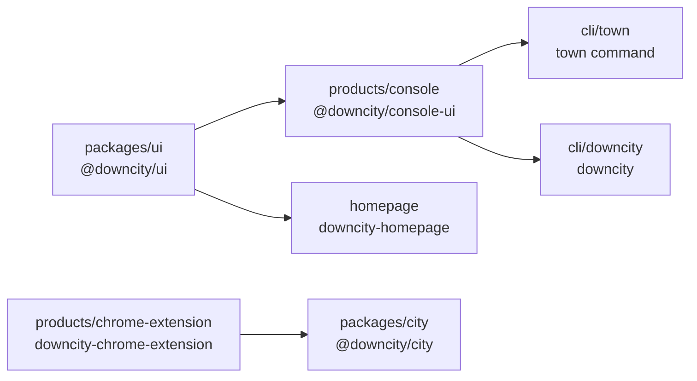
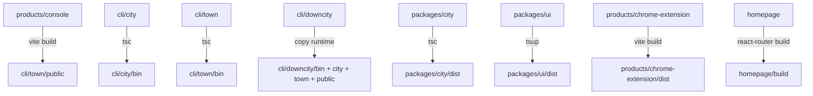
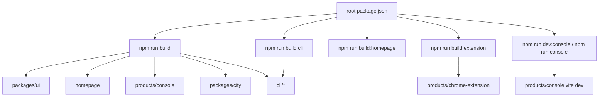

# 工作区与 Package 结构

这页只回答一个问题：

- 现在这个仓库里的 package / product / site 分层到底是什么，彼此怎么连起来

## 先给结论

- `packages/` 放可复用、可发布、偏基础设施的 package
- `products/` 放用户直接使用的产品形态
- `homepage/` 放官网与用户文档站
- `scripts/` 放仓库级构建、发布、辅助脚本
- `<root>/docs` 与 `<root>/devdocs` 是历史沉淀区，持续维护面已经转到 `homepage/content/devdocs`

## 当前 workspace 组成

当前 `pnpm-workspace.yaml` 纳入的工作区有：

- `products/console`
- `products/chrome-extension`
- `cli/city`
- `cli/town`
- `cli/downcity`
- `packages/agent`
- `packages/city`
- `packages/services`
- `packages/plugins`
- `packages/ui`
- `homepage`

也就是说，当前仓库不是“只有 `packages/` 才是 package”，而是：

- `packages/` 负责基础能力
- `products/` 负责真实产品
- `homepage/` 负责内容站点

## 根目录树

```text
downcity/
├─ package.json
├─ pnpm-workspace.yaml
├─ products/
│  ├─ console/
│  └─ chrome-extension/
├─ cli/
│  ├─ city/
│  ├─ town/
│  └─ downcity/
├─ packages/
│  ├─ agent/
│  ├─ city/
│  ├─ services/
│  ├─ plugins/
│  └─ ui/
├─ homepage/
├─ scripts/
├─ docs/
├─ devdocs/
└─ types/
```

## 职责图



## 当前几个核心工作区

| 目录 | package 名 | 定位 | 主要产物 |
| --- | --- | --- | --- |
| `cli/city` | private workspace | City 服务管理命令 | `bin/` |
| `cli/town` | private workspace | 本机 Agent 宿主、Console gateway、控制面 | `bin/` |
| `cli/downcity` | `downcity` | 唯一对外全局安装包，暴露 `city` / `town` | `bin/`、复制后的命令 runtime |
| `packages/city` | `@downcity/city` | 可复用 City runtime、service/action 基建 | `dist/` |
| `packages/ui` | `@downcity/ui` | React UI SDK | `dist/` |
| `products/console` | `@downcity/console-ui` | 浏览器 Console 前端 | 直接输出到 `cli/town/public/` |
| `products/chrome-extension` | `downcity-chrome-extension` | 浏览器扩展 | `dist/` |
| `homepage` | `downcity-homepage` | 官网、用户文档、开发文档 | `build/` |

这里最容易误解的一点是：

- `products/console` 的源码在 `products/console/`
- 但它的生产构建产物不保存在自己目录，而是直接写入 `cli/town/public/`

## 依赖关系图



## 构建流向图



## 根脚本怎样编排这些工作区



## 一句话理解当前结构

如果只记一句话：

> `packages/` 放能力底座，`cli/` 放终端产品，`products/` 放可视化产品，`homepage/` 放官网与文档。
