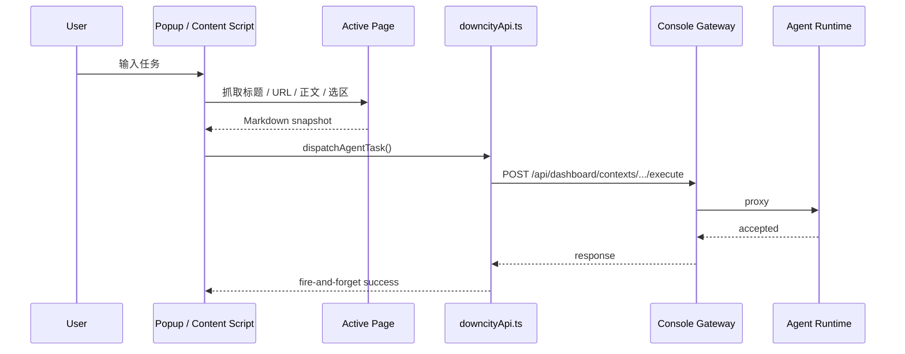

# Chrome Extension 请求流

Chrome Extension 的价值不只是“多一个入口”，而是把“看到内容”和“交给 Agent”之间的距离压到最短。

## 它解决的核心问题

如果用户要把网页交给 Agent，最笨的路径通常是：

1. 复制页面内容
2. 回到聊天界面
3. 粘贴内容
4. 再补一句任务说明

扩展就是在消灭这条链上的切换成本。

## 主链路

## 关键模块怎么分

### `pageMarkdown.ts`

职责：

- 在页面里提取结构化正文
- 转成 Markdown
- 补标题、来源 URL、抓取时间等元信息

它不是“纯文本复制器”，而是一个 best-effort 的页面结构归一化器。

### `downcityApi.ts`

职责：

- 拉取 agent 列表
- 拉取 chatKey / context 候选
- 发送任务

关键设计点：

- 优先 `sendBeacon`
- 回退 `keepalive fetch`
- 不等待完整执行结果，只保证请求已发出

### `popup/App.tsx`

职责：

- 组织最短发送主路径
- 维护当前页面发送历史
- 选择 agent / chatKey
- 调用抓取与 dispatch

## 为什么不在 popup 里等结果

因为扩展 popup 是短生命周期界面。

如果你要求 popup 负责等完整任务执行结束，会带来三个问题：

1. popup 关闭后状态丢失
2. 用户需要在扩展里等待，而不是回到主工作流
3. 扩展承担了不该承担的“对话面职责”

所以现在的策略是：

- 扩展负责投递
- 结果回到原有 chat / context 里查看

这更符合 Downcity 一贯的设计逻辑：入口面不抢执行面的职责。

## 两种入口为什么并存

### Popup

适合：

- 明确选择 agent
- 明确补任务说明
- 查看本页发送历史

### Content Script

适合：

- 选中一段文字后快速问
- 在网页现场就近发起交互

这两者不是重复，而是服务两个不同摩擦点。

## 协作者需要守住的设计约束

1. 扩展负责“采集与投递”，不负责变成第二个 Console UI
2. 页面内容抓取应尽量结构化，不要退化成粗暴 innerText
3. 发送链路优先保证“成功发出”，而不是强绑定“等待执行结果”
4. 所有 Console 地址、Agent 选择、chatKey 选择都要能在断连时优雅失败
