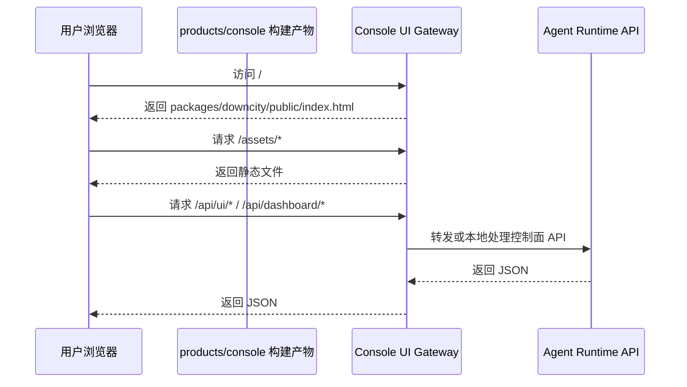

# Console 前端构建与运行时

当前仓库里，和 Console UI 相关的实现分成两层：

- `packages/downcity/`：CLI、console daemon、agent runtime、API gateway
- `products/console/`：独立前端工作区（Vite + React）

设计目标很明确：

- 前端独立开发、独立构建
- `city console ui start` 只负责托管构建产物并代理 API
- 不再把页面逻辑继续塞回 runtime 里的手工静态脚本

## 开发环境

日常开发应该这样理解：

1. 在 `products/console/` 中跑 Vite dev
2. API 继续走 console ui gateway，或者由 Vite proxy 到 gateway
3. 目标是让前端迭代不依赖每次都重构建 `packages/downcity`

## 生产环境

生产交付不是独立部署一个前端站，而是：

1. 构建 `products/console`
2. 构建产物直接输出到 `packages/downcity/public`
3. 用户执行 `city console ui start`
4. `ConsoleUIGateway` 直接托管这些静态资源并代理 `/api/*`

一句话：

> 开发用 Vite dev，生产用“预构建静态产物 + gateway 托管”。

## 目录与职责

### 前端包

- `products/console/index.html`：前端入口模板
- `products/console/src/main.tsx`：React 启动入口
- `products/console/src/App.tsx`：页面根组件
- `products/console/vite.config.ts`：构建配置，产物写入 `../../packages/downcity/public`

### 后端网关

`packages/downcity` 中的 Console 网关负责：

- 托管 `packages/downcity/public` 静态资源
- 提供 `api/ui/*`、`api/dashboard/*` 等控制台接口
- 代理其他运行时接口
- 对前端路由做 SPA fallback

## 构建与发布逻辑

仓库级 `build` 现在的顺序是：

1. 先构建 `@downcity/ui`
2. 再构建 `homepage`
3. 再构建 `products/console`
4. 再构建 `packages/downcity`

关键点：

- `products/console` 的产物不单独发布
- 它直接写入 `packages/downcity/public`
- 所以最终 npm 交付包天然包含最新 Console 前端

## 运行时调用链路

## 当前边界规则

- `products/console` 只负责界面、交互、状态管理
- runtime 编排逻辑仍在 `packages/downcity`
- 前端统一通过同域 `/api/*` 调用，不直接跨域打 agent 端口
