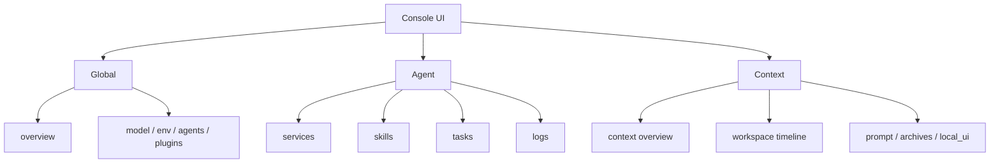
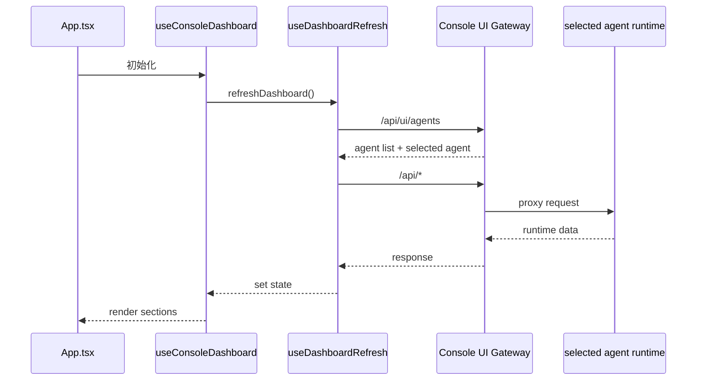

# Console UI 数据流与信息架构

`console-ui/` 的重点不只是“页面长什么样”，而是它如何把 console 级、agent 级、context 级信息分开。

## 当前核心思想

Console UI 不拥有 runtime，它拥有的是“观察与操作入口的编排权”。

所以它的设计目标不是把所有数据都塞进一个 dashboard，而是让用户明确知道自己当前作用在哪一层。

## 三层信息架构

## 为什么这样分

因为这三类信息本质上不是一件事：

- Global 是 console 级控制信息
- Agent 是当前项目运行信息
- Context 是当前会话与上下文信息

如果不分，用户会同时面对：

- 全局模型池
- 当前 agent 的 logs
- 某个 context 的消息时间线

这会让“我当前要操作什么”变得非常混乱。

## 顶层数据流

`useConsoleDashboard` 是总装配层，`useDashboardRefresh` 是刷新编排层。

## 切换逻辑

### 切 Agent

切换 agent 时，系统要做的是：

- 刷新 agent 列表
- 刷新当前 agent 级数据
- 重算可用 context
- 再刷新 context 级数据

这也是为什么 `useDashboardRefresh.ts` 里会先拿 `agents`、再拿 `sessions` 摘要、再决定下一个激活会话。

### 切 Session

切换 session 时，不需要重拉整个世界，只需要重拉：

- channel history
- context messages
- archives
- prompt

这保证了 UI 不会因为局部操作而整页震荡。

## 对协作者最重要的约束

### 1. UI 不要偷偷拥有业务规则

业务判断应该优先留在 runtime 或 types 契约里，UI 只负责表达与触发。

### 2. 不要把不同 scope 的按钮混放

例如：

- 全局模型切换，不应该藏到 context 页
- context 清理操作，不应该塞到 global overview

### 3. 允许未运行 agent 的降级展示

这是当前实现里一个很重要的体验点：

- agent 未运行时，仍可显示静态配置与全局数据
- 不要因为 runtime 不在线就让整个控制面失明

## 最后的阅读建议

想继续深入 Console UI，建议按这个顺序看：

1. `src/App.tsx`
2. `src/hooks/useConsoleDashboard.ts`
3. `src/hooks/dashboard/useDashboardRefresh.ts`
4. `src/lib/dashboard-queries.ts`
5. `src/lib/dashboard-mutations.ts`
6. `src/components/dashboard/*`
