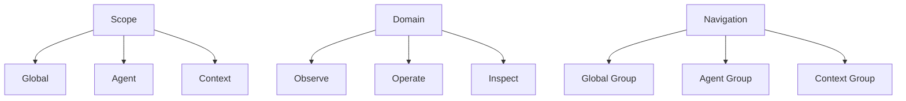

# Console 信息架构重构草案

这页保留的是一份仍然有参考价值的信息架构草案。

它的核心观点不是“页面长什么样”，而是：

- Console 不应该只按对象名平铺
- 页面必须同时回答“我在看哪一层”和“我在做什么”

## 结论先行

建议按三层模型组织 Console UI：

1. `Scope`：作用域层
2. `Domain`：功能层
3. `Navigation`：导航层

目标是让任何页面都能清楚回答两件事：

- 当前作用于哪一层：`Global / Agent / Context`
- 当前是在观察、操作还是排查：`Observe / Operate / Inspect`

## Scope

### Global

关注全局 console 级能力：

- console 进程状态
- console ui 状态
- registry 规模与健康
- model 配置管理
- agents 管理与切换

### Agent

关注当前选中 agent 的 runtime 能力：

- services
- tasks
- logs
- agent 基础状态

### Context

关注当前选中 context / session 的会话能力：

- context 元信息
- message timeline
- channel history
- system prompt
- local ui 写入口

## Domain

### Observe

- overview
- status
- counts
- health

### Operate

- start / stop / restart
- reconnect
- run task
- destructive 操作

### Inspect

- logs
- history
- prompt composition
- run detail

## Navigation

Sidebar 最适合固定三组：

1. `Global`
2. `Agent`
3. `Context`

## 结构图

## 这份草案现在的价值

它不是当前 UI 的逐像素实现说明，但仍适合拿来判断：

- 新页面该挂在哪个作用域
- 某个模块是观察、操作还是排查
- 为什么不应该把全局状态、agent 状态和 context 细节硬挤在同一个平面里
