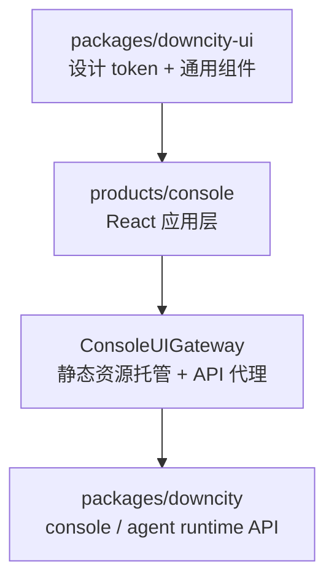

# Console React 化设计说明

这页记录的是一个已经落地的核心方向：

- Console UI 从 runtime 内嵌静态页面解耦
- 前端成为独立工作区
- gateway 只负责“静态资源托管 + API 代理”

## 这个方向为什么成立

主要收益有三类：

1. 可维护性更高
2. UI 设计空间更大
3. 工程效率更高

具体表现为：

- 前后端边界更清楚
- 能正常使用 React 组件体系、主题系统、状态管理
- 热更新、测试、类型检查都能独立运行

## 当前实际分层



## 当前运行时加载协议

`city console ui start` 时：

1. 启动 Console UI Gateway
2. Gateway 读取 `packages/downcity/public`
3. 浏览器访问 UI 端口时，返回 React 构建产物
4. React 前端通过同域 `/api/*` 调用现有 console / agent API

## 目录变化后的当前形态

历史设计稿里讲的是新增独立前端包，现在已经落地为：

```text
downcity/
├─ packages/downcity/
├─ packages/downcity-ui/
├─ products/console/
└─ homepage/
```

其中：

- `products/console/` 是前端源码工作区
- `packages/downcity-ui/` 是复用 UI SDK
- `packages/downcity/public/` 是最终托管的静态产物目录

## 当前关键约束

- gateway 不再维护 UI DOM 和样式逻辑
- UI 通过 API 访问业务能力，不把业务编排搬回前端
- 不引入第二套 runtime 概念，Console 前端只是消费控制面 API
