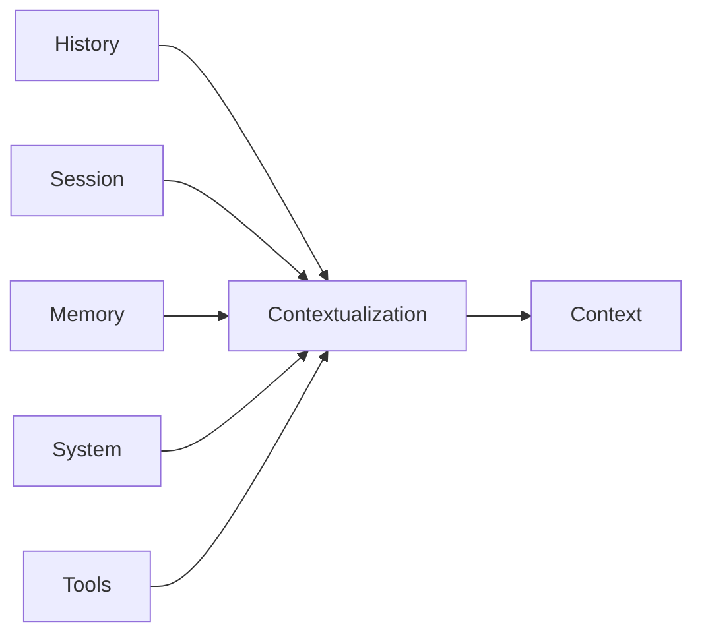

# Contextualization

这一页说的不是名词，而是动作。

```text
Contextualization = 把各种材料组织成最终 Context 的过程。
```

## 为什么要单独给这个动作命名

因为真正复杂的地方，不在于“Context 是什么”，而在于：

- Context 是怎么来的

也就是：

- 什么材料会进入
- 什么材料不会进入
- 顺序怎么排
- 长度怎么控
- Memory 怎么召回

这整件事不应该也叫 `Context`，否则名词和动作会混在一起。

## Contextualization 的输入

最典型的输入有：

- `Session`
- `History`
- `Memory`
- `system prompts`
- `tools`
- runtime 注入消息

## 输出

输出只有一个：

- 本次真正发送给模型的 `Context`

## 一张图看动作



## 当前 package 里这个动作大概落在哪里

今天它分散在几处：

- `PromptSystem`
- `RuntimeOrchestrator`
- `JsonlSessionHistoryStore.prepare`
- compact / merge / injected message 逻辑
- memory recall 相关逻辑

所以现在它还是一个分散实现。

但在概念上，我们最好把它统一叫：

- `Contextualization`

## 一句话定义

```text
Contextualization 不是保存状态，而是把状态转成这次模型真正能消费的输入。
```
