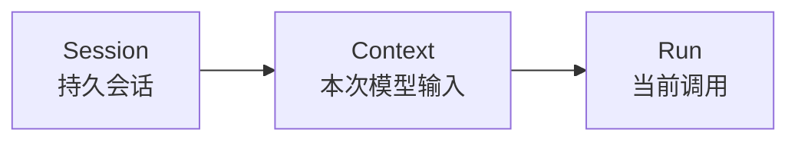
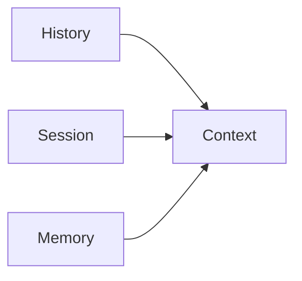

# Context 总览

这篇文档只做一件事：

```text
把 Context 这个词收窄。
```

## 先给结论

从现在开始，Downcity 文档里的 `Context` 应该尽量只保留一个语义：

- 真正发送给大模型的输入上下文

也就是：

- model context window
- prompt context
- 本次调用时模型真正看到的输入

一句话：

```text
Context 不是会话本体，Context 是模型输入。
```

## 为什么要这么收窄

因为之前 `Context` 这个词同时被拿来表示：

- 持久会话
- 某一轮模型真正收到的输入
- 甚至“把各种材料组织成输入”的过程

这会导致：

- 同一个词指三件不同的事

所以文档必须收口。

## Context 现在具体包括什么

一次真正送给模型的 Context，通常由这些部分组成：

- system prompt
- 当前需要的 message window
- 当前可用工具定义
- runtime 注入消息
- 必要时召回的一小部分 memory

所以它本质上是：

- 一次模型调用的输入切片

## Context 不再表示什么

### 不再表示持久会话

那个东西应该叫：

- `Session`

### 不再表示运行时线程局部作用域

那个东西应该叫：

- `RequestContext`

### 不再表示组装过程

那个动作应该叫：

- `Contextualization`

## 它和 Session 的关系

最准确的关系是：



也就是说：

- Session 是来源
- Context 是投影
- Run 是消费

## 它和 History / Memory 的关系

History 和 Memory 也都会影响 Context，但不是原样进入。



更准确地说：

- History 提供原始材料
- Session 提供当前会话状态
- Memory 提供长期有效状态
- 最终这些材料被选取、裁剪、排序之后，才形成 Context

## 一句话定义

```text
Context = 本次真正发送给大模型的输入上下文。
```
