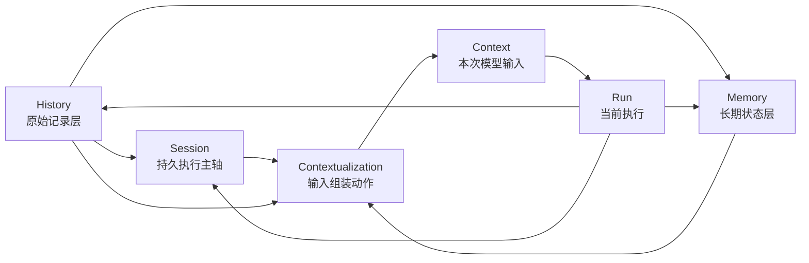

# History / Session / Context / Memory 整体关系

这一页的目标不是再发明一套新词，而是把当前 Downcity 已经逐步成形的一套语义一次收拢。

如果只记一句话，希望是这句：

```text
History 负责保留发生过什么，Session 负责承载这个会话怎样继续，Context 负责决定这次给模型看什么，Memory 负责留下未来还值得继续依赖的状态。
```

## 为什么这四个词必须一起讲

在当前仓库里，这四个概念长期容易混用：

- 把 `history` 当成 `memory`
- 把 `session` 当成 `context`
- 把 `context` 当成持久对象
- 把 `memory` 当成另一个主执行体

这篇文档就是为了解决这个问题。

## 一张总图先抓住全局



这张图里最重要的主次关系是：

- `Session` 是运行主轴
- `History` 是原始事实源
- `Memory` 是长期状态外挂
- `Context` 不是主体，只是一次输入切片
- `Contextualization` 是动作，不是状态容器

## 四个词的最小定义

| 概念 | 它真正回答的问题 | 时间尺度 | 是否直接发给模型 |
| --- | --- | --- | --- |
| `History` | 到底发生过什么 | 过去发生的原始事件 | 通常不 |
| `Session` | 这个会话现在怎样继续执行 | 跨多轮 run | 不直接 |
| `Context` | 这次真正给模型看什么 | 单次调用 | 是 |
| `Memory` | 什么值得跨时间继续留下 | 跨轮次、跨日期 | 只在 recall 时局部注入 |

## 当前 package 里的真实落点

### 1. History 的真实落点

最明确的原始历史层，是 chat service 的事件流。

它的职责非常清楚：

- append-only
- 记录 inbound / outbound
- 服务审计、回放、排查

也就是说：

```text
History 是原始事件流，不是 prompt，也不是长期记忆。
```

### 2. Session 的真实落点

当前 Session 的事实源已经收敛到：

- `sessionId`
- `SessionStore`
- `SessionRuntimeStore`
- `SessionCore`
- `messages.jsonl / meta / archive`

所以当前最准确的说法是：

```text
系统的主语义已经是 Session，而不是旧的 contextId 会话。
```

### 3. Context 的真实落点

`Context` 没有自己的长期目录，因为它本来就不应该有。

它的真实生成过程来自：

- system prompt
- message window
- tools
- injected runtime messages
- memory recall

所以在当前实现里：

- `Context` 是被动态组装出来的
- `Contextualization` 是一个动作，不是一个长期存储层

### 4. Memory 的真实落点

当前 memory service 已经是一个独立能力层。

它真实提供的是：

- `working / daily / longterm`
- 本地索引
- `search / get / store / flush / index / status`

所以文档层更适合把它描述为：

- 当前已有文件视图
- 长期目标是更清晰的状态系统

## 设计逻辑：为什么 Session 必须是主轴

### 不是围绕单条 message

因为单条 message 太小，承载不了：

- 多轮推进
- compact
- archive
- request scope
- 后续 memory 写回

### 不是围绕 service

因为 service 是能力层，不是执行主体。

### 不是围绕 Context

因为 `Context` 天生只有一次调用的寿命。

它必须是：

- 可裁剪的
- 有预算的
- 可重建的
- 面向单次模型消费的

### 所以只能围绕 Session

因为只有 `Session` 同时满足这些条件：

- 有稳定标识
- 可以持续追加消息
- 可以挂接 compact / archive
- 可以承接 request scope
- 可以被多个 service 协作访问

所以在当前架构里，最稳的主句应该是：

```text
系统围绕 Session 运转，service 围绕 Session 工作，Context 由 Session 在每次运行中临时投影出来。
```

## 一句话总结

```text
History、Session、Context、Memory 不是四个并列替代词，而是四层不同职责：原始记录、执行主轴、单次输入、长期状态。
```
