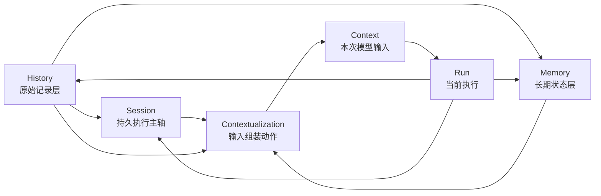
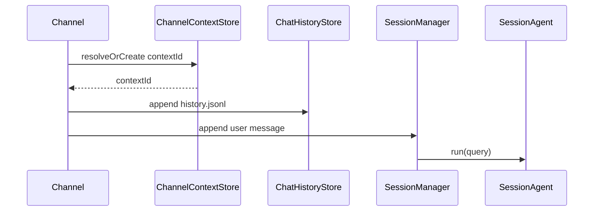
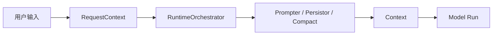

# History / Session / Context / Memory 整体关系

这一页的目标不是再发明一套新词，而是把当前 Downcity 已经逐步成形、但还没有被完整讲清楚的一套语义一次收拢。

如果只记一句话，我希望是这句：

```text
History 负责保留发生过什么，Session 负责承载这个会话怎样继续，Context 负责决定这次给模型看什么，Memory 负责留下未来还值得继续依赖的状态。
```

---

## 为什么这四个词必须一起讲

在当前仓库里，这四个概念不是完全错，而是长期有两类混用：

- 文档层已经逐步把主轴收敛到 `session`
- 包实现里仍然保留了不少 `contextId` 命名

再加上：

- chat service 里有 `history.jsonl`
- session runtime 里有 `messages.jsonl`
- memory service 里同时存在 `working / daily / longterm`
- prompt 组装又散落在 orchestrator / prompter / persistor / memory recall 之间

所以如果不把它们放在一张图里看，就很容易出现下面这些误解：

- 把 `history` 当成 `memory`
- 把 `session` 当成 `context`
- 把 `context` 当成持久对象
- 把 `memory` 当成“另一个主 agent”

这篇文档就是为了解决这个问题。

---

## 一张总图先抓住全局



这张图里最重要的不是箭头多，而是主次关系：

- `Session` 是运行主轴
- `History` 是原始事实源
- `Memory` 是长期状态外挂
- `Context` 不是主体，只是一次输入切片
- `Contextualization` 是动作，不是状态容器

---

## 四个词的最小定义

| 概念 | 它真正回答的问题 | 时间尺度 | 是否直接发给模型 |
| --- | --- | --- | --- |
| `History` | 到底发生过什么 | 过去发生的原始事件 | 通常不 |
| `Session` | 这个会话现在怎样继续执行 | 跨多轮 run | 不直接 |
| `Context` | 这次真正给模型看什么 | 单次调用 | 是 |
| `Memory` | 什么值得跨时间继续留下 | 跨轮次、跨日期 | 只在 recall 时局部注入 |

如果换成更口语的说法：

- `History` 像录像带
- `Session` 像工作台
- `Context` 像这次摆到桌面上的材料
- `Memory` 像已经整理好的长期笔记和原则

---

## 当前 package 里的真实落点

下面这部分不是理想图，而是当前 `packages/downcity` 里的真实实现落点。

### 1. History 的真实落点

最明确的原始历史层，是 chat service 的事件流：

```text
.downcity/chat/<contextId>/history.jsonl
```

对应实现：

- `packages/downcity/src/services/chat/runtime/ChatHistoryStore.ts`

它的职责非常清楚：

- append-only
- 记录 inbound / outbound
- 服务审计、回放、排查
- 明确与 session message history 分离，避免审计噪音直接进入模型上下文

也就是说：

```text
history.jsonl 是原始事件流，不是 prompt，也不是长期记忆。
```

### 2. Session 的真实落点

当前 session 的事实源已经迁到：

```text
.downcity/session/<sessionId>/messages/messages.jsonl
```

对应实现主要在：

- `packages/downcity/src/agent/context/context-agent/components/FilePersistor.ts`
- `packages/downcity/src/console/env/Paths.ts`
- `packages/downcity/src/agent/context/manager/SessionManager.ts`
- `packages/downcity/src/agent/context/context-agent/SessionAgent.ts`

这里有一个很关键的现实：

- 目录、持久化事实源、运行装配都已经偏向 `session`
- 但很多入参、变量名、chat 路由映射仍然保留 `contextId`

所以当前最准确的说法不是“系统还没 session”，而是：

```text
系统的主语义已经是 Session，只是内部还留有 contextId 时代的命名外壳。
```

### 3. Context 的真实落点

`Context` 没有自己的长期目录，因为它本来就不应该有。

它的真实生成过程散落在：

- `packages/downcity/src/agent/context/context-agent/components/RuntimeOrchestrator.ts`
- `packages/downcity/src/agent/components/PrompterComponent.ts`
- `packages/downcity/src/agent/context/context-agent/components/FilePersistor.ts`
- compact / injected message / system prompt / tool definition 相关逻辑

所以在当前实现里：

- `Context` 是被动态组装出来的
- `Contextualization` 还是一个分散实现，而不是单一模块名

### 4. Memory 的真实落点

当前 memory service 已经是一个独立能力层，核心文件主要在：

- `packages/downcity/src/services/memory/runtime/Store.ts`
- `packages/downcity/src/services/memory/runtime/Writer.ts`

当前实际文件投影包括：

```text
.downcity/memory/MEMORY.md
.downcity/memory/daily/*.md
.downcity/session/<sessionId>/memory/working.md
```

这里也存在一个实现层过渡点：

- `Paths.ts` 里仍保留 session memory 的 `Primary.md` 命名
- `memory/runtime/Store.ts` 与 `Writer.ts` 已按 `working.md` 组织 working memory

所以文档层更适合把它描述为：

- `session memory` 正在从旧的 `Primary` 语义向 `working` 语义收敛

---

## 设计逻辑：为什么 Session 必须是主轴

这一部分是整套设计最关键的逻辑。

### 不是围绕单条 message

因为单条 message 太小，承载不了：

- 多轮推进
- compact
- archive
- step merge
- request scope
- 后续 memory 写回

### 不是围绕 service

因为 service 是能力层，不是执行主体。

比如：

- chat service 负责接入和路由
- memory service 负责长期状态
- task service 负责任务定义与调度

但真正被持续推进的，是同一个会话。

### 不是围绕 Context

因为 `Context` 天生只有一次调用的寿命。

它必须是：

- 可裁剪的
- 有预算的
- 可重建的
- 面向单次模型消费的

而不能承担：

- 持久化主目录
- 生命周期主语义
- 执行状态主轴

### 所以只能围绕 Session

因为只有 `Session` 同时满足这些条件：

- 有稳定标识
- 可以持续追加消息
- 可以挂接 compact / archive
- 可以承接 request scope
- 可以挂 working memory
- 可以被多个 service 协作访问

所以在 Downcity 当前架构里，最稳的主句应该是：

```text
系统围绕 Session 运转，service 围绕 Session 工作，Context 由 Session 在每次运行中临时投影出来。
```

---

## 设计哲学：四者为什么必须分层

如果只讲工程结构，不讲哲学，很快又会混回去。这里把底层判断直接写清楚。

### 1. 保真和提炼必须分开

`History` 的第一职责是保真，不是提炼。

所以它允许：

- 有噪音
- 有重复
- 有尚未判断价值的内容

而 `Memory` 的第一职责是提炼，不是保真。

所以它必须回答：

- 什么值得留下
- 什么只是临时状态
- 什么应该升级
- 什么应该退出活跃状态

这就是为什么：

- `History != Memory`

### 2. 承载和输入必须分开

`Session` 负责承载。

它关心的是：

- 现在会话中已有些什么
- 接下来怎么继续
- 上一轮执行留下了什么

`Context` 负责输入。

它关心的是：

- 这次模型窗口里该放什么
- 顺序怎样排
- 预算怎样控
- 哪些 memory 需要被召回

这就是为什么：

- `Session != Context`

### 3. 长期记忆不能直接接管主循环

`Memory` 很重要，但它不应该变成第二个主执行体。

Downcity 当前更合理的结构是：

- `SessionAgent` 继续做主执行
- `memory service` 做长期状态治理
- recall 只在必要时局部介入当前 contextualization

这就是为什么：

- `Memory` 是外挂层，不是主循环替代品

### 4. 在线做事，离线整理

热路径应该尽量轻：

- 接收输入
- 写 history
- 追加 session message
- 组装 context
- 执行当前 run

冷路径才做重整理：

- memory 索引
- memory 提升
- working 到 daily / longterm 的整理
- 覆盖、合并、退场

这就是为什么：

```text
当前执行和长期整理必须解耦。
```

---

## 当前实现里的实际数据流

下面这部分是把文档语义和 package 行为真正对齐。

## 第一段：chat 如何进入系统

chat 入口的大致链路是：



这里最值得注意的是：

- chat 层仍然解析和返回 `contextId`
- 但 `SessionManager` 已把它当作 session 主键来使用

也就是说：

```text
contextId 在当前包实现里，更多是“sessionId 的历史命名别名”。
```

## 第二段：run 如何拿到这次真正的 Context

一次 run 的主链路大致是：



这里包含几层关键动作：

- `RequestContext` 透传 `sessionId / requestId / step callbacks`
- `RuntimeOrchestrator` 统一组装 request 级运行信息
- `Persistor` 负责把 session messages 作为事实源供窗口裁切
- `Prompter` 和 system prompt 相关逻辑负责注入稳定系统材料
- injected messages / merged step messages 决定本轮增量材料
- memory recall 在需要时注入少量相关片段

所以：

```text
Context 不是一个目录，而是一次把 session、history、memory、system、tools 裁剪成模型输入的结果。
```

## 第三段：结果如何回写

run 结束以后，结果不会只停留在模型返回值里，而是会反向写回系统：

- assistant 消息写回 `messages.jsonl`
- chat 出站可写回 `history.jsonl`
- 必要时工作记忆写回 `working.md`
- 后续再由 memory service 索引、刷写、整理

这说明整套系统不是“一次 prompt 调用”，而是一个持续累积状态的闭环。

---

## 一个最实用的判断法

如果以后再遇到边界混乱，可以用下面四句话快速判断：

### 如果你问的是“到底发生过什么”

它属于：

- `History`

### 如果你问的是“这个会话现在怎么继续”

它属于：

- `Session`

### 如果你问的是“这次模型真正看见什么”

它属于：

- `Context`

### 如果你问的是“什么值得以后继续带着走”

它属于：

- `Memory`

---

## 当前代码里的命名债务，也要正面承认

为了避免文档显得比代码更干净、反而误导，这里把当前过渡态直接说清楚。

### 债务一：`contextId` 仍广泛存在

现状是：

- chat 路由映射仍使用 `contextId`
- session manager / session agent 运行语义已经是 session
- 很多 API 参数仍接受 `contextId`

这不是概念没定，而是命名迁移没做完。

### 债务二：session memory 命名仍在迁移

现状是：

- memory service 已按 `working.md` 组织 working memory
- path 工具里仍保留 `Primary.md` 语义接口

这意味着当前文档应该描述“设计收敛方向”，同时保留“实现过渡态”的说明。

### 债务三：Contextualization 还是分散实现

现状是：

- 这套动作已经存在
- 但它仍散在多个组件中

所以今天它更适合先作为清晰概念来命名，而不是假装已经有一个完整的 `Contextualization.ts` 中枢。

---

## 这套关系最终想守住什么

如果把所有模块名、目录名、服务名都拿掉，真正想守住的其实只有四条原则。

### 原则一：原始事实不能丢

所以需要 `History`。

### 原则二：执行主轴不能漂

所以需要 `Session`。

### 原则三：模型输入不能失控

所以需要把 `Context` 收窄成单次输入语义。

### 原则四：长期状态不能变成垃圾堆

所以需要 `Memory` 作为治理层，而不是归档桶。

---

## 最后的统一结论

基于当前 devdocs 与 `packages/downcity` 的真实实现，Downcity 最合理、也最稳定的一句系统描述应该是：

```text
Downcity 是一个以 Session 为执行主轴、以 History 为原始事实源、以 Contextualization 为输入组装动作、以 Context 为单次模型输入、以 Memory 为长期状态治理层的系统。
```

如果再压缩成一句更短的话：

```text
History 保真，Session 承载，Context 消费，Memory 提炼。
```
