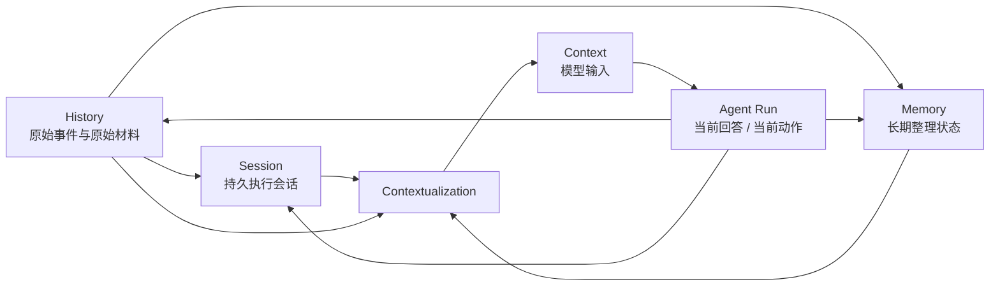
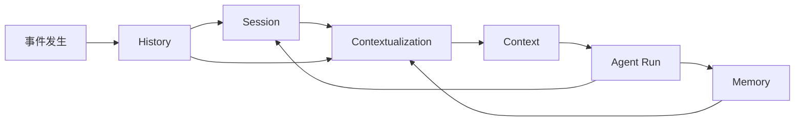

# History / Session / Memory / Context 关系

这一页的目标很直接：

```text
把 history、session、memory、context 这四个最容易打架的概念，一次讲清楚。
```

## 先给四个一句话定义

### `History`

原始记录层，回答：

- 到底发生过什么？

### `Session`

持久会话层，回答：

- 这个会话现在应该怎样继续执行？

### `Memory`

长期状态层，回答：

- 什么值得跨时间继续留下来，并在以后再拿回来用？

### `Context`

模型输入层，回答：

- 这次真正发给大模型的是什么？

## 如果只记一张总图，我希望是这张



## 四者最核心的区别

| 维度 | History | Session | Memory | Context |
| --- | --- | --- | --- | --- |
| 核心问题 | 发生过什么 | 这个会话怎样继续执行 | 以后要记什么 | 这次真正发给模型什么 |
| 时间尺度 | 过去 | 跨多轮 run 的当前会话 | 跨轮次、跨时间 | 单次调用 |
| 形态 | 原始事件、原始材料 | 以 `contextId` 为中心的执行单元 | 整理后的长期状态 | 一次模型输入切片 |
| 是否直接喂模型 | 通常不 | 不直接 | 只在 recall 时局部注入 | 是 |

## 当前 package 里的真实落点

### History

- `.downcity/chat/<contextId>/history.jsonl`

### Session

- `contextId`
- `.downcity/context/<contextId>/messages/messages.jsonl`
- `ContextAgent` / persistor / compact / archive

说明：

- 今天代码里还叫 `context`
- 但语义上更像 `session`

### Memory

- `.downcity/memory/MEMORY.md`
- `.downcity/memory/daily/*.md`
- `.downcity/context/<contextId>/memory/working.*`
- 以及配套索引

### Context

- 按次生成
- 不应该被当作持久目录名
- 是经过 contextualization 后真正送给模型的输入

## 为什么 Session 不等于 History

History 重在保真。

Session 重在持续推进执行。

History 更像录像带。

Session 更像持续运转的工作台。

## 为什么 Context 不等于 Session

Session 是会话本体。

Context 是这次模型输入。

Session 可以很长、可以持久、可以被持续追加。

Context 必须：

- 有长度预算
- 有排序逻辑
- 只服务这一次调用

## 为什么 Memory 不等于 Session

Session 里有很多内容只在当前会话阶段有效。

Memory 只留下真正跨时间的东西。

## 一条正确流水线



## 最后一句

```text
History 决定系统能不能回看过去，Session 决定这个会话能不能持续推进，Context 决定这次模型能不能看对东西，Memory 决定系统下次能不能更聪明。
```
