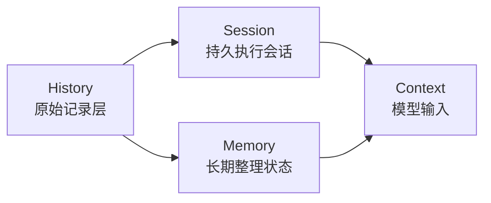
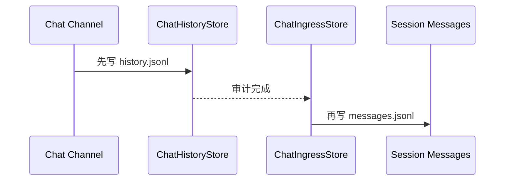

# History 总览

这篇文档专门解决一个前面反复混掉的问题：

```text
History 到底是什么？
```

## 先给最短定义

在 Downcity 里，`History` 最合理的定义是：

- 对“已经发生过什么”的原始记录层

它的关键词是：

- 原始
- 时间顺序
- 可追溯
- 不急着整理

所以 History 首先回答的是：

```text
到底发生过什么？
```

而不是：

- 当前模型应该看什么
- 以后默认按什么来

## 为什么这个词前面会让人困惑

因为在当前仓库里，`history` 同时有两层意思。

### 第一层：架构概念

也就是：

- 历史层
- 原始事件层

这是我们现在重新定义的概念层含义。

### 第二层：具体实现名词

也就是当前 package 里真实存在的：

- `.downcity/chat/<contextId>/history.jsonl`

这是 chat service 的审计事件流文件。

所以一定要分清楚：

```text
history.jsonl 是 History 的一个具体实现，不等于 History 这个概念的全部。
```

## 当前 package 里，最明确的 History 落点是什么

当前最明确、最第一性的 History 实现，是 chat 层的事件流：

```text
.downcity/chat/<contextId>/history.jsonl
```

它由 chat service 写入，特点是：

- append-only
- 一条一条记录事件
- 记录 inbound / outbound
- 主要面向审计、回放、排查

这在源码里也写得很清楚：

- `ChatHistoryStore` 明确说明它是聊天事件流持久化
- 并且明确说明它和 context message history 分离，避免审计噪声进入模型上下文

## 这类 History 里实际记录什么

当前 chat history 记录的是事件，而不是“已经为模型整理好的消息”。

典型字段包括：

- `direction`：入站还是出站
- `ingressKind`：`audit` 还是 `exec`
- `channel`
- `chatId`
- `contextId`
- `text`
- `actorId / actorName`
- `threadId / messageId`
- `extra`

所以它更像：

- 事件日志
- 审计流
- 回放材料

而不是：

- 当前 prompt
- 长期知识库

## History 最重要的 5 个特征

### 1. 它是原始层

History 尽量保留“发生时的样子”。

### 2. 它按时间推进

History 的天然组织方式是：

- 先后顺序

### 3. 它允许有噪音

History 不需要一开始就很干净。

因为它的责任不是“精炼”，而是“保真”。

### 4. 它适合审计，不适合直接全量喂给模型

History 很重要，但它通常太长、太杂、太原始。

### 5. 它应该优先 append-only

因为它首先承担：

- 可追溯
- 可回放
- 可审计

## History 不是谁

### History 不是 Session

`Session` 关心的是：

- 这个会话怎样继续执行

History 关心的是：

- 到底都发生过什么

### History 不是 Memory

`Memory` 关心的是：

- 什么值得长期留下来继续依赖

History 只是原材料，不等于整理结果。

### History 不是 prompt

History 可能是 prompt 的来源之一，但不会原样等于 prompt。

## 一张图先抓住感觉



这张图里最重要的一点是：

- History 可以流向 Session
- History 也可以流向 Memory
- 最终只有一部分会经过 contextualization 进入 Context

## 当前 package 里，History 是怎么进入系统主链路的

以 chat 入站为例，当前逻辑大致是：



这条链路表达了一个非常重要的架构判断：

```text
先保留原始事件，再决定什么进入 Session，并最终在需要时形成 Context。
```

## 为什么先有 History，再有 Session，很重要

因为这样系统才能同时满足两件事：

### 1. 保真

即使某条消息后来没有进入最终 Context，History 里仍然知道它发生过。

### 2. 控噪

不是所有历史都应该直接进入会话执行层，更不应该直接进入模型输入。

这也是当前 `ChatIngressStore` 要把 chat history 和 session messages 分开的根本原因。

## 当前 package 里，除了 chat history，还有没有别的“历史味道”结构

有，但语义不完全相同。

例如：

- `.downcity/context/<contextId>/messages/archive/*`

这类 archive 记录的是：

- 被 compact 折叠掉的旧 context message 段

它也有“历史材料”的属性，但它更接近：

- context 的归档层

而不是 chat service 那种一手事件流。

所以最稳妥的说法是：

- 当前一等公民的 History 实现，是 chat history
- archive 是 context 侧的补充追溯材料

## 我建议以后统一怎么说

为了避免文档继续混乱，我建议统一下面这套口径。

### `History`

指：

- 原始记录层
- append-only 的事件和原材料

### `chat history`

指：

- `.downcity/chat/<contextId>/history.jsonl`
- chat service 的审计事件流实现

### `session messages`

指：

- `.downcity/context/<contextId>/messages/messages.jsonl`
- 当前 Session 的消息事实源

### `Context`

指：

- 本次真正发给模型的输入

### `Memory`

指：

- 从历史与上下文里整理出来、以后还要继续依赖的长期状态

## 一句话定义

```text
History 是“发生过什么”的原始记录层；它负责保真，不负责会话推进，也不负责最终模型输入或长期定稿。
```

## 下一篇建议

接着看：

1. `Session 总览`
2. `Context 总览`
3. `History / Session / Memory / Context 关系`
4. `Memory 总览`
