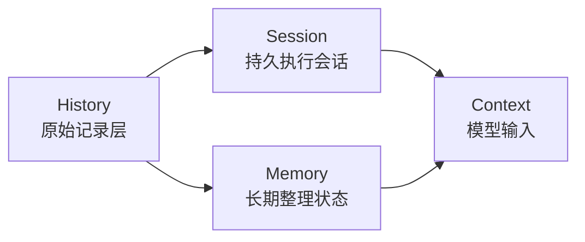
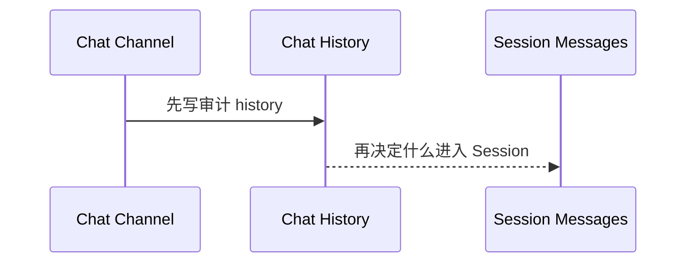

# History 总览

这篇文档专门解决一个前面反复混掉的问题：

```text
History 到底是什么？
```

## 先给最短定义

在 Downcity 里，`History` 最合理的定义是：

- 对“已经发生过什么”的原始记录层

它的关键词是：

- 原始
- 时间顺序
- 可追溯
- 不急着整理

## 为什么这个词前面会让人困惑

因为在当前仓库里，`history` 同时有两层意思。

### 第一层：架构概念

也就是：

- 历史层
- 原始事件层

### 第二层：具体实现名词

也就是当前 package 里真实存在的：

- chat 侧的 `history.jsonl`

所以一定要分清楚：

```text
history.jsonl 是 History 的一个具体实现，不等于 History 这个概念的全部。
```

## 当前 package 里，最明确的 History 落点是什么

当前最明确、最第一性的 History 实现，是 chat 层的事件流。

它由 chat service 写入，特点是：

- append-only
- 一条一条记录事件
- 记录 inbound / outbound
- 主要面向审计、回放、排查

## 这类 History 里实际记录什么

当前 chat history 记录的是事件，而不是已经为模型整理好的消息。

典型字段会包括：

- `direction`
- `ingressKind`
- `channel`
- `chatId`
- `text`
- `actorId / actorName`
- `threadId / messageId`
- `extra`

所以它更像：

- 事件日志
- 审计流
- 回放材料

而不是：

- 当前 prompt
- 长期知识库

## History 最重要的 5 个特征

### 1. 它是原始层

History 尽量保留发生时的样子。

### 2. 它按时间推进

History 的天然组织方式是：

- 先后顺序

### 3. 它允许有噪音

History 不需要一开始就很干净。

因为它的责任不是精炼，而是保真。

### 4. 它适合审计，不适合直接全量喂给模型

History 很重要，但它通常太长、太杂、太原始。

### 5. 它应该优先 append-only

因为它首先承担：

- 可追溯
- 可回放
- 可审计

## History 不是谁

### History 不是 Session

`Session` 关心的是：

- 这个会话怎样继续执行

History 关心的是：

- 到底都发生过什么

### History 不是 Memory

`Memory` 关心的是：

- 什么值得长期留下来继续依赖

History 只是原材料，不等于整理结果。

### History 不是 Context

History 可能是 Context 的来源之一，但不会原样等于 Context。

## 一张图先抓住感觉



## 当前 package 里，History 是怎么进入系统主链路的

以 chat 入站为例，当前逻辑大致是：



这条链路表达了一个重要判断：

```text
先保留原始事件，再决定什么进入 Session，并最终在需要时形成 Context。
```

## 一句话总结

```text
History 在 Downcity 里是原始记录层：它首先回答“到底发生过什么”，而不是“这次模型应该看什么”。
```
