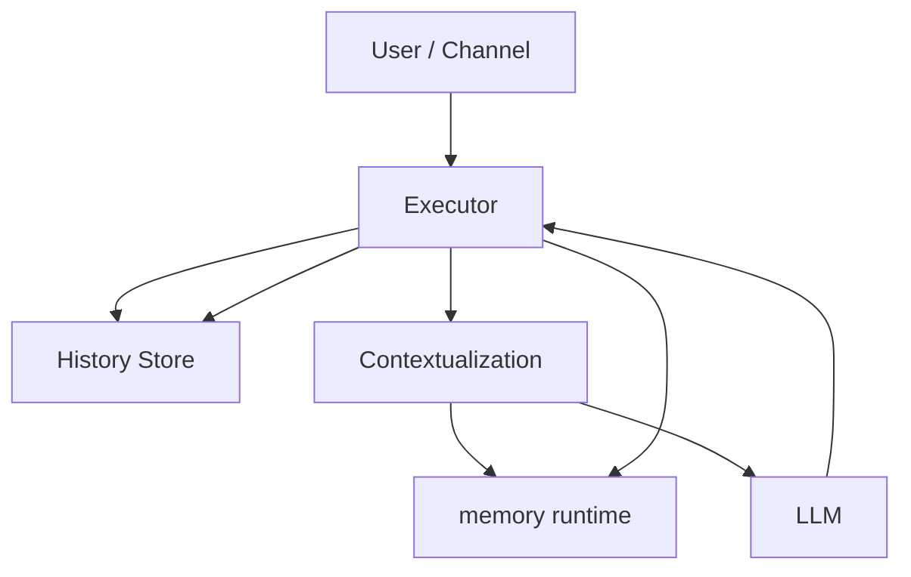

# Memory 架构

这页回答的是实现问题：

- Memory 在当前系统里应该挂在哪里
- 谁驱动它
- 它和 Session 主轴是什么关系

## 总体原则

1. Agent host 负责装配执行与状态 runtime
2. Session 负责当前执行
3. memory runtime 负责记忆读写、检索、整理与投影
4. Context 不是独立存储体，而是一次构造结果

## 理想结构

## 这张图该怎么读

### Executor 是前台执行者

它负责：

1. 接收输入
2. 追加 history
3. 发起 contextualization
4. 调用 LLM
5. 写回 assistant message
6. 必要时触发 memory 写入

也就是说：

- Executor 不拥有 Memory
- 但它负责驱动 Memory

### memory runtime 是后台治理者

更适合承接：

- `store`
- `search`
- `get`
- `index / flush / status`

所以它是一个长期状态治理 runtime，不是主对话执行体。

## 当前最稳的架构判断

- `memory runtime` 是宿主
- `Session` 是使用者
- `memoryAgent` 是 runtime 内部的维护角色
- `LLM` 是被借用的整理能力，不是 Memory 的宿主
