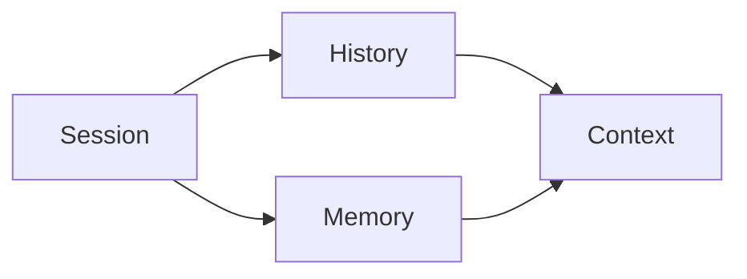

# Memory 概念

这页先不讲实现，只讲概念。

如果概念没分清，系统很容易出现三类错误：

1. 把 `history` 当 `memory`
2. 把 `memory` 当 `context`
3. 把 `session` 和 `context` 当成同一个词

## 一句话定义

- `Session`：一次持续交互的持久单元
- `History`：这个 session 中发生过的原始记录
- `Memory`：从历史里提炼出来、值得跨轮次复用的长期状态
- `Context`：某一次模型调用时，临时组装出来的输入

## 为什么应该围绕 Session 设计

真正稳定存在、能承接业务动作的，不是 `context`，而是 `session`。

因为：

1. 用户是在和一个 session 交互
2. history 挂在 session 上
3. working memory 也挂在 session 上
4. agent 的执行状态、调度状态、清理动作，都是按 session 组织

所以主轴应该是：

```text
Session -> History / Memory -> Context
```

而不是：

```text
Context -> everything
```

## 四个概念的关系



## Session 是什么

Session 是系统真正的会话容器。

它承接：

- 交互属于谁
- 这个会话的消息历史
- 这个会话的 working memory
- 当前是否在执行
- 对应的 runtime 缓存

## History 是什么

History 不是“给模型看的上下文”，而是“真实发生过什么”的记录层。

它应该：

- 原始
- 可审计
- 可回放

## Memory 是什么

Memory 不是所有历史的镜像。

它只保留真正值得跨轮次存在的长期状态，比如：

- 用户长期偏好
- 已确认的事实
- 稳定工作规则
- 多轮执行沉淀出的结论

## Context 是什么

Context 不是存储层，而是构造层。

它是某一次模型调用时，临时从这些来源拼出来的输入：

- 当前用户输入
- 最近历史
- 选中的 memory
- 当前 system / tool / routing 信息
