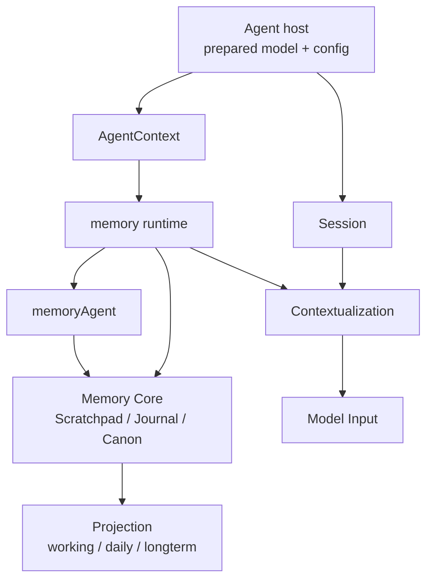

# Memory Runtime 框架文档

这一页回答一个核心问题：

```text
在当前架构里，Memory 到底应该挂在哪里？
```

## 先把几个角色摆正

当前仓库里最重要的事实是：

1. 主模型由 agent host 在启动阶段统一准备
2. 主执行体是 Session + Executor
3. task 可以有自己的 session，但不是第二套长期主轴
4. Memory 最适合被理解成一个托管长期状态 runtime

## 结论先说

在当前逻辑里，Memory 的正确位置是：

- `memory runtime` 是宿主
- `Session` 是使用者
- `memoryAgent` 是 `memory runtime` 内部的后台整理角色
- `LLM` 是被借用的整理能力，不是 Memory 的宿主

## 一张图看整体位置



## LLM 在这里的正确位置

LLM 更适合参与冷路径：

- 归纳多条 Journal
- 聚合同主题候选记忆
- 重写 Canon
- 处理冲突和覆盖关系

它不适合承包热路径：

- 每条消息即时写入
- 每次 recall 的基础排序
- 每次 context 更新都强制总结

## 当前 V2 已经有什么

当前 memory 相关 runtime 已经具备：

- `working / daily / longterm` 文件视图
- 本地 SQLite FTS 索引
- `search / get / store / flush / index / status` 这类 action

所以今天更准确的理解不是“一个附属执行组件”，而是：

- 一个基于 Markdown 文件和本地索引的长期状态 runtime

## 一句话总结

```text
Memory 在当前架构里的正确位置，是 agent host 里的托管长期状态 runtime；Session 使用它，但不被它替代。
```
