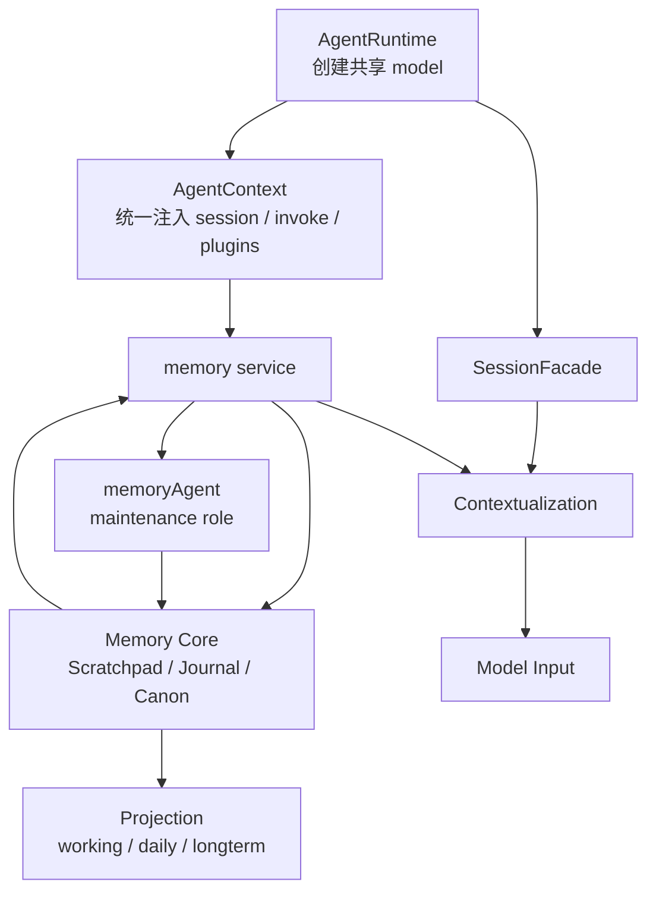

# Memory Service 框架文档

这一页专门回答一个核心问题：

```text
在 Downcity 当前 package 逻辑里，Memory 到底应该挂在哪里？
```

## 先把 package 里的真实角色摆正

当前仓库里，最重要的几个事实是：

### 1. 主模型是在 runtime 启动时统一创建的

当前主模型实例在 agent 初始化阶段创建，并挂在 `AgentRuntime.model` 上。

这意味着：

- 模型生命周期属于 agent runtime
- 不是某个 service 自己管理一套模型

### 2. 主执行体是 Session 主轴

当前真正的执行主轴是：

- `SessionFacade`
- `SessionExecutorRegistry`
- `SessionEngine`

它们围绕 `sessionId` 组织每次执行。

### 3. task 会创建自己的 task run session，但它不是另一套长期主轴

task runtime 可以创建自己的 task session。

但它仍然是在复用 session 执行内核，而不是创造平级的长期架构中心。

### 4. service 层是能力编排层

当前 service 层承载的是：

- service 生命周期
- service action 调用
- 通过 `AgentContext` 注入能力

所以 Memory 在 package 里的正确宿主，应当首先是：

- 一个 service

## 所以结论先说

在当前 package 逻辑里，Memory 的正确位置是：

- `memory service` 是宿主
- `Session` 是使用者
- `memoryAgent` 是 `memory service` 内部的后台整理角色
- `LLM` 是被借用的整理能力，不是 Memory 的宿主

## 一张图看整体位置



这张图表达的是：

- Memory 被放回了现有 runtime 主轴里
- `memoryAgent` 只是 `memory service` 的内部维护回路
- Session、Memory 共同参与 contextualization，最终影响模型看到的 Context

## 系统里到底哪里有 LLM

### LLM 的正确位置

当前 runtime 启动时已经创建共享模型。

所以 Memory 最合理的做法是：

- 需要 LLM 时，向 runtime 借能力
- 不自己管理第二套模型生命周期

### LLM 适合参与什么

- 归纳多条 Journal
- 聚合同主题候选记忆
- 重写 Canon 文本
- 处理冲突和覆盖关系

### LLM 不适合承包什么

- 每条消息的即时写入
- 每次 recall 的基础排序
- 每次 context 更新都强制总结

一句话：

```text
LLM 在 Memory 里应该是冷路径助手，不是热路径地基。
```

## 系统里到底哪里有 service

Memory 放在 service 层，有三个直接好处：

### 1. 生命周期清楚

跟随 runtime 启停。

### 2. 能力边界清楚

读写、检索、维护、投影都能归到同一个 service。

### 3. 能和现有 action / CLI / API 自然对接

当前 memory service 已经有：

- `search`
- `get`
- `store`
- `flush`
- `index`
- `status`

## 当前 V2 已经有什么

当前 `services/memory` 已具备这些能力：

### 文件层

- `working`
- `daily`
- `longterm`

### 索引层

- SQLite + FTS 本地索引
- 文件变化 watcher
- 增量同步

### action 层

- `memory.search`
- `memory.get`
- `memory.store`
- `memory.flush`
- `memory.index`
- `memory.status`

也就是说，当前 V2 更像：

- 基于 Markdown 文件的可检索 Memory service

## V3 要在什么地方升级

V3 不是推翻宿主结构，而是升级内部逻辑。

### V2 的中心偏向文件

今天更像：

- `working / daily / longterm` 是事实源
- SQLite 是检索加速器

### V3 的中心偏向状态

未来更像：

- `Scratchpad / Journal / Canon` 是核心状态
- `working / daily / longterm` 退成 projection

## 一句话总结

```text
Memory Service 在当前架构里的正确位置，是 agent runtime 中负责长期状态的 service；Session 使用它，但不被它替代。
```
