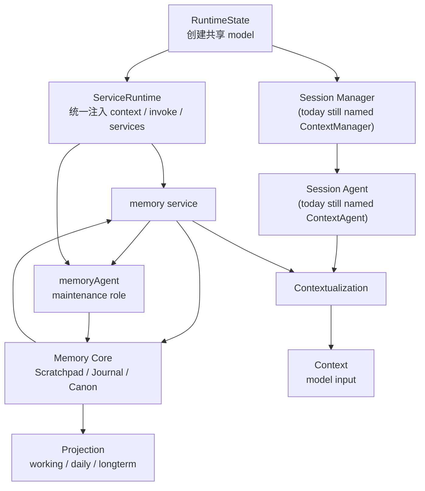
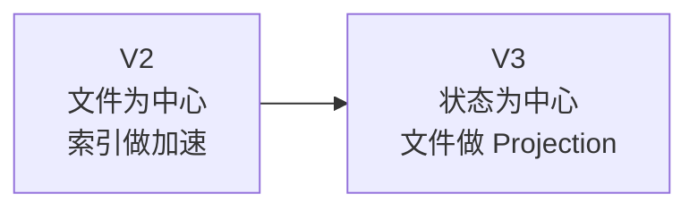
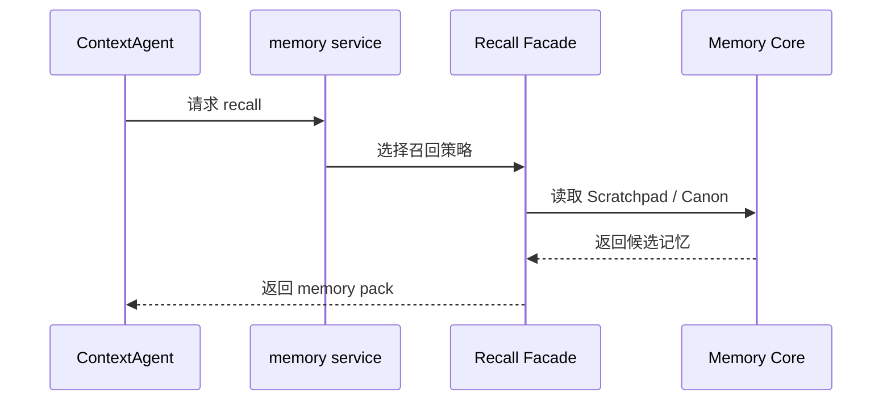
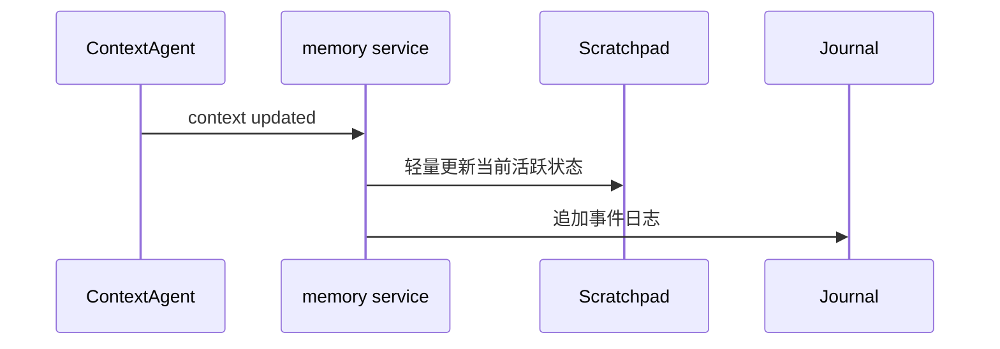
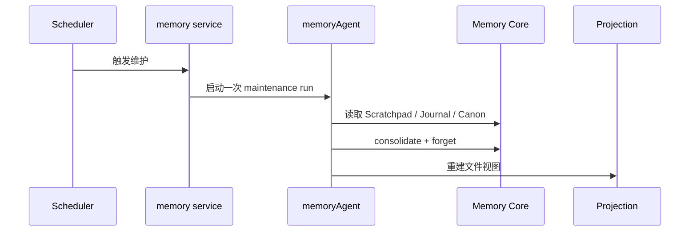

# Memory Service 框架文档

这一页专门回答一个核心问题：

```text
在 Downcity 当前 package 逻辑里，Memory 到底应该挂在哪里？
```

这件事必须先说清楚，否则后面的 `memoryAgent`、`LLM`、`service`、`projection` 都会混。

## 先把 package 里的真实角色摆正

当前仓库里，最重要的几个事实是：

### 1. 主模型是在 runtime 启动时统一创建的

当前主模型实例在 `packages/downcity/src/agent/context/manager/RuntimeState.ts` 启动阶段创建，并通过 `ServiceRuntime.context.model` 暴露给系统使用。

这意味着：

- 模型生命周期属于 runtime
- 不是某个 service 自己偷偷管理一套模型

### 2. 主执行体今天代码里叫 `ContextAgent`

`packages/downcity/src/agent/context/context-agent/ContextAgent.ts` 里的 `ContextAgent`，本质上是当前 `contextId` 下的 Agent 装配器。

说明：

- 从代码命名上它还叫 `ContextAgent`
- 但从新的文档语义上，它更接近 `SessionAgent`

它负责：

- 承接当前请求
- 基于当前 Session 组织本轮 Context
- 驱动实际 `Agent` 执行

### 3. task 会临时创建 Agent，但它不是另一个长期主轴

`packages/downcity/src/services/task/runtime/Runner.ts` 会在 task runtime 中创建临时 `Agent` 实例。

但它的角色更像：

- 某个运行场景下的专用执行体

而不是：

- 平级于 `ContextAgent` 的另一套长期架构中心

### 4. service 层是能力编排层

`ServiceRuntime`、`ServiceManager`、`Manager` 这一组模块承载的是：

- service 生命周期
- service action 调用
- 跨 service 注入能力

所以 Memory 在 package 里的正确宿主，应当首先是：

- 一个 service

## 所以结论先说

在当前 package 逻辑里，Memory 的正确位置是：

- `memory service` 是宿主
- `ContextAgent` 是使用者
- `memoryAgent` 是 `memory service` 内部的后台整理角色
- `LLM` 是被借用的整理能力，不是 Memory 的宿主

## 一张图看整体位置



这张图想表达的不是“多了一个新系统”，而是：

- Memory 被放回了现有 runtime 主轴里
- `memoryAgent` 只是 `memory service` 的内部维护回路
- Session、Memory 共同参与 Contextualization，最终影响模型真正看到的 Context

## 系统里到底哪里有 Agent

这个问题用户前面已经明确指出过，必须重新考虑。

所以这里直接拆开说。

### 第一种：真正的主执行 Agent

就是：

- `ContextAgent`

它是系统当前面对请求、推进执行的主入口。

### 第二种：运行场景里的临时 Agent

比如：

- task runtime 里临时创建的 `Agent`

它们存在，但不应该反过来重写整个系统主结构。

### 第三种：`memoryAgent`

这里最容易误解。

在这份设计里，`memoryAgent` 更准确的意思不是：

- 一个常驻的、平级的、对话型 Agent

而是：

- `memory service` 内部用于维护 Memory 的“agent role”

它可以实现成：

- 一个定时维护 worker
- 一次后台维护 job
- 一次借助共享模型完成整理的内部流程

换句话说，`memoryAgent` 是一个角色，不一定非要先变成一个平级顶层对象。

## 系统里到底哪里有 LLM

同样也要说清楚。

### LLM 的正确位置

当前 runtime 启动时已经创建共享模型。

所以 Memory 最合理的做法是：

- 需要 LLM 时，向 runtime 借能力
- 不自己管理第二套模型生命周期

### LLM 适合参与什么

- 归纳多条 Journal
- 聚合同主题候选记忆
- 重写 Canon 文本
- 处理冲突和覆盖关系

### LLM 不适合承包什么

- 每条消息的即时写入
- 每次 recall 的基础排序
- 每次 context 更新都强制总结

一句话就是：

```text
LLM 在 Memory 里应该是冷路径助手，不是热路径地基。
```

## 系统里到底哪里有 service

Memory 放在 service 层，有三个非常直接的好处：

### 1. 生命周期清楚

可以跟随 runtime 启停。

### 2. 能力边界清楚

读写、检索、维护、投影都能归到同一个 service。

### 3. 能和现有 action / CLI / API 体系自然对接

当前 memory service 已经有：

- `search`
- `get`
- `store`
- `flush`
- `index`
- `status`

这说明现有 package 已经给了 Memory 一个很自然的宿主壳子。

## 当前 V2 已经有什么

这一点很重要，因为 V3 不是空想。

当前 `services/memory` 已经具备这些能力：

### 文件层

- `working` 记忆
- `daily` 记忆
- `longterm` 记忆

### 索引层

- SQLite + FTS5 本地索引
- 文件变化 watcher
- 定时增量同步

### action 层

- `memory.search`
- `memory.get`
- `memory.store`
- `memory.flush`
- `memory.index`
- `memory.status`

也就是说，当前 V2 更像：

- 基于 Markdown 文件的可检索 Memory service

## V3 要在什么地方升级

V3 不是推翻宿主结构，而是升级内部逻辑。

### V2 的中心偏向文件

今天更像：

- `working / daily / longterm` 是事实源
- SQLite 是检索加速器

### V3 的中心偏向状态

未来更像：

- `Scratchpad / Journal / Canon` 是核心状态
- `working / daily / longterm` 退成 projection

可以用这张图看：



## Memory Service 的内部框架

我建议把它拆成 4 个部分看。

### 1. Memory Core

真正承载状态：

- `Scratchpad`
- `Journal`
- `Canon`

### 2. Recall Facade

对外只暴露：

- 怎么查
- 怎么拿
- 这次该给 `ContextAgent` 什么 memory pack

### 3. Maintenance Loop

负责：

- curate
- consolidate
- forget
- project

### 4. Projection Layer

负责把内部状态投影回：

- `working.md`
- `daily/*.md`
- `MEMORY.md`

## 一轮真实调用是怎么流的

### 场景一：当前回答需要历史



这里的关键点是：

- recall 不等于把全部 Memory 打开
- recall 是“为当前问题选一小包相关记忆”

### 场景二：当前上下文更新了

当前 package 里，`ContextManager.afterContextUpdatedAsync` 已经为 Memory 这样的异步后处理留出了入口。

最合理的 V3 行为是：



这里仍然坚持一条原则：

- 热路径只写，不重整理

### 场景三：后台维护



## 为什么这里不需要什么“cmd:memory”中心概念

用户前面已经明确纠正过这一点，这里顺手说清楚。

`cmd:memory` 最多只能算一种口语表达。

真正的设计中心不应该是：

- 一个神秘命令入口

而应该是：

- Memory 是一套状态逻辑
- `memory service` 是它的宿主
- `ContextAgent` 和后台维护都通过这个宿主来读写它

## 一句话总结

```text
Memory Service 是 Downcity 里负责长期状态的宿主：在线时为 ContextAgent 提供记忆，离线时把零散经验慢慢整理成稳定状态。
```
