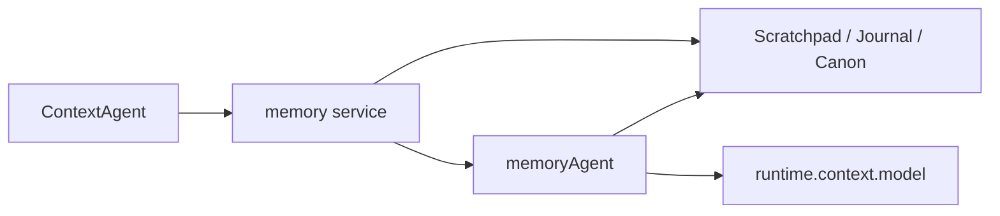
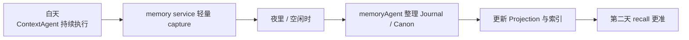
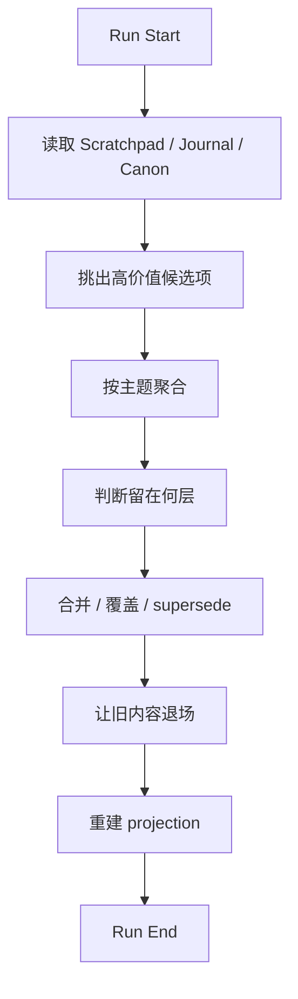
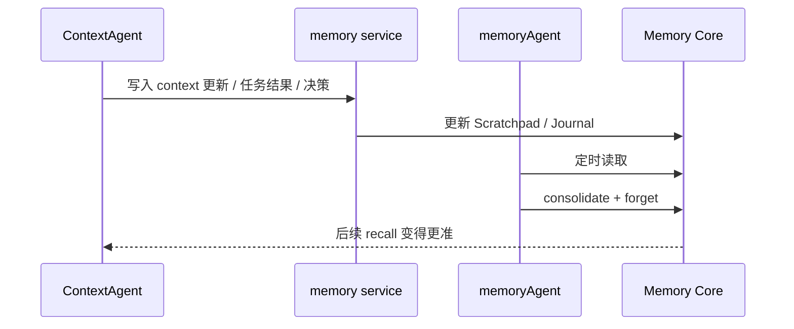

# memoryAgent 工作逻辑

这一页只讲一件事：

```text
memoryAgent 到底是什么，它到底怎么工作？
```

## 先给最短定义

在 Downcity 的正确设计里，`memoryAgent` 不是第二个主执行 Agent。

它更准确的定义是：

- `memory service` 内部的后台整理角色

它的核心职责只有一句话：

- 把零散的过去，整理成以后还能继续用的状态

## memoryAgent 不是谁

先把几个常见误解排除掉。

### 它不是和 `ContextAgent` 平级的主 Agent

主执行体仍然是：

- `ContextAgent`

### 它不是一个必须长期常驻对话的角色

`memoryAgent` 更像一个维护 job，未必需要一直挂着等输入。

### 它不是“每来一条消息就跑一次模型总结”

那样会把热路径做重，也会让 Memory 充满低质量总结。

### 它也不是 Memory 本身

Memory 是状态系统。

`memoryAgent` 只是这个状态系统的整理工。

## memoryAgent 为什么成立

因为“当前执行”和“长期整理”是两种完全不同的劳动。

| 角色 | 主要目标 | 时间尺度 |
| --- | --- | --- |
| `ContextAgent` | 把当前这一步做好 | 秒级 |
| `memoryAgent` | 把过去整理成长期状态 | 分钟、小时、天 |

一句话：

```text
ContextAgent 负责现在，memoryAgent 负责时间。
```

## memoryAgent 在系统里的位置



这张图有两个重点：

1. `memoryAgent` 是从属于 `memory service` 的
2. 它需要模型时，借用 runtime 已有的 model，而不是自己长一套新的

## memoryAgent 更像“角色”，不一定先是“类”

这一点非常重要。

在设计层面，我们可以说 `memoryAgent`。

但落实到 package 时，它完全可以实现成下面任意一种形态：

- 一个定时维护函数
- 一个 maintenance runner
- 一个内部 worker
- 一次带模型参与的后台整理 job

所以不要被名字骗了。

`memoryAgent` 的重点不是“先创造一个新顶层对象”，而是：

- 让长期整理这件事有独立职责

## 它平时到底处理什么输入

`memoryAgent` 的输入不应该是“整段历史原样塞进去，让模型自己想”。

更合理的输入应该是：

- 最近一段时间的 `Journal`
- 当前 `Scratchpad`
- 现有 `Canon`
- 少量高价值候选记忆
- 一些元信息，比如最近是否被召回、是否冲突、是否已过期

一句话：

- 它处理的是“已初步结构化的材料”，不是全部原始噪音

## 它最终产出什么

我理想中的 `memoryAgent` 每次运行，主要产出 4 类结果。

### 1. 更新 `Canon`

把值得长期保留的内容写成当前有效版本。

### 2. 清理旧状态

让这些内容退出活跃层：

- 已过期
- 被覆盖
- 长期未再使用
- 明显低价值

### 3. 保持 `Journal` 可追溯但不过载

也就是：

- 保留事件线索
- 不让它膨胀成垃圾堆

### 4. 重建 Projection

把当前状态映射回：

- `working.md`
- `daily/*.md`
- `MEMORY.md`

## 它什么时候运行

最合理的是三种触发方式同时存在。

### 1. 定时触发

这是最关键的。

例如：

- 每天夜里做一次重整理
- 每隔几小时做一次轻整理

### 2. 阈值触发

例如：

- `Journal` 新增很多条
- 某个 `contextId` 长时间活跃
- 某一类候选记忆积累到一定量

### 3. 手动触发

适合：

- 调试
- 导入旧数据后重建
- 大版本迁移
- 索引异常后的修复

## 我理想中的 daily rhythm

如果把它想成一个白天和夜晚的节奏，会很好理解。



这就是 Memory 最应该有的气质：

- 白天别打扰主流程
- 晚上慢慢把账理清

## 一次 `memoryAgent` run 的工作流



## 拆开看这 7 步

### 第一步：读取状态

读取：

- 当前活跃 scratchpad
- 最近 journal 窗口
- 当前 canon

### 第二步：挑候选

挑出真正值得处理的内容，比如：

- 明显稳定的偏好
- 重复出现的失败模式
- 已经形成的决策

### 第三步：聚合同主题

把零散事件聚成“同一个东西”，例如：

- 关于同一用户偏好的多次表达
- 关于同一路失败路径的多个事件

### 第四步：决定去向

判断它应该：

- 留在 `Scratchpad`
- 留在 `Journal`
- 升级进入 `Canon`

### 第五步：合并旧版本

如果 `Canon` 里已经有旧版本，需要处理：

- 更新
- 覆盖
- 标记 `superseded`

### 第六步：遗忘与退场

清退：

- 过期项
- 重复项
- 噪音项
- 已被覆盖项

### 第七步：投影

把最终状态重新映射回人能读、系统能检索的文件和索引。

## 它什么时候需要 LLM

`memoryAgent` 可以用 LLM，但不应该把所有事情都交给 LLM。

### 适合用 LLM 的地方

- 多条 Journal 的归并与抽象
- Canon 的表述重写
- 冲突记忆的统一表达
- 复杂候选项的分类判断

### 不适合用 LLM 的地方

- 每一条消息都即时总结
- 每一次 context 更新都跑长链分析
- recall 时做基础检索和排序

最稳妥的策略是：

- 规则先过一遍
- 模型只处理真正复杂的部分

## 它和 `ContextAgent` 到底怎么协作

最简单的理解方式是：

- `ContextAgent` 产生日志
- `memoryAgent` 整理日志



它们不是竞争关系，而是前后工序关系。

## 失败时应该怎么处理

`memoryAgent` 的失败不应该拖垮主流程。

所以设计上应当坚持：

### 失败隔离

- 后台整理失败，不影响当前回答

### 幂等重跑

- 下次维护可以继续补跑

### 可观测

- 记录最后一次整理时间
- 记录失败原因
- 记录本轮处理数量

## 一句话结尾

```text
memoryAgent 不是另一个会聊天的主角，而是 memory service 里那个安静、持续、专门负责“把过去整理成未来资源”的后台编辑器。
```
