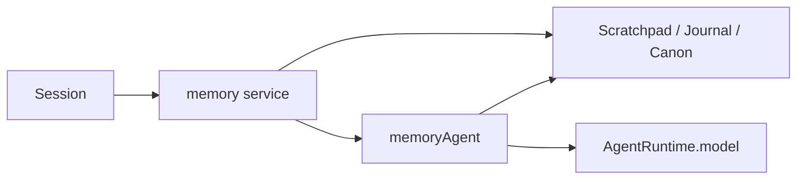
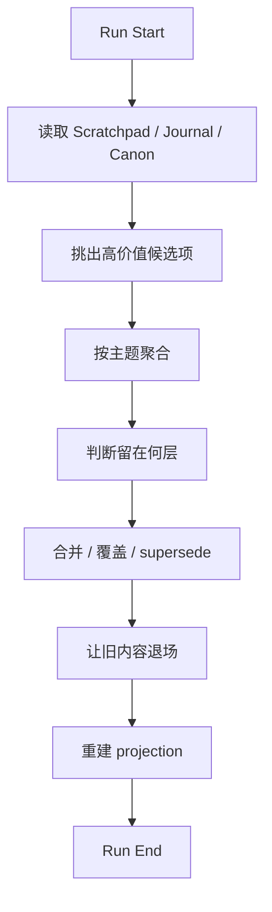

# memoryAgent 工作逻辑

这一页只讲一件事：

```text
memoryAgent 到底是什么，它到底怎么工作？
```

## 先给最短定义

在 Downcity 的正确设计里，`memoryAgent` 不是第二个主执行体。

它更准确的定义是：

- `memory service` 内部的后台整理角色

它的核心职责只有一句话：

- 把零散的过去，整理成以后还能继续用的状态

## memoryAgent 不是谁

### 它不是和 Session 平级的主执行体

主执行主轴仍然是：

- `SessionFacade -> SessionEngine`

### 它不是一个必须长期常驻对话的角色

`memoryAgent` 更像一个维护 job，未必需要一直挂着等输入。

### 它不是“每来一条消息就跑一次模型总结”

那样会把热路径做重，也会让 Memory 充满低质量总结。

### 它也不是 Memory 本身

Memory 是状态系统。

`memoryAgent` 只是这个状态系统的整理工。

## memoryAgent 为什么成立

因为“当前执行”和“长期整理”是两种完全不同的劳动。

| 角色 | 主要目标 | 时间尺度 |
| --- | --- | --- |
| `Session` | 把当前这一步做好 | 秒级 |
| `memoryAgent` | 把过去整理成长期状态 | 分钟、小时、天 |

一句话：

```text
Session 负责现在，memoryAgent 负责时间。
```

## memoryAgent 在系统里的位置



这张图有两个重点：

1. `memoryAgent` 是从属于 `memory service` 的
2. 它需要模型时，借用 runtime 已有的 model，而不是自己长一套新的

## memoryAgent 更像“角色”，不一定先是“类”

在设计层面，我们可以说 `memoryAgent`。

但落实到 package 时，它完全可以实现成：

- 一个定时维护函数
- 一个 maintenance runner
- 一个内部 worker
- 一次带模型参与的后台整理 job

所以重点不是“先创造一个新顶层对象”，而是：

- 让长期整理这件事有独立职责

## 它平时到底处理什么输入

`memoryAgent` 的输入不应该是“整段历史原样塞进去，让模型自己想”。

更合理的输入应该是：

- 最近一段时间的 `Journal`
- 当前 `Scratchpad`
- 现有 `Canon`
- 少量高价值候选记忆
- 一些元信息，比如最近是否被召回、是否冲突、是否已过期

一句话：

- 它处理的是“已初步结构化的材料”，不是全部原始噪音

## 它最终产出什么

我理想中的 `memoryAgent` 每次运行，主要产出 4 类结果。

### 1. 更新 `Canon`

把值得长期保留的内容写成当前有效版本。

### 2. 清理旧状态

让这些内容退出活跃层：

- 已过期
- 被覆盖
- 长期未再使用
- 明显低价值

### 3. 保持 `Journal` 可追溯但不过载

也就是：

- 保留事件线索
- 不让它膨胀成垃圾堆

### 4. 重建 Projection

把当前状态映射回：

- `working.md`
- `daily/*.md`
- `MEMORY.md`

## 它什么时候运行

最合理的是三种触发方式同时存在。

### 1. 定时触发

例如：

- 每天夜里做一次重整理
- 每隔几小时做一次轻整理

### 2. 阈值触发

例如：

- `Journal` 新增很多条
- 某个 Session 长时间活跃
- 某一类候选记忆积累到一定量

### 3. 手动触发

适合：

- 调试
- 导入旧数据后重建
- 大版本迁移
- 索引异常后的修复

## 我理想中的 daily rhythm


这就是 Memory 最应该有的气质：

- 白天别打扰主流程
- 晚上慢慢把账理清

## 一次 memoryAgent run 的工作流



## 一句话总结

```text
memoryAgent 不是第二个主执行体，而是 memory service 内部负责把长期状态慢慢整理好的后台角色。
```
