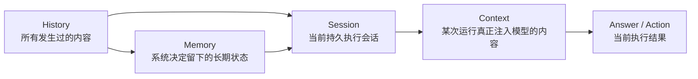
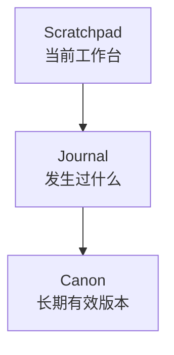
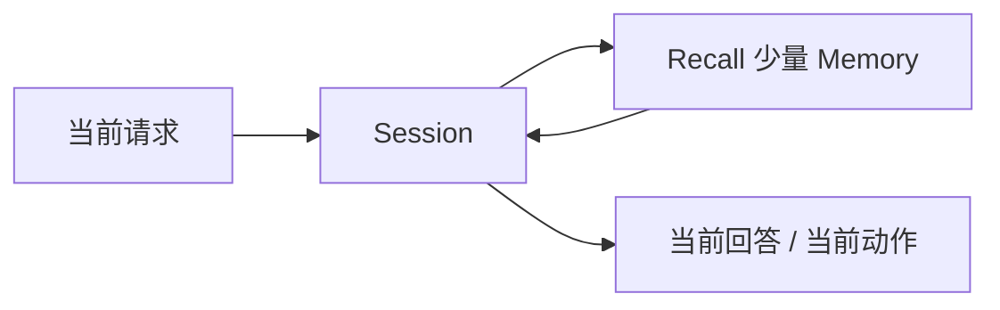
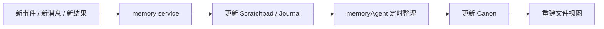

# Memory 总览

这篇文档只回答 4 个问题：

1. 为什么一定要有 Memory
2. Memory 在系统里到底管什么
3. 它和 `Session`、`memory service`、`memoryAgent`、`LLM` 分别是什么关系
4. 理想状态下，Memory 最终应该长什么样

说明：

- 本文里的 `History` 指原始记录层
- 本文里的 `Session` 指以 `sessionId` 为中心的持久执行会话
- 本文里的 `Context` 只指本次真正发给模型的输入

## 先用三句话建立感觉

### 第一句：History 不是 Memory

- `History` 是发生过的原始内容
- `Memory` 是系统决定要留下来的长期状态

### 第二句：Memory 不是 Session

- `Session` 是以 `sessionId` 为中心的执行会话
- `Memory` 是这个会话之外、跨时间存在的长期状态层

### 第三句：Memory 不是另一个主执行体

- Downcity 当前真正的执行主轴是 `SessionFacade -> SessionEngine`
- Memory 的正确位置是一个长期状态系统，由 `memory service` 承载

## 为什么一定要有 Memory

没有 Memory，系统会反复遇到四类问题：

### 1. 会话一断就失去长期偏好

比如：

- 用户昨天说过偏好
- 今天又得从头再讲

### 2. 每次都像第一次做事

比如：

- 某种方案已经失败过
- 下一次还是重新试一遍

### 3. 历史越来越长，但重点越来越少

比如：

- 原始消息堆得很多
- 真正重要的结论却埋掉了

### 4. 旧结论会污染新决策

比如：

- 临时成立的判断后来失效了
- 系统却还在继续依赖它

所以 Memory 的目标不是“记得更多”，而是：

- 让系统下次还能站在上次的肩膀上
- 让真正重要的状态留下来
- 让过时的东西自己退下去

## 一张图看全景



一句话解释：

- 历史是原材料
- 记忆是提纯后的状态
- Session 是当前会话容器
- Context 是它这一次真正要用的那一小部分

## 在 Downcity 里，谁负责什么

把这四个角色分清楚，后面大部分问题都会清楚。

| 角色 | 真正职责 | 不负责什么 |
| --- | --- | --- |
| `Session` | 承接当前执行、推进会话、调用工具、沉淀消息 | 不负责长期整理所有记忆 |
| `memory service` | 承载 Memory 的读写、检索、整理、投影 | 不是主对话执行体 |
| `memoryAgent` | `memory service` 内部的后台整理角色 | 不是和 Session 平级的第二主执行体 |
| `LLM` | 在需要时参与推理、归纳、改写 | 不是 Memory 本身 |

## 最重要的边界

### Memory 不是聊天记录

聊天记录是原始历史。

Memory 是从历史里筛出来、以后还要继续用的部分。

### Memory 不是全文注入

好的 Memory 不是把所有旧内容都塞回模型，而是：

- 需要时再召回
- 召回时只拿最相关的一小部分

### Memory 不是第二套主循环

主循环仍然是：

- `SessionFacade` 收到输入
- `SessionEngine` 推进当前执行

Memory 主要改变：

- Session 未来会沉淀出什么长期状态
- 后续 contextualization 时模型会看见什么

## 我理想中的 Memory，不是一个仓库，而是三层状态



### `Scratchpad`

表示当前还在活跃使用的状态，比如：

- 当前目标
- 当前约束
- 当前开放问题
- 下一步计划

### `Journal`

表示事件时间线，比如：

- 某次决策
- 某次失败
- 某次任务结果
- 某次用户反馈

### `Canon`

表示以后默认还要继续依赖的版本，比如：

- 稳定偏好
- 长期规则
- 当前有效决策
- 稳定事实

## 一轮执行里，Memory 怎么流

### 热路径

面向当前执行，要求轻、快、低延迟。



### 冷路径

面向长期整理，允许慢、允许归纳、允许重写。



## 当前 package 里的一个关键事实

当前仓库里已经有一个 `memory service`。

它现在主要做的是：

- 管理 `working / daily / longterm` 这三类 Markdown 文件
- 建立本地 SQLite FTS 索引
- 提供 `search / get / store / flush / index / status`

所以这份设计不是从零发明新系统，而是：

- 先尊重现在 package 的宿主结构
- 再把它演进成更清晰的三层状态系统

## 一句话总结

```text
Memory 在 Downcity 里是长期状态层：它不替代 Session，而是帮助 Session 在跨时间的尺度上保留真正值得继续依赖的信息。
```
