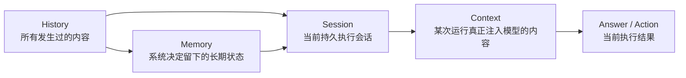
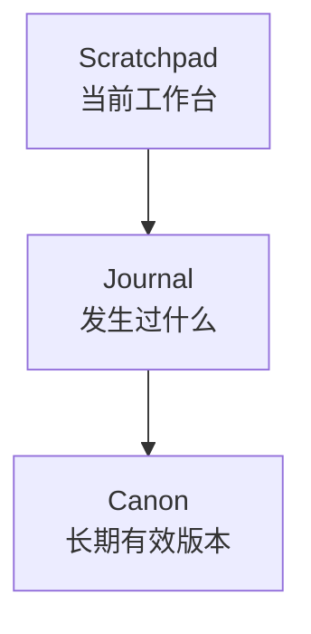
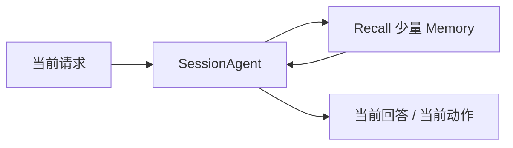

# Memory 总览

如果只想先抓住 Downcity Memory 的感觉，这一页就够了。

这篇文档只回答 4 个问题：

1. 为什么一定要有 Memory
2. Memory 到底在系统里管什么
3. 它和 `SessionAgent`、`memory service`、`memoryAgent`、`LLM` 分别是什么关系
4. 理想状态下，Memory 最终应该长什么样

说明：

- 本文里的 `History` 指“历史层/原始记录层”
- 不专指某一个具体文件
- 本文里的 `Session` 指“以 `contextId` 为中心的持久执行会话”
- 本文里的 `Context` 只指“本次真正发给模型的输入”
- 如果你想先看清楚 `history.jsonl`、`messages.jsonl`、Session 和 Memory 的边界，先看 [History 总览](/zh/devdocs/history/overview)、[Session 总览](/zh/devdocs/session/overview) 和 [Context 总览](/zh/devdocs/context/overview)

## 先用三句话建立感觉

### 第一句：History 不是 Memory

- `History` 是原始记录层里“发生过的东西”
- `Memory` 是系统决定要留下来的东西

### 第二句：Memory 不是 Session

- `Session` 是以 `contextId` 为中心的执行会话
- `Memory` 是这个会话之外、跨时间存在的长期状态层

### 第三句：Memory 不是另一个主 Agent

- Downcity 当前真正的主执行体就是 `SessionAgent`
- Memory 的正确位置是一个长期状态系统，由 `memory service` 承载

## 为什么一定要有 Memory

没有 Memory，系统会反复遇到四类问题：

### 1. 会话一断就失忆

比如：

- 用户昨天说过偏好
- 今天又得从头再讲

### 2. 每次都像第一次做事

比如：

- 某种方案已经失败过
- 下一次还是重新试一遍

### 3. 历史越来越长，但重点越来越少

比如：

- 原始消息堆得很多
- 真正重要的结论却埋掉了

### 4. 旧结论会污染新决策

比如：

- 曾经临时成立的判断后来失效了
- 系统却还在继续依赖它

所以 Memory 的目标不是“记得更多”，而是：

- 让系统下次还能站在上次的肩膀上
- 让真正重要的状态留下来
- 让过时的东西自己退下去

## 一张图看全景

先记住这张图。



一句话解释：

- 历史是原材料
- 记忆是提纯后的状态
- Session 是当前会话容器
- Context 是它这一次真正要用的那一小部分

## 在 Downcity 里，谁负责什么

把这四个角色分清楚，后面大部分问题都会清楚。

| 角色 | 真正职责 | 不负责什么 |
| --- | --- | --- |
| `SessionAgent` | 执行当前这一步，回答问题，调用工具，推进任务 | 不负责长期整理所有记忆 |
| `memory service` | 承载 Memory 的读写、检索、整理、投影 | 不是主对话 Agent |
| `memoryAgent` | `memory service` 内部的后台整理角色 | 不是和 `SessionAgent` 平级的第二主 Agent |
| `LLM` | 在需要时参与推理、归纳、改写 | 不是 Memory 本身 |

## 最重要的边界

### Memory 不是聊天记录

聊天记录是原始历史。

Memory 是从历史里筛出来、以后还要继续用的部分。

### Memory 不是全文注入

好的 Memory 不是把所有旧内容都塞回模型，而是：

- 需要时再召回
- 召回时只拿最相关的一小部分

### Memory 不是第二套主循环

主循环仍然是：

- `SessionAgent` 收到输入
- `SessionAgent` 推进当前执行

Memory 主要改变：

- Session 未来会沉淀出什么长期状态
- 后续 contextualization 时模型会看见什么
- 系统留下了什么

### Memory 也不是“另起一个模型”

在当前 package 逻辑里，模型实例是在 runtime 启动时创建并注入系统的。

Memory 不应该再偷偷长出一套独立模型生命周期。

## 我理想中的 Memory，不是一个仓库，而是三层状态



### `Scratchpad`

表示当前还在活跃使用的状态，比如：

- 当前目标
- 当前约束
- 当前开放问题
- 下一步计划

### `Journal`

表示事件时间线，比如：

- 某次决策
- 某次失败
- 某次任务结果
- 某次用户反馈

### `Canon`

表示以后默认还要继续依赖的版本，比如：

- 稳定偏好
- 长期规则
- 当前有效决策
- 稳定事实

## 这三层为什么有用

因为它们刚好把三种完全不同的问题分开了：

| 状态层 | 回答的问题 |
| --- | --- |
| `Scratchpad` | 我现在正在处理什么？ |
| `Journal` | 之前到底发生过什么？ |
| `Canon` | 以后默认按什么来？ |

这件事看起来简单，但它会直接决定 Memory 是否会越用越乱。

## 一轮执行里，Memory 到底怎么流

可以把它理解成两条路：

### 热路径

面向当前执行，要求轻、快、低延迟。



### 冷路径

面向长期整理，允许慢、允许归纳、允许重写。


一句话就是：

- 在线时先把事做完
- 离线时再慢慢把经验整理出来

## 当前 package 里的一个关键事实

当前仓库里已经有一个 `memory service`。

它现在主要做的是：

- 管理 `working / daily / longterm` 这三类 Markdown 文件
- 建立本地 SQLite FTS 索引
- 提供 `search / get / store / flush / index / status`

所以这份设计不是“从零发明一个全新的 Memory 世界”，而是：

- 先尊重现在 package 的宿主结构
- 再把它演进成更清晰的三层状态系统

也就是：

- 当前文件层：`working / daily / longterm`
- 目标状态层：`Scratchpad / Journal / Canon`

文件继续保留，但更像视图；真正的中心应逐渐变成状态系统。

## 我理想中的最终形态

我理想中的 Downcity Memory，有这 6 个特征：

1. `SessionAgent` 仍然是唯一主执行体
2. `memory service` 是 Memory 的唯一宿主
3. `memoryAgent` 只是 service 内部的后台整理角色
4. 热路径轻，冷路径重
5. 文件可读可改，但不再承担全部事实语义
6. 每条重要记忆都能解释：从哪来、为什么还有效、为什么这次被召回

## 一句话记住

```text
Downcity 的 Memory，不是“保存历史”，而是“把历史慢慢变成以后还能继续用的状态”。
```

## 建议阅读顺序

建议按这个顺序继续往下看：

1. `Memory 设计哲学`
2. `Memory Service 框架文档`
3. `memoryAgent 工作逻辑`
4. `Memory V3 技术设计稿`
