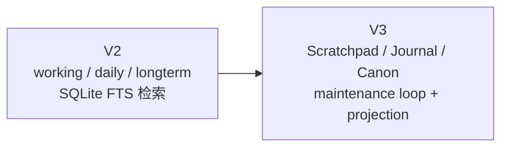
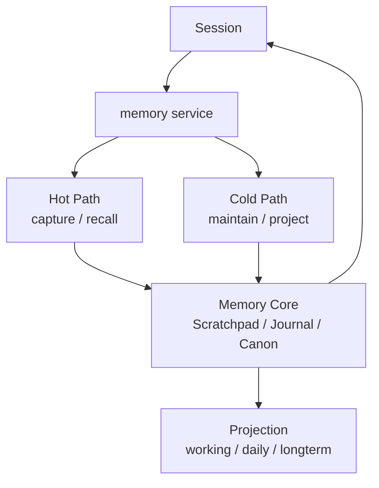
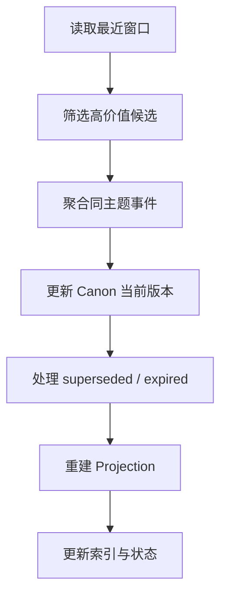

# Memory V3 技术设计稿

这一篇开始讲：

```text
如果要在当前 packages/downcity 里把 Memory 真正做出来，V3 应该长什么样？
```

## 设计前提

V3 建立在 4 个已经明确的前提上：

1. Session 主轴仍然是主执行体
2. `memory service` 是 Memory 的宿主
3. `memoryAgent` 是 service 内部的后台维护角色
4. 共享 `AgentState.model`，不再新造一套主模型生命周期

## V3 不是什么

- 不是把当前 `memory.search` 做得更花
- 不是把所有历史自动总结一遍
- 不是把 Memory 变成第二个对话系统

V3 真正要做的是：

- 把当前“文件 + 索引”的 Memory 升级成“状态 + 维护回路 + Projection”的系统

## V2 到 V3 的核心变化



### V2 的优点

- 简单
- 文件可读
- 已经能检索
- 宿主结构是对的，因为它已经是 service

### V2 的不足

- 文件本身既像事实源，又像展示层，语义混在一起
- 缺少明确的 `Scratchpad / Journal / Canon` 分层
- 缺少真正的长期整理与退场机制

### V3 的方向

- 内部以状态为中心
- 外部继续保留文件视图
- 热路径和冷路径彻底分开
- 后台维护成为正式机制

## V3 的最小架构



## V3 的核心状态模型

### 1. `Scratchpad`

作用：

- 描述当前活跃工作台

特点：

- 粒度小
- 强上下文相关
- 更新频率高
- 生命周期短

### 2. `Journal`

作用：

- 记录已经发生的事件

特点：

- 以时间线为主
- 可追溯
- 可筛选
- 是 `Canon` 的原料池

### 3. `Canon`

作用：

- 保留当前有效的长期状态

特点：

- 强版本意识
- 允许被覆盖
- 允许过期
- 默认是 recall 的高价值来源

## V3 的动作协议

建议把动作分成三组：

### 热路径动作

| 动作 | 作用 |
| --- | --- |
| `capture` | 轻量更新 `Scratchpad` / 追加 `Journal` |
| `recall` | 为当前请求构造 memory pack |
| `status` | 返回当前 Memory 健康状态 |

### 冷路径动作

| 动作 | 作用 |
| --- | --- |
| `curate` | 筛候选、去噪音 |
| `consolidate` | 聚合并生成 Canon 当前版本 |
| `forget` | 让旧内容失效、归档、退场 |
| `project` | 把状态投影回文件视图与索引 |

### 运维动作

| 动作 | 作用 |
| --- | --- |
| `rebuild` | 全量重建状态或 Projection |
| `repair` | 修复异常状态 |
| `reindex` | 重建检索索引 |

## 热路径应该怎么做

### 写入时

发生新事件后：

1. 更新 `Scratchpad`
2. 追加 `Journal`
3. 标记候选整理任务

不要在这里做：

- 大段总结
- 多轮推理
- Canon 重写

### recall 时

建议默认优先级：

1. 当前 session 的 `Scratchpad`
2. 当前 session 的 `Canon`
3. project scope 的 `Canon`
4. 必要时回查 `Journal`

## 冷路径应该怎么做

冷路径由 maintenance loop 驱动。



## 一句话总结

```text
Memory V3 的核心，不是做出更花的检索，而是把当前 Memory 从“文件 + 索引”升级成“状态 + 维护回路 + projection”的系统。
```
