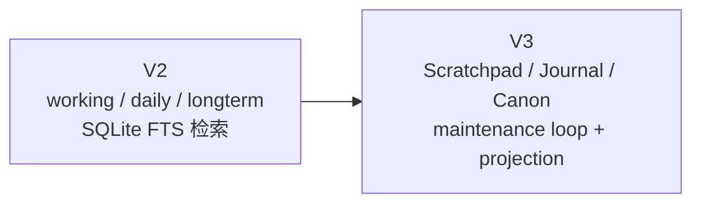
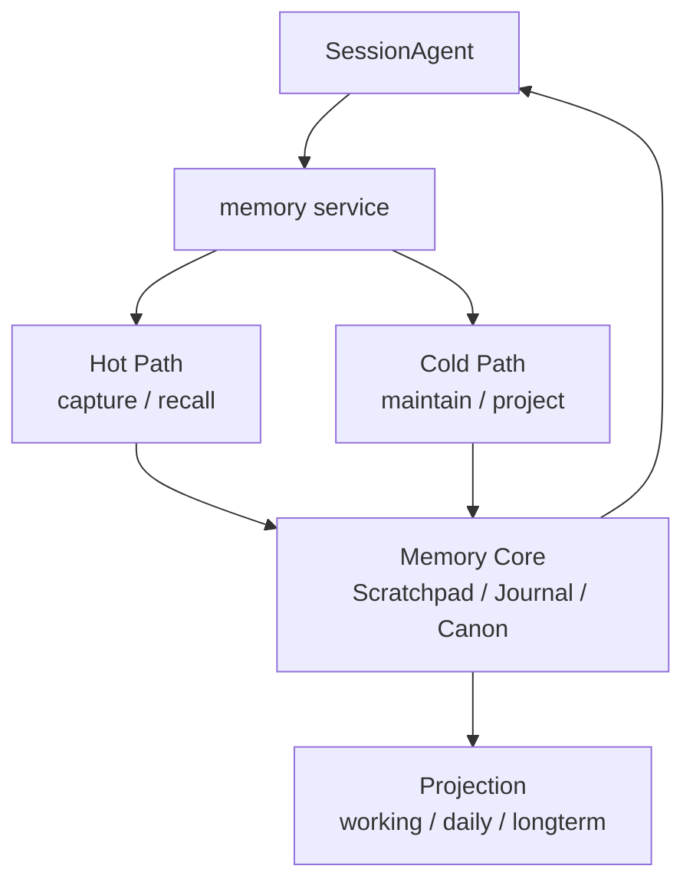
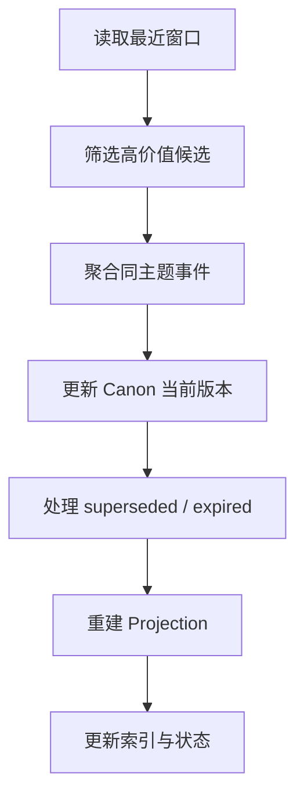

# Memory V3 技术设计稿

前面几篇文档讲的是“为什么”和“怎么理解”。

这一篇开始讲：

```text
如果要在当前 packages/downcity 里把 Memory 真正做出来，V3 应该长什么样？
```

## 设计前提

V3 建立在 4 个已经明确的前提上：

1. `SessionAgent` 仍然是主执行体
2. `memory service` 是 Memory 的宿主
3. `memoryAgent` 是 service 内部的后台维护角色
4. 共享 `runtime.session.model`，不再新造一套主模型生命周期

## V3 不是什么

先说清楚它不是什么：

- 不是把当前 `memory.search` 做得更花
- 不是把所有历史自动总结一遍
- 不是把 Memory 变成第二个对话系统

V3 真正要做的是：

- 把当前“文件 + 索引”的 Memory 升级成“状态 + 维护回路 + Projection”的系统

## V2 到 V3 的核心变化



### V2 的优点

- 简单
- 文件可读
- 已经能检索
- 宿主结构是对的，因为它已经是 service

### V2 的不足

- 文件本身既像事实源，又像展示层，语义混在一起
- 缺少明确的 `Scratchpad / Journal / Canon` 分层
- 缺少真正的长期整理与退场机制
- `working / daily / longterm` 和“为什么会被召回”之间缺少状态解释

### V3 的方向

- 内部以状态为中心
- 外部继续保留文件视图
- 热路径和冷路径彻底分开
- 后台维护成为正式机制

## V3 的最小架构



## V3 的核心状态模型

V3 仍然建议只保留三层。

### 1. `Scratchpad`

作用：

- 描述当前活跃工作台

特点：

- 粒度小
- 强上下文相关
- 更新频率高
- 生命周期短

典型内容：

- 当前目标
- 当前约束
- 当前开放问题
- 下一步计划

### 2. `Journal`

作用：

- 记录已经发生的事件

特点：

- 以时间线为主
- 可追溯
- 可筛选
- 是 `Canon` 的原料池

典型内容：

- 用户新偏好
- 某次决策
- 某次失败
- 某次任务结果

### 3. `Canon`

作用：

- 保留当前有效的长期状态

特点：

- 强版本意识
- 允许被覆盖
- 允许过期
- 默认是 recall 的高价值来源

典型内容：

- 稳定偏好
- 长期规则
- 当前仍有效的决策
- 可复用的失败模式

## 一个真实例子

假设用户今天说了三件事：

1. “以后默认用中文回复”
2. “上一次那个方案失败了，因为 API 超时”
3. “这轮先把文档写完，不要改代码”

在 V3 里，理想流动应该是：

### 当下

- 第 3 条先进入 `Scratchpad`

### 今天的记录

- 第 1、2、3 条都可以进入 `Journal`

### 整理之后

- 第 1 条可能升级进 `Canon.preference`
- 第 2 条可能升级进 `Canon.failure_pattern`
- 第 3 条多数情况下只留在 `Scratchpad` 或 `Journal`

这就是三层状态各自的意义：

- 不是每条信息都值得长期化
- 不是每条信息都要一直活着

## V3 的动作协议

我建议把动作分成三组来看。

### 一组：热路径动作

这些动作会经常发生，要求轻。

| 动作 | 作用 |
| --- | --- |
| `capture` | 轻量更新 `Scratchpad` / 追加 `Journal` |
| `recall` | 为当前请求构造 memory pack |
| `status` | 返回当前 Memory 健康状态 |

### 一组：冷路径动作

这些动作由维护回路驱动。

| 动作 | 作用 |
| --- | --- |
| `curate` | 筛候选、去噪音 |
| `consolidate` | 聚合并生成 Canon 当前版本 |
| `forget` | 让旧内容失效、归档、退场 |
| `project` | 把状态投影回文件视图与索引 |

### 一组：运维动作

用于手工修复和迁移。

| 动作 | 作用 |
| --- | --- |
| `rebuild` | 全量重建状态或 Projection |
| `repair` | 修复异常状态 |
| `reindex` | 重建检索索引 |

## 热路径应该怎么做

热路径的目标不是“聪明”，而是“稳定”。

### 写入时

发生新事件后：

1. 更新 `Scratchpad`
2. 追加 `Journal`
3. 标记候选整理任务

不要在这里做：

- 大段总结
- 多轮推理
- Canon 重写

### recall 时

建议默认优先级：

1. 当前 `contextId` 的 `Scratchpad`
2. 当前 `contextId` 的 `Canon`
3. project scope 的 `Canon`
4. 必要时回查 `Journal`

这套顺序的核心思想是：

- 当前活跃状态优先
- 稳定长期状态次之
- 原始事件日志最后再看

## 冷路径应该怎么做

冷路径由 maintenance loop 驱动。



### 冷路径最重要的三个输出

1. `Canon` 更准了
2. 旧内容退场了
3. 文件视图和索引同步了

## Projection 策略

Projection 是 V3 非常关键的一层。

### 为什么必须保留 Projection

因为文件的价值依然很大：

- 人能读
- 人能改
- 便于审计
- 便于导出

### 但 Projection 不再是全部事实

建议关系是：

| Projection | 映射自什么 |
| --- | --- |
| `working.md` | `Scratchpad` |
| `daily/*.md` | `Journal` |
| `MEMORY.md` | `Canon` |

也就是说：

- 文件继续存在
- 但它们更多承担“展示”和“审计”职责

## 建议的状态字段

为了避免这一页变成纯代码，这里只讲字段思想。

### `ScratchpadItem`

至少应包含：

- `contextId`
- `kind`
- `title`
- `content`
- `updatedAt`

### `JournalEntry`

至少应包含：

- `kind`
- `summary`
- `content`
- `sourceRefs`
- `createdAt`
- 可选 `contextId`

### `CanonRecord`

至少应包含：

- `scopeType`
- `scopeId`
- `kind`
- `title`
- `summary`
- `content`
- `status`
- `confidence`
- `salience`
- `expiresAt`
- `supersedesId`
- `createdAt`
- `updatedAt`

这几个字段最关键的不是“完整”，而是让系统能表达：

- 它属于哪个范围
- 它是什么类型
- 它现在是不是有效
- 它是不是覆盖了旧版本

## memoryAgent 在 V3 里扮演什么

在 V3 里，`memoryAgent` 就是 cold path 的执行者。

它不直接决定主回答。

它决定的是：

- 哪些 Journal 值得升级
- 哪些 Canon 仍然有效
- 哪些旧结论该退场
- Projection 应该如何重建

可以把它理解成：

- Memory 的编辑部

## 当前代码可以怎样渐进演进

这部分很重要，因为我们不是重写整个系统。

### Phase 1：先建立语义分层

先在现有 `memory service` 内部明确：

- `working` 对应 `Scratchpad`
- `daily` 对应 `Journal`
- `longterm` 对应 `Canon`

这一步即使底层仍是文件中心，也已经能把概念摆正。

### Phase 2：建立真正的内部状态层

开始引入：

- 独立的 `Scratchpad / Journal / Canon` 状态存储
- recall 策略
- maintenance loop

### Phase 3：把文件退成 Projection

这时：

- 文件继续保留
- 但主语义转移到状态层
- SQLite 索引更多围绕 Projection 和 recall 服务

### Phase 4：在冷路径中逐步引入模型辅助

注意是逐步引入，而不是一上来全权交给模型。

优先顺序建议是：

1. 规则完成基础筛选
2. LLM 只处理复杂归纳和重写

## V3 成功的判断标准

如果 V3 做对了，应该出现这几个结果：

1. `SessionAgent` 的当前上下文更短，但更有信息密度
2. recall 命中率更高，不再经常捞到历史噪音
3. 旧记忆会自然退场，而不是永久堆积
4. `working / daily / longterm` 更像清晰视图，而不是互相打架的三堆文件
5. Memory 的位置和 package 的真实运行时结构完全一致

## 最后一句

```text
Memory V3 = 一个由 memory service 承载、由 memoryAgent 维护、以 Scratchpad / Journal / Canon 为核心状态、并持续投影到 working / daily / longterm 的长期状态系统。
```
