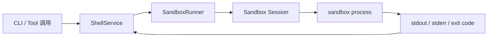

# Console Sandbox Module 设计

这页只回答一个问题：

- Downcity 现在要补一个 sandbox，最简单、最稳的设计应该是什么

先给结论：

- sandbox 不是权限系统
- sandbox 不是新的 agent runtime
- sandbox 就是 **命令执行边界**
- 当前先只保护 `cli / shell` 执行

一句话：

```text
所有 CLI 与 shell 命令，不再直接跑宿主机，而是统一先进入 SandboxRunner 再执行。
```

## 只保留一条主链

当前 package 里，最直接的改造点就是：

```text
ShellService
  -> SandboxRunner
  -> sandbox 内命令执行
  -> 返回 stdout / stderr / exit code
```

而不是：

- 重新设计 agent 权限系统
- 引入复杂 profile / binding / policy 体系
- 先讨论 chat 用户审批

这版只解决一件事：

- **执行命令时，给宿主机加一层硬边界**

## 为什么现在就该这么收缩

当前代码里的风险非常直接：

- `ShellService` 最终还是宿主机直接 `spawn(...)`
- `cwd` 只是默认收敛到 `projectRoot`
- 这不是 sandbox，只是执行位置默认值

所以第一阶段最重要的不是“权限治理有多漂亮”，而是：

```text
别再让命令直接跑在宿主机上。
```

## sandbox 在 v1 里到底是什么

在 v1 里，sandbox 只表达四类边界：

### 1. 路径边界

- 默认只看得到 `projectRoot`
- 默认只允许写：
  - `projectRoot`
  - `.downcity/`
  - 明确声明的运行目录
- 其他路径默认看不到

### 2. 环境变量边界

- 不继承宿主全部 `process.env`
- 只导出显式 allowlist 里的 env
- 默认不给：
  - `HOME`
  - `SSH_AUTH_SOCK`
  - 云凭据
  - 私有 token

### 3. 网络边界

- 默认 `off`
- 以后再扩展：
  - `restricted`
  - `full`

### 4. 资源边界

- CPU
- 内存
- 超时
- 进程数

## v1 不解决什么

这版先明确不解决：

- chat 用户是否有权限触发 shell
- human-in-the-loop 审批
- 不同 agent 的复杂差异化安全策略
- 复杂 provider marketplace
- `session -> profile -> binding` 这类治理模型

这些都可以以后再加。

当前先做：

```text
一个最小的 SandboxRunner，让 shell/cli 统一走它。
```

## 当前 package 中的合理边界

v1 里建议边界如下：

### `console`

只负责：

- 提供一个 Sandbox 配置入口
- 让 UI 能看到当前 agent 的 sandbox 基本设置

不负责：

- 直接执行命令
- 持有 shell session
- 持有 stdout/stderr

### `agent runtime`

负责：

- 持有 `ShellService`
- 在运行时读取 sandbox 配置
- 创建并调用 `SandboxRunner`

### `ShellService`

负责：

- `shell_start`
- `shell_exec`
- `shell_read`
- `shell_write`
- `shell_wait`
- `shell_close`

关键变化是：

```text
ShellService 不再直接 spawn，而是调用 SandboxRunner。
```

### `SandboxRunner`

负责：

- 创建 sandbox
- 在 sandbox 中执行命令
- 读取输出
- 写 stdin
- 等待状态变化
- 关闭 sandbox

它不需要知道 chat 业务，不需要知道审批，不需要知道用户是谁。

## 最小逻辑图



这就是 v1 的全部逻辑。

## 为什么不是 `session -> sandbox`

当前不需要把 sandbox 和 `sessionId` 强绑定。

原因很简单：

- `session` 是上层上下文
- sandbox 是执行边界
- 这版目标只是保护命令执行，不是重构整个 runtime 主轴

所以 v1 里可以用更简单的规则：

- `shell_exec`：一次命令，一个短生命周期 sandbox
- `shell_start`：一个 shell session，一个状态化 sandbox

也就是说：

```text
one-shot command -> one sandbox
long-lived shell session -> one sandbox
```

这已经足够。

## 推荐对象

v1 只保留两个核心对象。

### `SandboxConfig`

这是配置对象。

它回答的是：

- sandbox 应该长什么样

最小字段只要：

- `rootPath`
- `writablePaths`
- `envAllowlist`
- `networkMode`
- `cpuLimit`
- `memoryMiB`
- `timeoutMs`
- `maxProcesses`

### `SandboxRunner`

这是执行对象。

它回答的是：

- 如何在 sandbox 里执行命令

最小接口只要：

- `exec`
- `start`
- `read`
- `write`
- `wait`
- `close`

## 推荐的最小接口

```ts
type SandboxConfig = {
  rootPath: string;
  writablePaths: string[];
  envAllowlist: string[];
  networkMode: "off" | "restricted" | "full";
  cpuLimit?: number;
  memoryMiB?: number;
  timeoutMs?: number;
  maxProcesses?: number;
};

type SandboxRunner = {
  exec(input: { cmd: string; cwd?: string; shell?: string; login?: boolean }): Promise<...>;
  start(input: { cmd: string; cwd?: string; shell?: string; login?: boolean }): Promise<...>;
  read(input: { sandboxId: string; fromCursor?: number }): Promise<...>;
  write(input: { sandboxId: string; chars: string }): Promise<void>;
  wait(input: { sandboxId: string; afterVersion?: number; timeoutMs?: number }): Promise<...>;
  close(input: { sandboxId: string; force?: boolean }): Promise<...>;
};
```

## Console module 在 v1 里到底做什么

既然你明确要“console module 的 Sandbox”，那 v1 里它应该非常克制。

建议只做：

- `SandboxApiRoutes`
- `SandboxConfigService`

功能也只要：

- 读取当前 agent sandbox 配置
- 更新当前 agent sandbox 配置
- 预览当前 sandbox 生效边界

不要现在就做：

- provider 抽象
- profile marketplace
- binding 优先级系统

## 配置应该放哪

v1 推荐直接放 console store，保持和：

- global env
- model pool
- channel account

一致的治理方式。

最小模型只要一条“agent sandbox config”就够了。

例如：

- `agent_id`
- `enabled`
- `root_path`
- `writable_paths_json`
- `env_allowlist_json`
- `network_mode`
- `cpu_limit`
- `memory_mib`
- `timeout_ms`
- `max_processes`
- `updated_at`

## provider 先不要抽象太多

v1 里只需要在文档上留出这个概念：

- 当前 sandbox backend

但实现上先允许只有一种 backend。

例如：

- `container`

或你后面决定的本地隔离后端。

关键点不是 provider 花样，而是先把：

```text
ShellService -> 宿主直接 spawn
```

改成：

```text
ShellService -> SandboxRunner
```

## 与 shell service 的接入关系

当前 `ShellService` 保持不变的部分：

- service action 名称
- `shell_start/status/read/write/wait/close`
- shell output 落盘
- chat 自动回投逻辑

变化的只有一层：

- `runtime/ShellActionRuntime.ts` 内部不再直接 `spawn`
- 改成通过 `SandboxRunner` 启动和管理 sandbox 里的进程

这能最大程度保持协议稳定。

## 实施顺序

### Phase 1：先落类型与配置

- `SandboxConfig`
- `SandboxRunner`
- console module 配置读写

### Phase 2：先接 `shell_exec`

先把 one-shot command 接进去。

因为它最简单：

- 不需要长生命周期 stdin
- 不需要复杂状态同步

### Phase 3：再接 `shell_start`

把状态化 shell session 接进去。

### Phase 4：以后再看 task

task 是否接 sandbox，可以等 shell 稳定后再做。

## 一句话总结

```text
Downcity 的 v1 sandbox 设计，最重要的不是复杂权限模型，而是：所有 CLI 与 shell 执行统一先进入 SandboxRunner，让路径、env、网络和资源边界先真正存在。
```
