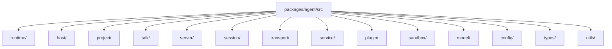

# Package 模块拆解

当前单 Agent 执行内核位于 `packages/agent/`。理解它最有效的方式，不是记旧目录名，而是先抓住这些真实中心对象：

- `AgentRuntime`
- `AgentContext`
- `Session`
- `LocalSessionCore`
- `BaseService`
- `PluginRegistry`

一句话：

```text
agent 负责装配单项目运行时，session 负责模型执行主轴，service 负责主业务流程，plugin 负责增强，server/sdk 负责把这些能力暴露出去。
```

## 当前目录级关系



## 1. `runtime/`

这是单项目 agent runtime 的中心层。

### `AgentRuntime.ts`

负责：

- 读取项目配置、项目 env、全局 env
- 加载静态 system prompt
- 创建模型实例
- 创建 session factory
- 创建 per-agent service instances
- 初始化 plugin manager
- 绑定 shell tool runtime
- 启动 prompt/config 热重载

### `AgentContext.ts`

负责从 `AgentRuntime` 派生统一能力面，给 service、plugin、session tool 使用。

它暴露：

- `config`
- `env`
- `logger`
- `session`
- `invoke`
- `chat`
- `plugins`

## 2. `project/`

负责项目初始化、模型绑定、execution binding 与项目结构准备。

- `AgentInitializer.ts`：agent 项目创建与默认文件写入。
- `ProjectExecutionBinding.ts`：项目执行目标读取与校验。
- `types/`：项目初始化相关类型。

## 3. `host/`

这是 Agent 运行时与宿主环境之间的端口层。

- `host/runtime/`：注入到 `AgentRuntime` 的宿主端口、plugin 配置能力与 plugin runtime resolver。
- `host/daemon/`：agent 侧 daemon 协议、项目准备、HTTP client 与项目级 daemon meta 路径。

daemon 进程启停、pid 清理、registry 同步等平台级管理职责属于 `@downcity/city`。

## 4. `sdk/`

这是本地 SDK facade。

负责：

- `Agent`
- `RemoteAgent`
- `SdkSession`
- SDK HTTP/RPC wrapper
- SDK session metadata
- SDK 专用 system composer

## 5. `server/`

这是单 Agent server 层。

- `server/http/`：HTTP server 与 `control / execute / services / plugins / health / static` 路由。
- `server/http/auth/`：agent HTTP / CLI token 相关鉴权辅助。
- `server/http/control/`：single-agent control API。
- `server/rpc/`：本机 local RPC server。

## 6. `session/`

这是模型执行主轴。

### `Session`

单个 `sessionId` 对应一个 `Session` 实例。

负责：

- `run`
- `appendUserMessage`
- `appendAssistantMessage`
- executor 缓存
- 同一 session 的并发保护
- assistant step 持久化

### `LocalSessionExecutor`

负责把 model、history composer、system composer、compaction composer、execution composer 装配成一次可运行的本地执行器。

### `LocalSessionCore`

这是当前模型与 tool loop 的执行内核。

负责：

- 拼装模型输入
- 处理 history compaction
- 驱动 tool loop
- 处理 incomplete response 恢复
- 收敛最终 assistant message

相关 helper：

- `SessionToolLoopRunner.ts`：驱动模型响应后的 tool 调用循环与继续执行判断。
- `SessionModelMessageState.ts`：维护 session 语义消息与模型消息两份运行基线。
- `SessionUiStreamCollector.ts`：消费 UI stream 并收敛最终 assistant message。
- `SessionExecutionError.ts`：归一化 AI SDK / provider 错误。

### `composer/`

负责 session 运行所需的不同组合面：

- `history/`：JSONL history 读写与恢复。
- `system/`：静态 prompt、service/plugin system prompt 与变量渲染。
- `execution/`：将请求输入映射成模型输入。
- `compaction/`：上下文压缩。

## 7. `service/`

这是主业务流程层。

- `service/core/`：service class 注册、状态控制、action 调度、HTTP route 注册。
- `service/builtins/`：内建 service 实现。
- `service/schedule/`：持久化 service action 调度。
- `service/types/`：service 公共协议类型。

当前内建 service 包括：

- `chat`：渠道接入、chat queue、session bridge、回复分发、chat plugin points。
- `contact`：联系人相关能力。
- `task`：任务定义、计划调度、agent run、run artifacts。
- `memory`：记忆写入、检索、flush 与 system prompt。
- `shell`：shell session 生命周期与命令执行。

## 8. `plugin/`

这是增强层。

- `plugin/core/`：注册、启用态、hook 调度、本地 action、HTTP route 支持。
- `plugin/builtins/`：`auth`、`skill`、`web`、`asr`、`tts`、`voice`、`workboard`。
- `plugin/types/`：plugin 公共协议类型。

plugin 可以提供：

- 显式 action
- system 注入
- hook 实现

hook 语义统一是：

- `pipeline`
- `guard`
- `effect`
- `resolve`

关键点：

- plugin 点由 service 定义。
- plugin 负责实现其中某些点。
- plugin 不拥有主业务流程。

## 9. `sandbox/`

这是命令执行隔离层。

负责：

- 解析 sandbox 配置
- 解析安全 cwd
- 启动普通 shell process
- 在 macOS 上启动 seatbelt sandbox

shell tool、shell service、task service 最终都会通过这里进入命令执行。

## 10. `transport/`

这是 agent 调用端 transport 协议层。

- `transport/rpc/Client.ts`：local RPC client。
- `transport/rpc/Transport.ts`：本地 IPC / 外部 HTTP transport 选择器。
- `transport/rpc/Paths.ts`：local RPC endpoint 路径解析。
- local RPC 协议类型位于 `types/rpc/`。

## 11. `types/`

这是跨模块、跨包共享协议类型目录。

- `types/common/`：JSON、模板等基础类型。
- `types/config/`：`downcity.json`、execution binding、LLM、start options 等配置类型。
- `types/host/`：Agent 宿主端口类型。
- `types/platform/`：city control plane / managed agent 平台协议类型。
- `types/daemon/`、`types/rpc/`、`types/auth/`、`types/http/`：daemon、local RPC、鉴权、inline instant 等协议类型。

领域内部类型仍留在对应领域目录，例如 `service/types/`、`plugin/types/`、`session/types/`。

## 12. `config/`、`model/`、`utils/`

- `config/`：项目配置、schema、项目级路径规则。
- `model/`：模型创建与模型管理辅助。
- `utils/`：日志、CLI 输出、storage、id、time。

## 公开 API 边界

`src/index.ts` 是 `@downcity/agent` 的唯一公开入口。它使用显式导出清单，只暴露：

- SDK：`Agent`、`RemoteAgent` 与 session 配置/运行类型。
- 插件/服务作者 API：`BaseService`、`ChatService`、内建 plugin 与插件/服务定义类型。
- city 运行集成 API：runtime 启停、server/RPC 启动、service 调度、项目初始化、模型创建。
- 跨包协议类型：platform、daemon、RPC、auth、store、inline instant 等控制面协议。

HTTP router、sandbox runner、内部 service runner 等实现细节不从根入口导出。

## 推荐阅读顺序

第一次读 `packages/agent`，建议按这条线：

1. `src/index.ts`
2. `src/runtime/AgentRuntime.ts`
3. `src/runtime/AgentContext.ts`
4. `src/session/Session.ts`
5. `src/session/executors/local/LocalSessionExecutor.ts`
6. `src/session/executors/local/LocalSessionCore.ts`
7. `src/session/executors/local/SessionToolLoopRunner.ts`
8. `src/service/core/Services.ts`
9. `src/service/core/ServiceClassRegistry.ts`
10. `src/service/builtins/chat/ChatService.ts`
11. `src/service/builtins/task/TaskService.ts`
12. `src/plugin/core/PluginManager.ts`
13. `src/plugin/core/PluginRegistry.ts`
14. `src/server/http/Server.ts`
14. `src/server/rpc/Server.ts`
15. `src/sdk/Agent.ts`

这个顺序最容易先建立真实主链，再进入具体业务模块。
