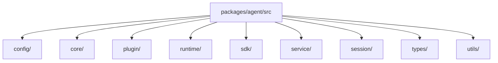
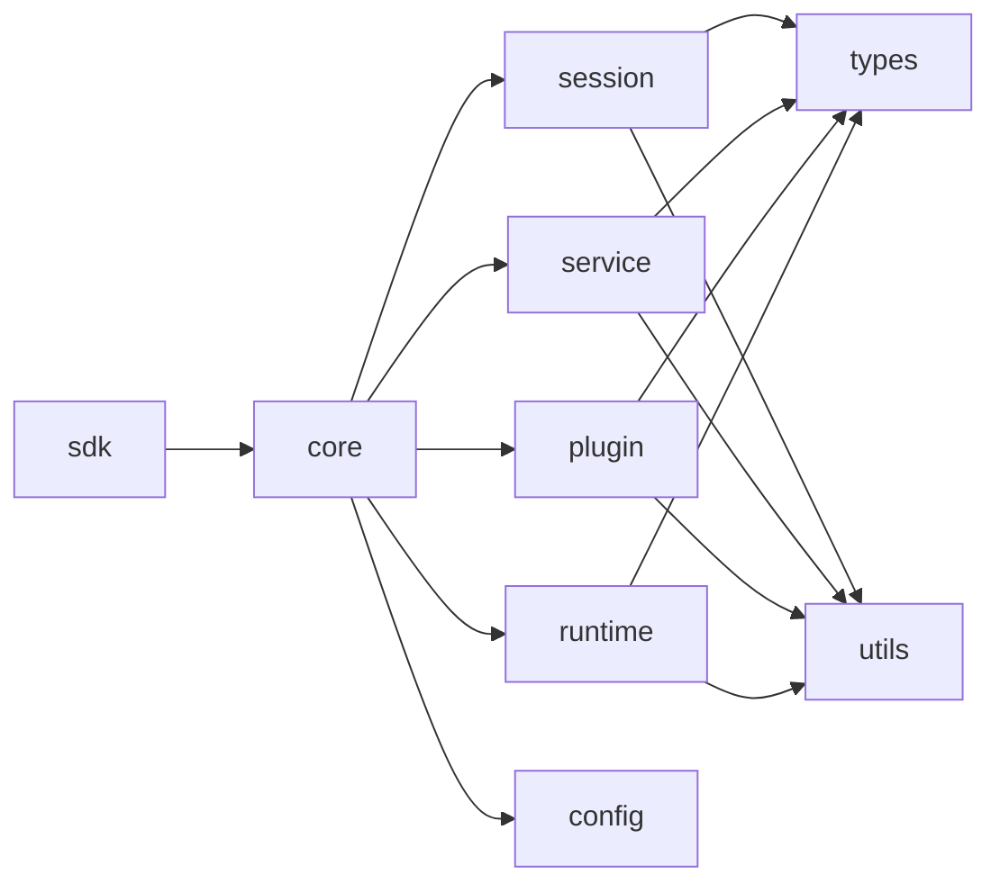

# Package 模块拆解

当前单 Agent 执行内核位于 `packages/agent/`。现在最适合理解它的方式，不是继续记旧的 `host/`、`server/`、`project/` 顶层目录，而是直接按当前真实结构来看：

- `sdk/`：用户 API 面
- `core/`：实例级装配中心
- `session/`：模型执行主轴
- `service/`：业务流程层
- `plugin/`：增强层
- `runtime/`：HTTP/RPC、sandbox、transport、host、model 等运行时实现

一句话：

```text
sdk 负责暴露能力，core 负责装配实例，session / service / plugin 负责执行域，runtime 负责把这些能力接到真实宿主、网络与命令执行环境上。
```

## 当前目录结构



## 模块依赖主链



## 1. `config/`

这里负责项目配置与项目初始化。

- `config/project/AgentInitializer.ts`：创建 agent 项目、写入默认文件、给出初始化结果。
- `config/project/types/`：项目初始化返回值与输入协议。
- `config/ExecutionBinding.ts`：execution binding 读取、校验与断言。

现在 `project/` 已经不再是顶层目录，而是归并进 `config/project/`，因为它本质上属于“项目配置与初始化”域。

## 2. `core/`

这里是单个 Agent 实例的装配中心。

- `AgentCore.ts`：把 config、session、service、plugin、runtime 组装成一个实例级执行内核。
- `AgentCoreTypes.ts`：定义实例运行时视图。
- `AgentContextTypes.ts`：定义 service / plugin / session 共用的统一能力面。

关键点：

- 一个 `AgentCore` 只对应一个 agent 实例。
- SDK `Agent`、HTTP server、local RPC server 都应该围绕这个实例内核工作。
- 默认策略尽量由宿主注入，而不是写死在 SDK 中。

## 3. `sdk/`

这里是本地使用 `@downcity/agent` 时看到的高层 API。

- `Agent.ts`：本地嵌入入口，统一通过 `start()` / `stop()` 管理长期运行能力。
- `Session.ts`：session facade。
- `RemoteAgent.ts`：远端 agent 调用入口。
- `sdk/session/`：SDK session metadata、落盘路径、持久化与 service 端口适配。

当前推荐的长期运行方式是：

```ts
const agent = new Agent({
  id: "demo",
  path: process.cwd(),
});

await agent.start({
  http: { host: "127.0.0.1", port: 5314 },
  rpc: true,
});
```

不调用 `start()` 时，就是纯 library mode。

## 4. `session/`

这里是模型执行主轴。

- `Executor.ts`：单个 `sessionId` 的执行器入口。
- `executors/local/Runner.ts`：当前模型与 tool loop 的执行内核。
- `executors/local/SessionToolLoopRunner.ts`：处理模型响应后的工具循环与继续执行。
- `composer/`：history、system、execution、compaction 等组合层。
- `tools/`：工具定义与工具运行时适配。

它负责把“本轮 query”一路推进到最终 assistant 回复，并把过程中的消息、step 与输出持久化下来。

## 5. `service/`

这里是主业务流程层。

- `service/core/`：service class 注册、实例启动停止、action 调度、system provider、状态控制。
- `service/core/schedule/`：持久化的 service action 调度基础设施。
- `service/builtins/`：`chat`、`contact`、`memory`、`shell`、`task` 等内建 service。
- `service/types/`：service 共享协议类型。

这里有一个重要边界：`schedule` 现在不再是独立顶层概念，而是 `service/core/schedule/` 的一部分，因为它本质上只是 service action 的延迟执行设施。

## 6. `plugin/`

这里是增强层。

- `plugin/core/`：注册、启用态、hook 调度、本地 action、HTTP route 支持。
- `plugin/builtins/`：`auth`、`skill`、`web`、`asr`、`tts`、`voice`、`workboard` 等内建插件。
- `plugin/types/`：插件公共协议类型。

关键边界：

- service 定义主业务流程与 plugin points
- plugin 负责实现某些扩展点
- plugin 不拥有主业务流程本身

## 7. `runtime/`

这里统一收纳运行时实现细节，不再把这些能力散落在顶层目录。

- `runtime/host/`：宿主注入能力、plugin runtime、daemon 协议与项目准备。
- `runtime/sandbox/`：命令执行隔离与沙箱协议。
- `runtime/server/`：单 Agent HTTP / RPC 服务端实现。
- `runtime/transport/`：agent client 侧 transport 协议与 local RPC client。

这次重构的核心目标之一，就是把 `host/`、`server/`、`transport/`、`sandbox/` 都收进 `runtime/`，让目录语义更清晰：这些模块不是一等业务域，而是运行时基础设施。

模型实例本身不在 `@downcity/agent` 内解析。宿主应先把 provider / modelId 解析成 `LanguageModel`，再通过 `session.set({ model })` 注入。

## 8. `types/`

这里放跨模块、跨包共享协议类型。

- `types/common/`：JSON、模板等基础类型。
- `types/config/`：`downcity.json`、LLM、execution binding、start options 等配置协议。
- `types/runtime/host/`：Agent 宿主端口类型。
- `types/runtime/platform/`：city control plane / managed agent 平台协议。
- `types/runtime/daemon/`、`types/runtime/rpc/`、`types/runtime/auth/`、`types/runtime/http/`：daemon、local RPC、鉴权、inline instant 等运行时协议。

领域内部类型仍留在自己的目录里，比如 `service/types/`、`plugin/types/`、`session/types/`。只有需要跨领域、跨包复用的稳定契约，才进入 `types/`。

## 9. `utils/`

这里放低层通用工具。

- `utils/logger/`：日志。
- `utils/storage/`：存储辅助。
- `utils/cli/`：CLI 输出辅助。

它应该保持“横向支撑”角色，而不是反向承载业务语义。

## 公开 API 边界

`src/index.ts` 是 `@downcity/agent` 的唯一公开入口。它使用显式导出清单，只暴露：

- SDK：`Agent`、`RemoteAgent` 与 session 配置/运行类型。
- 插件/服务作者 API：`BaseService`、`ChatService`、内建 plugin 与插件/服务定义类型。
- city 运行集成 API：runtime 启停、server/RPC 启动、service 调度、项目初始化、模型创建。
- 跨包协议类型：platform、daemon、RPC、auth、store、inline instant 等控制面协议。

HTTP router、sandbox runner、内部 service runner 等实现细节不从根入口导出。

## 推荐阅读顺序

第一次读 `packages/agent`，建议按这条线：

1. `src/index.ts`
2. `src/sdk/Agent.ts`
3. `src/core/AgentCore.ts`
4. `src/core/AgentContextTypes.ts`
5. `src/session/Executor.ts`
6. `src/session/executors/local/Runner.ts`
7. `src/service/core/Manager.ts`
8. `src/service/builtins/chat/ChatService.ts`
9. `src/plugin/core/PluginManager.ts`
10. `src/runtime/server/http/Server.ts`
11. `src/runtime/server/rpc/Server.ts`
12. `src/runtime/transport/rpc/Transport.ts`

这个顺序最容易先抓住公开 API，再顺着实例装配主链进入执行内核与运行时基础设施。
