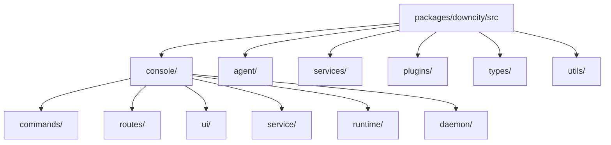

# Package 模块拆解

`packages/downcity/` 是系统内核。理解它最有效的方式不是按文件树死记，而是按职责拆。

## 目录级职责图

## 1. `console/`

这是全局控制面代码。

### `commands/`

职责：

- 解析 CLI 参数
- 调用 console / agent / service / plugin 对应能力
- 不承载真正的业务执行

关键理解：

- command 层是“命令映射层”
- 真正运行仍然要么进入 console 管理逻辑，要么进入 agent runtime

### `routes/`

职责：

- 提供 agent HTTP server 的协议入口
- 挂载 health、execute、services、plugins、dashboard 等路由

关键理解：

- `src/console/index.ts` 只负责装配 Hono app
- 具体路由逻辑按域拆分

### `service/`

职责：

- 管理 service registry
- 管理 service runtime state
- 处理 start/stop/restart/status
- 提供统一 `ServiceRuntime` 注入契约

这是整个业务层能够保持清晰边界的关键。

### `ui/`

职责：

- 为 Console UI 提供 gateway、dashboard routes、model routes、env routes 等
- 让浏览器控制面通过统一接口接入 runtime

### `runtime/` 与 `daemon/`

职责：

- 管理 console 自己的 pid、registry、路径与 daemon 元数据
- 负责 agent 项目注册与进程发现

## 2. `agent/`

这是单项目执行面。

职责包括：

- prompt 组装
- context manager 协作
- 持久化与上下文切片
- orchestrator / prompter / persistor 等组件拆分

你可以把它理解成：

- `console` 决定“去哪一个 agent”
- `agent` 决定“这个项目怎么实际执行”

## 3. `services/`

这是主业务层。现在的核心包括：

- `shell`
- `chat`
- `task`
- `memory`

### `chat`

负责：

- 平台消息接入
- chatKey/context 对齐
- history / queue / visible text
- 渠道适配

它之所以是 service，不是因为“聊天很重要”，而是因为它会主动参与 agent 周期：

- 有 incoming message 进入
- 有出站响应发出
- 与当前 runtime 上下文强耦合
- 有明确的运行态与链路责任

### `task`

负责：

- 任务定义
- 手动 / 调度执行
- cron runtime
- run artifacts

它也是典型 service，因为它本身就可能主动触发执行。

### `memory`

负责：

- 记忆读写与检索主路径

它与 agent 当前上下文状态强相关，不是一个孤立工具点。

## 4. `plugins/`

这里是增强层，而不是第二主业务层。

当前内建方向包括：

- auth
- skill
- voice

使用它们时要记住：

- plugin 不是顶层 workflow owner
- plugin 是增强层
- plugin 没有独立生命周期
- plugin 不主动参与 agent 周期
- plugin 只有在 runtime 或 service 调用时才工作

例如 `voice` 更准确地说是：

- 实现 `chat` 定义的语音相关 plugin 点
- 在入站消息增强和语音转写时被动参与
- 而不是自己长期运行一套服务状态机

### 更好的理解方式

不要把 plugin 理解成“功能市场”。

更合适的理解是：

- service 定义流程和扩展点
- runtime 提供 `pipeline / guard / effect / resolve` 四种执行语义
- plugin 负责实现这些点
- asset 负责底层依赖

这更符合 Downcity 的整体方法论。

## 5. `types/`

这里是跨层契约中心。

重要性很高，因为：

- Console UI 依赖它
- gateway 依赖它
- runtime 依赖它
- 插件与 service 也依赖它

在这个仓库里，类型不是“补充说明”，而是架构边界的一部分。

## 6. `utils/`

这里放的是横切能力：

- logger
- store
- template
- storage
- id

判断标准是：如果一个能力不是业务语义，而是多个层都会复用的基础设施，就更适合放这里。

## 最后给一个阅读顺序

第一次读 package，建议这样看：

1. `src/console/index.ts`
2. `src/console/commands/Run.ts`
3. `src/console/service/ServiceRuntime.ts`
4. `src/console/service/Manager.ts`
5. `src/services/chat/Index.ts`
6. `src/services/task/Index.ts`
7. `src/console/ui/ConsoleUIGateway.ts`
8. `src/types/*`

这个顺序能先建立“系统为什么这样分层”，再进入具体业务模块。
