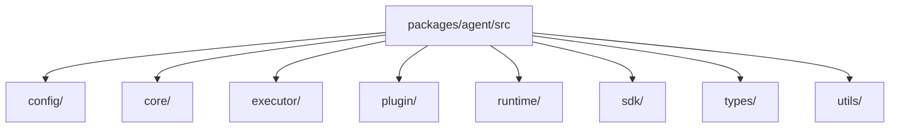

# Package 模块拆解

当前单 Agent 执行内核位于 `packages/agent/`。

现在最适合理解它的方式，是直接跟着真实顶层目录走：

- `sdk/`：公开本地与远程 API
- `core/`：实例装配中心
- `executor/`：session 执行引擎、composer、tools 与持久化
- `plugin/`：plugin 定义、hook 调度与内建 plugin runtime
- `runtime/`：host、HTTP/RPC、sandbox、transport 等运行时基础设施
- `config/`、`types/`、`utils/`：支撑域

## 当前目录图

## 模块主链

- `sdk` 暴露公开能力面
- `core` 装配一个 `AgentCore`
- `executor` 负责真正执行一轮
- `plugin` 负责能力暴露与增强
- `runtime` 把 agent 接到真实宿主环境

## 1. `sdk/`

这里是 `@downcity/agent` 的公开 API。

- `Agent.ts`：本地嵌入入口
- `RemoteAgent.ts`：远程 HTTP client
- `Session.ts`：session facade
- `AgentSdkTypes.ts`：SDK 侧类型

## 2. `core/`

这里是单个 agent 实例的装配中心。

- `AgentCore.ts`：装配 config、session 访问、plugins 与 runtime hooks
- `AgentCoreTypes.ts`：实例运行时视图
- `AgentContextTypes.ts`：给 plugin runtime 使用的统一执行能力面

## 3. `executor/`

这里是执行主轴。

- 执行引擎
- history 与 system composer
- tools 与 tool-runtime adapter
- 持久化与 step facts

真正的模型与 tool loop 就在这里。

## 4. `plugin/`

这里是能力层。

- `chat`、`task`、`memory`、`shell`、`schedule`、`skill`、`web`、`auth` 等内建 plugin
- plugin 注册与 hook 调度
- plugin runtime 局部类型

这里最重要的边界很简单：

- session 负责执行
- plugin 负责暴露或增强能力

## 5. `runtime/`

这里是运行时基础设施层。

- host integration
- HTTP server
- local RPC server
- transport 协议
- sandbox runtime

这些模块是 runtime 设施，不是产品业务域。

## 6. `types/`

这里放稳定共享契约：

- config types
- runtime protocol types
- SDK 侧执行类型
- 公共 JSON 与工具类型

## 7. `config/` 与 `utils/`

- `config/` 负责项目配置与初始化支持
- `utils/` 负责日志、存储等低层辅助能力

## 公开 API 边界

`src/index.ts` 是唯一公开入口。

它应该只暴露：

- SDK API
- plugin author API
- runtime integration API
- 稳定共享协议类型

它不应该暴露私有 router 装配、sandbox runner 或内部 runtime helper。
