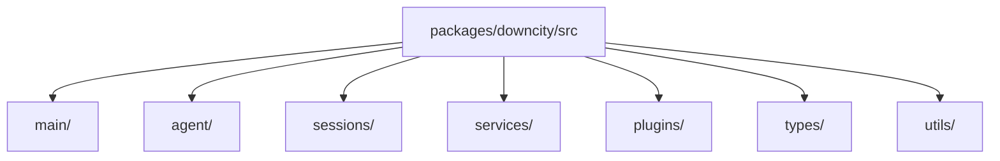

# Package 模块拆解

`packages/downcity/` 是当前 runtime 内核。理解它最有效的方式，不是记旧目录名，而是先抓住几个真实中心对象：

- `AgentState`
- `ExecutionContext`
- `SessionStore`
- `PluginRegistry`
- `Service` instances

一句话：

```text
main 负责入口和装配
agent 负责单项目运行时中心
sessions 负责执行主轴
services 负责主业务流程
plugins 负责增强
```

## 当前目录级关系



## 1. `main/`

这是当前 package 的入口装配层，不是旧文档里的 `console/`。

它主要负责：

- HTTP server 启动与路由挂载
- service / plugin / dashboard 的主入口装配
- daemon、runtime、UI gateway、service manager 等控制逻辑
- model、env、config、project setup 等启动期装配

### 重点子目录

#### `main/index.ts`

当前 agent HTTP server 的入口。

负责：

- 创建 Hono app
- 挂载 `static / health / services / plugins / execute / dashboard` 路由
- 启停 Node HTTP Server

#### `main/service/`

负责：

- service 类注册表的控制入口
- service 生命周期控制
- service action 执行与 API 注册

当前关键不是旧概念 `ServiceRuntime`，而是：

- `ServiceStateController`
- `ServiceActionRunner`
- `ServiceActionApi`

#### `main/plugin/`

负责：

- plugin 注册
- hook 注册与执行
- availability 检查
- builtin plugin 装配

这里真正的核心对象是：

- `HookRegistry`
- `PluginRegistry`

#### `main/runtime/` 与 `main/daemon/`

负责：

- console / agent 进程状态
- pid、registry、路径与 daemon 元数据
- agent 项目注册与前后台进程管理

#### `main/ui/`

负责：

- dashboard / web UI API
- gateway
- model / env / channel account 等控制面接口

## 2. `agent/`

这是单项目 agent runtime 的中心层。

当前最重要的对象不是旧命名 `host runtime`，而是：

- `AgentState`

`AgentState` 持有当前 agent 的长期运行状态：

- `cwd`
- `rootPath`
- `config`
- `env`
- `systems`
- `model`
- `sessionStore`
- `services`
- `pluginRegistry`

### `AgentState.ts`

负责：

- 初始化项目级运行时
- 读取 config / env / systems
- 创建 model
- 创建 `SessionRuntimeStore` 与 `SessionStore`
- 创建 plugin registry
- 创建 per-agent service instances
- 启动 prompt 热更新

### `ExecutionContext.ts`

负责：

- 从 `AgentState` 派生统一执行上下文
- 为 service 和 plugin 提供统一能力面

当前 service / plugin 拿到的，不是旧的 `ServiceRuntime` 门面，而是统一的：

- `ExecutionContext`

它里面主要有：

- `config`
- `env`
- `logger`
- `session`
- `invoke`
- `plugins`

## 3. `sessions/`

这是当前执行主轴层。

一句话：

```text
session 是真正承接模型执行、消息持久化、compact、tools 和 run 协调的主轴。
```

### 关键对象

#### `SessionStore`

这是 agent 持有的统一会话门面。

负责：

- `getRuntime`
- `getPersistor`
- `run`
- `appendUserMessage`
- `appendAssistantMessage`
- 会话执行状态管理

#### `SessionRuntimeStore`

负责：

- 按 `sessionId` 缓存 `SessionRuntime`
- 管理 runtime 与 persistor 的创建关系

#### `SessionRuntime`

负责：

- 把 `model / persistor / compactor / prompter / tools` 装配成一个可运行 session

#### `SessionCore`

这是执行内核。

负责：

- 组装当前轮模型输入
- 处理 compact 重试
- 驱动 tool loop
- 收敛最终 assistant message

## 4. `services/`

这里是主业务层。当前注册的核心 service 包括：

- `chat`
- `task`
- `memory`
- `shell`

这些 service 都继承自 `BaseService`，由 agent 在启动时创建 per-agent 实例。

### `chat`

负责：

- 渠道接入
- chat queue
- session bridge
- 回复分发
- chat plugin points

这是最典型的“实时输入 -> session run -> 回复出站”的 service。

### `task`

负责：

- task 定义
- cron 调度
- script / agent 两类任务执行
- run artifacts 落盘

它不是单独一套模型执行引擎，而是围绕 task 定义创建受控 session run。

### `memory`

负责：

- memory 文件写入
- indexing
- search
- flush / status

### `shell`

负责：

- one-shot shell exec
- 长生命周期 shell session
- read / write / wait / close

## 5. `plugins/`

这是增强层。

当前内建 plugin 包括：

- `auth`
- `skill`
- `voice`

这些 plugin 的职责是：

- 提供显式 actions
- 提供 system 注入
- 实现 hook 点

当前 plugin 体系的执行语义统一是：

- `pipeline`
- `guard`
- `effect`
- `resolve`

关键点：

- plugin 点由 service 定义
- plugin 负责实现其中某些点
- plugin 不拥有主业务流程

## 6. `types/`

这里是跨层契约中心。

当前非常关键，因为：

- `AgentState`
- `ExecutionContext`
- `Service`
- `Plugin`
- `SessionRun`
- Dashboard / API 返回值

都在这里汇总契约。

## 7. `utils/`

这里放横切基础设施：

- logger
- sqlite store
- template
- storage
- id
- time

判断标准很简单：

- 多个层都会复用
- 但它本身不属于某一个具体业务语义

## 推荐阅读顺序

第一次读 package，建议按这条线：

1. `src/main/index.ts`
2. `src/agent/AgentState.ts`
3. `src/agent/ExecutionContext.ts`
4. `src/sessions/SessionStore.ts`
5. `src/sessions/SessionRuntimeStore.ts`
6. `src/sessions/SessionCore.ts`
7. `src/main/service/Services.ts`
8. `src/main/registries/ServiceClassRegistry.ts`
9. `src/services/chat/ChatService.ts`
10. `src/services/task/TaskService.ts`
11. `src/services/memory/MemoryService.ts`
12. `src/services/shell/ShellService.ts`
13. `src/main/plugin/Plugins.ts`
14. `src/main/plugin/PluginRegistry.ts`
15. `src/types/*`

这个顺序最容易先建立真实主链，再进入具体业务模块。
