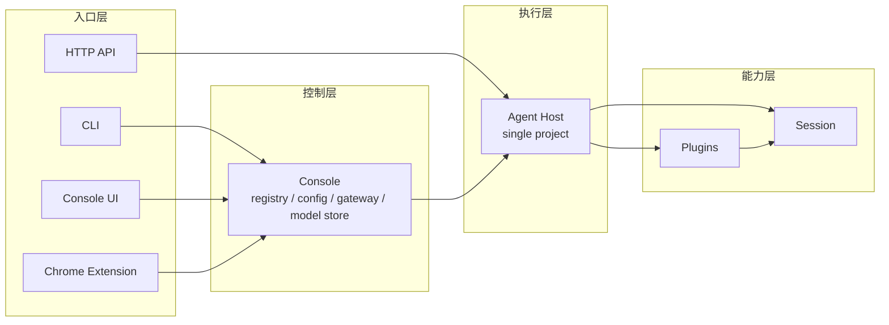
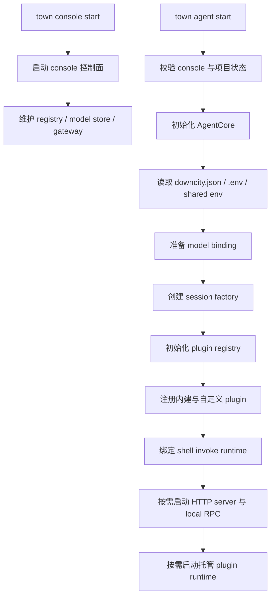
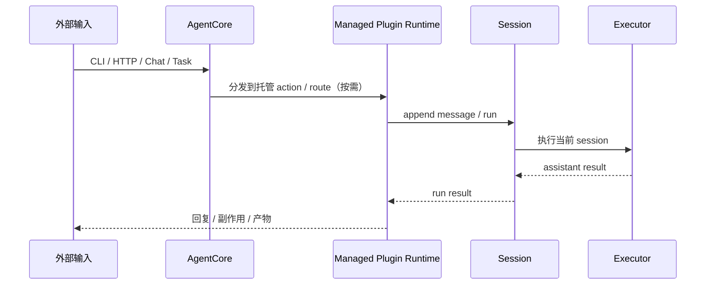

# Runtime / Session / Plugin 逻辑

这页只回答当前实现里最关键的三件事：

1. runtime 中心对象到底是什么
2. session 和 plugin 分别负责什么
3. agent host 是怎么被装起来的

## 核心结论

- `AgentCore` 是单个 agent 实例的运行内核
- `Session` 是执行拥有者
- `Plugin` 是能力单元
- 托管 plugin 可以拥有长期运行态，但不会替代 session 执行

## 一句话模型

```text
AgentCore 负责把这个 agent 装起来
session 负责真正执行这一轮
plugin 负责暴露能力并在运行时做增强
```

## 当前分层

Downcity 现在最适合按四层理解：

1. 入口层：CLI、Console UI、Chrome Extension、HTTP API
2. 控制层：console
3. 执行层：agent host
4. 能力层：session 与 plugins



这里真正重要的不是抽象词，而是当前代码里真实存在的对象：

- `Agent`
- `AgentCore`
- `Session`
- `PluginRegistry`
- `chat` / `task` / `memory` / `shell` / `schedule` 等托管 plugin runtime

## runtime 现在到底是什么

当前 runtime 的中心已经不是一层独立的顶层扩展管理器。

真正的中心是 `AgentCore` 实例。它持有：

- `config`
- `env`
- `plugins`
- session 创建与读取能力
- 宿主集成端口
- 给 plugin runtime 使用的统一 `AgentContext`

所以今天更准确的一句话是：

```text
console 管多个 agent
每个 agent host 里有一个 AgentCore
AgentCore 再协调 session 执行与 plugin runtime
```

## 启动顺序



`town console start` 拉起的是全局控制面，负责 registry、共享配置、模型池与 UI 网关。

`town agent start` 则把某个项目装配成可运行的 agent host。这个过程会读取项目配置、准备模型绑定、创建 session 层、注册 plugin，并在需要时启动托管 runtime。

## 现在到底是谁负责什么

### session 负责执行

session 回答：

- 当前输入归到哪个 `sessionId`
- 历史与 prompt 状态怎么装配
- 什么时候进入模型 / tool 执行
- 结果如何落盘并返回

### plugin 负责能力

plugin 回答：

- 暴露什么显式 action
- 注入什么 system 文本
- 在哪些运行时点做增强
- 是否需要一个跟随 host 存活的长期运行模块

当前统一的 hook 语义是：

- `pipeline`
- `guard`
- `effect`
- `resolve`

像 `chat`、`task`、`memory`、`contact`、`shell`、`schedule`、`workboard` 这类托管 plugin，也可能拥有后台循环、HTTP route 或运行态状态。

### AgentContext 是共享能力面

plugin runtime 不应该直接钻进宿主内部模块。

它消费统一的 `AgentContext`：

- `config`
- `env`
- `logger`
- `session`
- `invoke`
- `plugins`
- path 与 plugin config 访问能力

## 一条真实调用链



## 当前稳定模型

```text
console 负责治理
agent host 负责单项目
session 负责执行
plugin 负责暴露与增强能力
托管 plugin 负责长期运行模块
```
