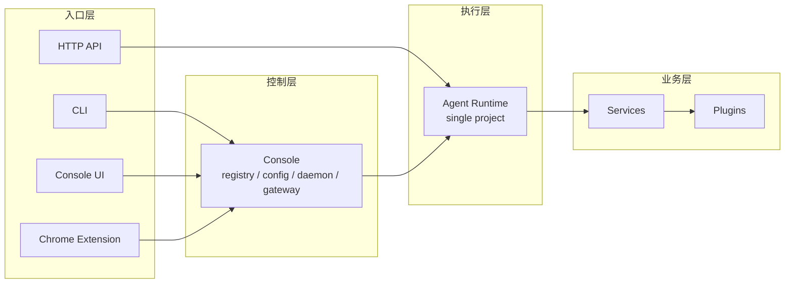
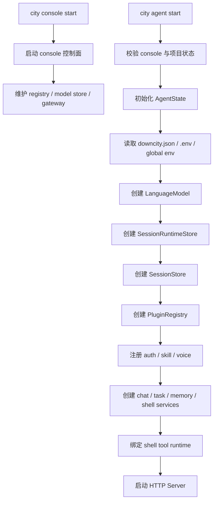
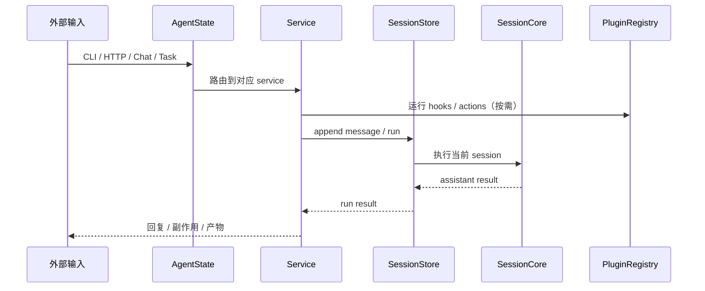

# Runtime / Service / Plugin 逻辑

这页的目标很明确：

- 用当前 package 里的真实对象，重新解释 runtime、service、plugin 三层

先给结论：

- `AgentState` 是单项目 runtime 中心
- `service` 是主业务流程拥有者
- `plugin` 是增强单元

补一条当前实现口径：

- plugin 是否启用，由 `downcity.json > plugins.<name>.enabled` 决定
- 如果没有显式写 `enabled`，则回退到 plugin 默认值
- disabled plugin 不参与 action、hook 和 system 注入

## 一句话模型

```text
AgentState 管理这个项目怎么跑
service 决定主流程怎么走
plugin 决定某个节点怎么增强
```

## 当前总体分层

Downcity 当前可以按四层理解：

1. 入口层：CLI、Console UI、Chrome Extension、HTTP API
2. 控制层：console
3. 执行层：agent runtime
4. 业务层：services / plugins



这里最重要的不是抽象词，而是当前代码里真正存在的对象。

## runtime 现在到底是什么

当前 runtime 的中心对象是：

- `AgentState`

它持有：

- `config`
- `env`
- `systems`
- `model`
- `sessionStore`
- `services`
- `pluginRegistry`

也就是说，当前代码里不应该再把 runtime 的主概念写成旧的：

- `RuntimeState`
- `SessionManager`
- `ServiceRuntime`

这些名字已经不是现在的主中心。

## agent 启动顺序

### 启动总图



### 详细顺序

#### 第一步：启动 `console`

`city console start` 拉起的是全局控制面。

它主要负责：

- 维护 console registry
- 管理多个 agent 项目登记
- 提供 Console UI gateway
- 管理全局模型配置与共享 env

#### 第二步：启动某个项目的 `agent`

`city agent start` 会先做前置校验，然后启动某个项目自己的 agent 进程。

这里的关键不是“当前终端执行了哪个命令”，而是“当前项目是否被装配成了一个完整的 `AgentState`”。

#### 第三步：初始化 `AgentState`

这一步会做：

- 读取项目 `downcity.json`
- 读取项目 `.env`
- 读取 console 全局 env
- 加载静态 systems
- 创建 model
- 创建 session 层
- 创建 plugin registry
- 创建 service instances

#### 第四步：启动 server

当前 HTTP server 会挂载：

- `static`
- `health`
- `services`
- `plugins`
- `execute`
- `dashboard`

## service 现在如何拿能力

当前 service 不再依赖旧文档里的 `ServiceRuntime` 对象。

它们真正拿到的是：

- `ExecutionContext`

这个上下文里主要有：

- `config`
- `env`
- `logger`
- `session`
- `invoke`
- `plugins`

所以现在更准确的说法是：

- runtime 通过 `ExecutionContext` 给 service 和 plugin 暴露统一能力面

## service 的职责

service 回答的是：

- 哪类输入由谁承接
- 业务主流程怎么走
- 哪一步进入 `session.run`
- 哪些节点开放给 plugin

当前注册的 service 包括：

- `chat`
- `task`
- `memory`
- `shell`

这些 service 都是 per-agent 实例，不是旧式全局单例。

## plugin 的职责

plugin 回答的是：

- 在不抢走主流程所有权的前提下，如何增强当前系统

当前 plugin 能做的事主要有三类：

- 显式 action
- hook
- system 注入

hook 语义统一是：

- `pipeline`
- `guard`
- `effect`
- `resolve`

关键点：

- plugin 点由 service 定义
- plugin 负责实现其中某些点
- plugin 本身不拥有业务主流程

## 一条真实调用链



## 为什么必须区分三层

这不是为了抽象漂亮，而是因为它们回答不同问题。

### runtime 回答

- 当前项目怎么初始化
- model / session / plugin / service 怎么装配
- 统一能力面从哪里来

### service 回答

- 主业务流程谁拥有
- 输入怎么归类
- session 在哪里进入

### plugin 回答

- 哪些节点可以增强
- 增强逻辑怎么插入
- 是否启用、是否可用

## 当前最稳定的设计判断

以后判断一个模块该落在哪层，可以用这个顺序：

1. 它是否拥有主业务流程
2. 它是否有生命周期
3. 它是否需要成为 per-agent 长期实例
4. 它是否只是某个流程节点的增强

如果答案是：

- 拥有主流程、需要长期实例：更像 service
- 只是增强，不拥有主流程：更像 plugin
- 负责装配和统一上下文：更像 runtime
