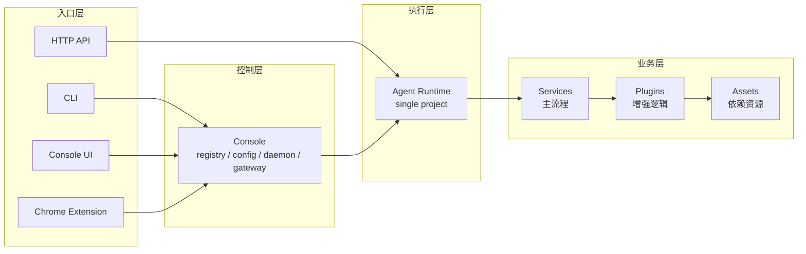
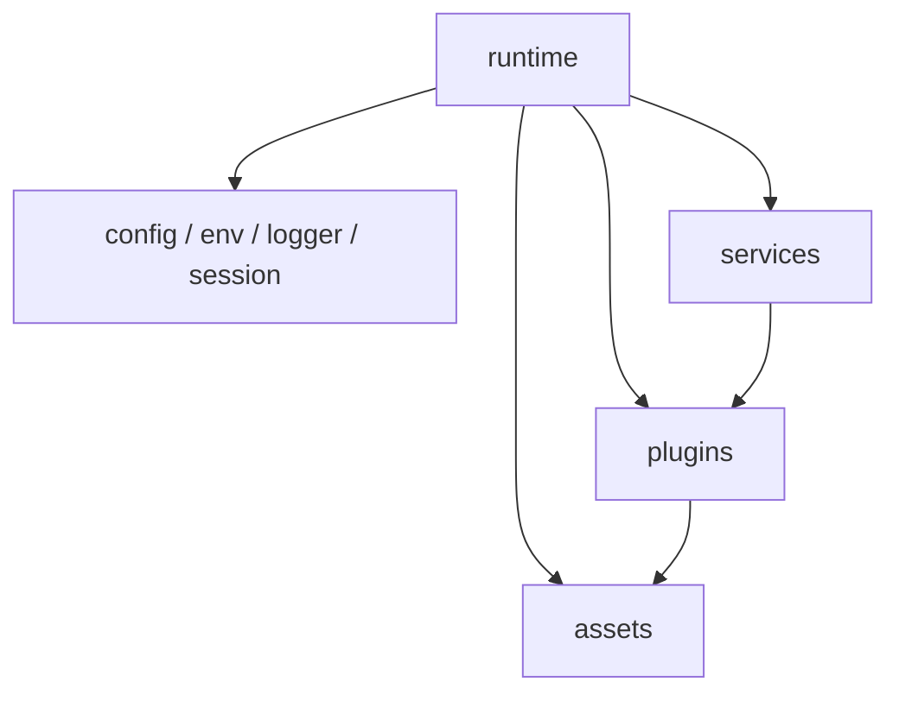
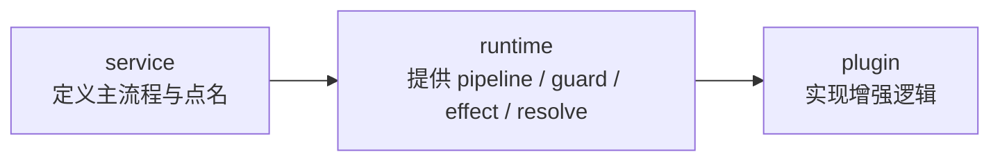
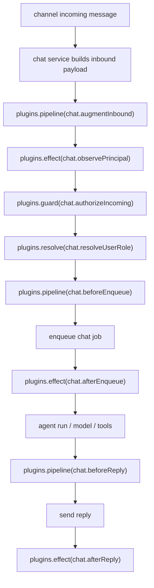

# Runtime / Service / Plugin 逻辑

这页的目标只有一个：把 `runtime`、`service`、`plugin` 这三层重新讲清楚，并给后续改代码时一个稳定口径。

先给结论：

- `runtime` 是宿主与调度底座
- `service` 是主业务流程拥有者
- `plugin` 是被动增强单元

如果一个模块没有生命周期、不拥有主流程、只是被某个流程节点调用，那它就不应该被理解成 `service`。

## 一句话模型

```text
runtime 管理系统怎么跑
service 决定主流程怎么走
plugin 决定某个节点怎么增强
```

## 总体分层

Downcity 当前可以按四层来理解：

1. 入口层：CLI、Console UI、Chrome Extension、HTTP API
2. 控制层：console
3. 执行层：agent runtime
4. 业务层：services / plugins / assets



这里最重要的不是目录，而是调用方向：

- `console` 负责全局控制
- `agent runtime` 负责单项目执行
- `service` 负责业务主流程
- `plugin` 通过预定义点接入流程
- `asset` 负责底层依赖

## 为什么必须区分三层

这不是为了抽象好看，而是为了回答三个不同的问题。

### `runtime` 回答什么问题

系统怎么启动、怎么装配、怎么调度、怎么把端口注入给业务模块。

它关心的是：

- 当前项目配置怎么加载
- 当前 session / env / logger / model 从哪里来
- service 怎么注册和启动
- plugin 怎么注册和执行
- service 和 plugin 之间通过什么统一端口协作

### `service` 回答什么问题

主业务流程谁拥有。

它关心的是：

- 用户主路径怎么走
- 哪些 action 是稳定对外能力
- 哪些流程节点允许 plugin 接入
- 什么时候进入运行态
- 什么时候结束、停止、重启

### `plugin` 回答什么问题

如何在不改主流程所有权的前提下增强系统。

它关心的是：

- 某个点上要不要补充信息
- 某个点上要不要校验
- 某个点上要不要做副作用
- 某个点上谁来提供解析结果

## `runtime` 到底是什么

`runtime` 不是业务模块本身，而是业务模块的宿主。

在当前代码里，`ServiceRuntime` 这类注入对象已经体现了这一点。它提供的是一组端口，而不是某个具体业务逻辑：

- 已解析 config
- 当前 agent 的 env 快照
- logger
- session 能力
- 跨 service invoke
- `assets`
- `plugins`

也就是说，`runtime` 的职责不是“替 service 做业务”，而是“让 service 以统一方式拿到运行环境”。



## `service` 到底是什么

`service` 是主业务流程拥有者。

它的判断标准不是“代码量大不大”，也不是“有没有 action”，而是下面四件事。

### 1. 它有生命周期

比如：

- 跟 agent runtime 一起启动
- 可以停止
- 可以重启
- 可能有运行态状态

### 2. 它和当前 agent 状态强相关

例如：

- 依赖当前项目配置
- 依赖当前 agent 的 session / context
- 依赖当前运行态资源

### 3. 它拥有一整段主流程

比如：

- 收到输入后如何编排
- 在什么时机调用模型
- 在什么时机调别的 service
- 在什么时机输出结果

### 4. 它会主动参与 agent 执行周期

例如：

- 接收消息
- 调度任务
- 维护长期状态
- 管理会话

所以像下面这些通常是 `service`：

- `chat`
- `task`
- `memory`
- `shell`

它们的共同点不是“功能重要”，而是“它们拥有自己的主业务流”。

## `plugin` 到底是什么

`plugin` 是被动增强层。

它不是 service 的另一个名字，也不是缩小版 service。

判断一个模块是不是 `plugin`，要看这些特征：

- 没有独立生命周期
- 不自己启动、不自己停止
- 不维护独立 runtime 状态机
- 不拥有主流程
- 只能在 `runtime` 或 `service` 预定义的点上执行

当前实现里，plugin 的统一语义已经固定成四种：

- `pipeline`：串行改写值
- `guard`：串行校验，抛错即中断
- `effect`：执行副作用，不返回值
- `resolve`：单点单实现，返回确定结果

这四种语义非常关键，因为它们把 plugin 的角色收得足够窄：

- plugin 不定义流程
- plugin 只实现流程节点

## service 和 plugin 的真正关系

最容易混淆的点就在这里。

正确关系不是：

- plugin 是更轻的 service

而是：

- service 定义流程与扩展点
- runtime 提供统一执行语义
- plugin 只实现这些扩展点



换句话说：

- 流程所有权在 `service`
- 调度语义在 `runtime`
- 具体增强逻辑在 `plugin`

这条边界不能反过来。  
如果 plugin 开始自己定义主流程，plugin 就会长成第二套 service。

## plugin 有 action，不代表它是 service

这是当前语义里最容易发虚的一点。

当前 `PluginRegistry` 不只支持 hooks / resolves，也支持显式 `actions`。这意味着 plugin 可以暴露明确命令能力，例如：

- `plugin <name> <action>`
- `runtime.plugins.runAction(...)`

但要注意：

**plugin 有 action，不等于 plugin 有生命周期。**

action 只说明一件事：

- 这个 plugin 可以被显式调用

它不说明：

- 这个 plugin 拥有运行态
- 这个 plugin 是主流程拥有者
- 这个 plugin 应该升级成 service

所以判断 service / plugin 的标准，不是“有没有 action”，而是：

- 是否拥有主流程
- 是否拥有生命周期
- 是否主动参与 runtime 周期

## 判断规则

如果你在新增一个模块，先问下面三个问题。

### 问题一：它是否拥有主流程

如果答案是“是”，优先考虑 `service`。

典型信号：

- 它要决定一整段流程怎么走
- 它要定义稳定的业务动作集合
- 它要对外承担用户主路径

### 问题二：它是否需要生命周期

如果答案是“是”，优先考虑 `service`。

典型信号：

- 要 start / stop / restart
- 要维护运行态状态
- 要跟 agent runtime 一起生灭

### 问题三：它是否只是某个节点的增强

如果答案是“是”，优先考虑 `plugin`。

典型信号：

- 补充输入
- 追加上下文
- 做鉴权
- 做副作用
- 解析某个 provider 的确定结果

## 一个判断矩阵

| 维度 | runtime | service | plugin |
| --- | --- | --- | --- |
| 角色 | 宿主与调度底座 | 主流程拥有者 | 被动增强单元 |
| 生命周期 | 有 | 有或参与运行态 | 无 |
| 是否拥有主流程 | 否 | 是 | 否 |
| 是否可被显式调用 | 间接 | 是 | 可以 |
| 是否可定义扩展点 | 提供统一语义 | 是 | 否 |
| 是否实现扩展点 | 否 | 可触发 | 是 |
| 是否维护独立状态机 | 是 | 可以 | 否 |

## chat 作为样板

`chat` 是最典型的 service，因为它完整拥有一段主流程。

### 真实语义

1. 接收消息
2. 构造基础 inbound payload
3. 触发 plugin 点增强和校验
4. 入队
5. 驱动 agent run
6. 发送回复
7. 触发发送后的副作用

### 流程图



这里的所有权非常清楚：

- `chat service` 拥有主流程
- `auth` 这类 plugin 只在节点上执行
- `voice` 这类 plugin 只在节点上增强 payload

## 为什么不应该把 service 和 plugin 强行统一

从实现层可以复用很多机制，但从语义层不应该把两者抹平。

原因很简单：

- `service` 表达“谁拥有主流程”
- `plugin` 表达“谁只是增强主流程”

如果把两者完全合并成一个词，就会失去一个很重要的架构信号：  
**谁才是系统里的主角。**

所以最稳的做法不是取消区分，而是：

- 实现上允许共用注册与调度基础设施
- 语义上保留 `service` 和 `plugin` 的边界

## 关于显式管理类能力

有些模块不只是 hook，还会暴露显式动作，例如：

- 查找
- 安装
- 列出
- 查阅

这类能力并不会自动把它变成 `service`。

只要它仍然满足下面条件：

- 没有独立生命周期
- 不拥有主流程
- 不主动参与 agent 执行周期

那它依然更接近 `plugin`。

也就是说：

- “能被显式调用”不是 service 的专利
- “有 action”也不是 service 的判断标准

真正的标准依然只有那条主线：

- 是否拥有主流程
- 是否拥有生命周期

## 反模式

下面这些情况基本都说明边界开始歪了。

### 反模式一：plugin 开始定义自己的主流程

表现为：

- plugin 反过来决定 service 何时执行
- plugin 组织完整业务编排
- plugin 越过 service 自己变成主入口

这是错误的，因为它会把 plugin 长成第二套 runtime。

### 反模式二：service 只剩一个薄壳

表现为：

- service 只是在转发给 plugin
- 主要业务编排全都散落在 plugin 里

这会导致流程所有权不清晰，调试成本也会迅速上升。

### 反模式三：是否有 action 决定模块归属

表现为：

- 觉得“有 action 就应该是 service”
- 觉得“能命令式调用就不该是 plugin”

这会把判断标准从“主流程所有权”错误地换成“调用形式”。

## 当前代码中的核心对象

如果要落到源码，可以按下面这些对象来理解：

- `ServiceRuntime`：service 的统一运行时注入对象
- `ServiceManager`：service 契约定义
- `Manager.ts`：service runtime 的注册、启动、停止、调度
- `PluginRegistry`：plugin 注册、availability、action 调度
- `HookRegistry`：`pipeline / guard / effect / resolve` 的统一执行器
- `PluginPoints.ts`：由具体 service 定义稳定点名

它们组合起来的结构可以概括成：

```text
runtime 注入端口
  -> service 持有主流程
    -> service 定义 plugin points
      -> runtime 按统一语义执行 plugin
```

## 最后定稿

后续讨论和改代码时，建议统一使用下面这套口径：

- `runtime`：宿主、装配、调度、注入
- `service`：主流程、生命周期、运行态业务模块
- `plugin`：无生命周期、无主流程、通过预定义点接入的增强单元

所有边界判断，最终都回到一个问题：

**这个模块是在拥有流程，还是在增强流程。**

如果它拥有流程，它是 `service`。  
如果它只是增强流程，它是 `plugin`。  
而 `runtime` 负责让两者以统一方式协作。
