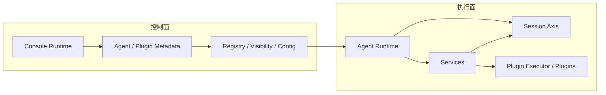
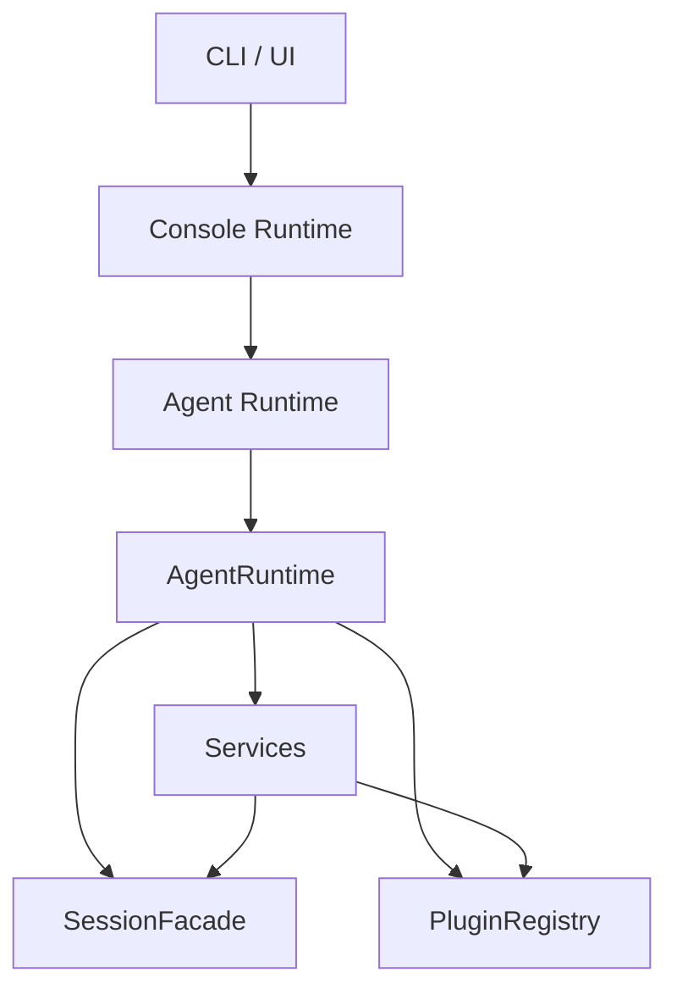
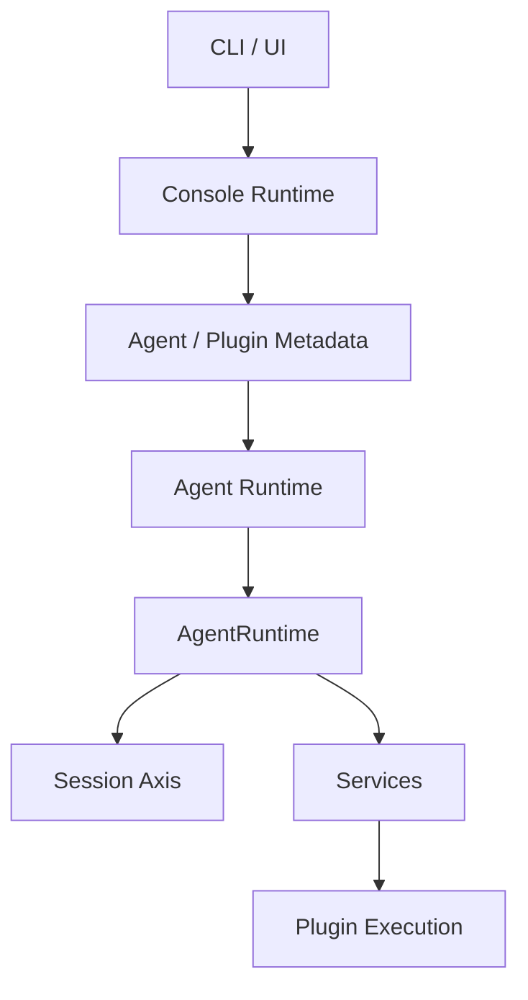

# Runtime 演进方向

这页不描述当前实现“已经是什么”，而是回答另一个问题：

- 结合现在的 package 代码，后续应该往什么方向调，才能让 console、agent、session、service、plugin 的边界更顺

先给结论：

- `console runtime` 应该越来越像 control plane
- `agent runtime` 应该越来越像 execution plane
- `session` 应该继续保持为统一执行主轴
- `service` 只保留主流程所有权
- `plugin` 只保留增强逻辑与显式插件动作

## 为什么需要演进

当前实现已经完成了很多正确收敛，例如：

- plugin 统一到 `pipeline / guard / effect / resolve`
- `PluginRegistry` 已支持 action 与 availability
- `skill` 已迁到 plugin
- runtime 中心已经收敛到 `AgentRuntime`

但仍然有几处边界可以继续变顺。

### 1. 控制面和执行面的语义还可以更清晰

当前已经基本形成：

- console 管控制与观测
- agent 管执行

但文档、部分历史心智和少量实现边缘还可能把这两层混起来。

### 2. session 应继续保持主执行轴，不要被重新揉进 service

当前这条主链已经很清晰：

- `AgentRuntime`
- `SessionFacade`
- `SessionExecutorRegistry`
- `SessionEngine`

后续演进时不应该把 session 执行权再散回某个 service 内部。

### 3. plugin 的管理和执行语义还可以继续收干净

更稳的方向是：

- console 侧更偏 plugin 清单、启用、可见性和控制语义
- agent 侧继续负责 plugin 执行注册与运行

## 理论上更顺的结构



这张图里有几个关键判断。

### Console Runtime

它应该只管控制面：

- agent 的启动、停止、观测
- 模型配置、共享 env、registry
- plugin 的可见性与控制语义

它不应该承担某个 agent 的真实业务执行。

### Agent Runtime

它应该只管执行面：

- 加载当前项目 config / env / systems
- 初始化 `AgentRuntime`
- 创建 session、services、plugins
- 运行当前项目的业务流程

### Session

它应该继续作为统一执行主轴：

- 负责消息历史
- 负责 run
- 负责 history store、compact、tools、prompt、model 协调

### Service

它只负责主流程：

- 定义 workflow
- 定义 action
- 定义 plugin points
- 决定调用时机

### Plugin

它只负责增强逻辑：

- hook
- resolve
- guard
- effect
- 显式 plugin action

## 当前实现和目标之间的差距

### 现状



当前实现里的关键点：

- runtime 中心已经是 `AgentRuntime`
- session 已经收敛到 `SessionFacade` 一套主链
- plugin registry 在 agent runtime 内实例化
- builtin plugin 在 agent runtime 初始化时注册

### 目标



核心变化不是推翻重来，而是三条：

1. 控制面语义继续往 console 侧收
2. 执行语义继续留在 agent 侧
3. session 主轴继续保持独立稳定

## 建议的分阶段迁移

### Phase 1：统一命名与文档心智

优先持续统一到当前真实对象：

- `AgentRuntime`
- `SessionFacade`
- `AgentContext`
- `SessionEngine`

### Phase 2：继续收紧控制面和执行面边界

目标是让：

- console 更清楚地负责 registry / config / daemon / visibility
- agent 更清楚地负责 session / services / plugins 的执行装配

### Phase 3：保持 session 主轴稳定

后续即使继续重构 service 或 plugin，也尽量不要破坏：

- `SessionFacade -> SessionExecutorRegistry -> SessionEngine`

这条执行主链。

## 不建议现在就做的事

### 1. 不要为了抽象统一而重新发明 runtime 名词

当前代码里最稳定的对象已经是：

- `AgentRuntime`
- `AgentContext`
- `SessionFacade`

所以不建议再引入一套平行主概念把它们重新包一层。

### 2. 不要把 service、session、plugin 混成同一个层

如果三者重新揉在一起，会直接损失当前已经收敛出来的边界。

## 一句话总结

```text
后续最稳的演进方向，不是重做一套新 runtime，而是继续强化 console 作为控制面、agent 作为执行面、session 作为执行主轴、service 作为主流程、plugin 作为增强层的边界。
```
