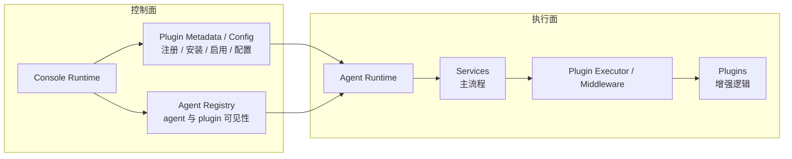
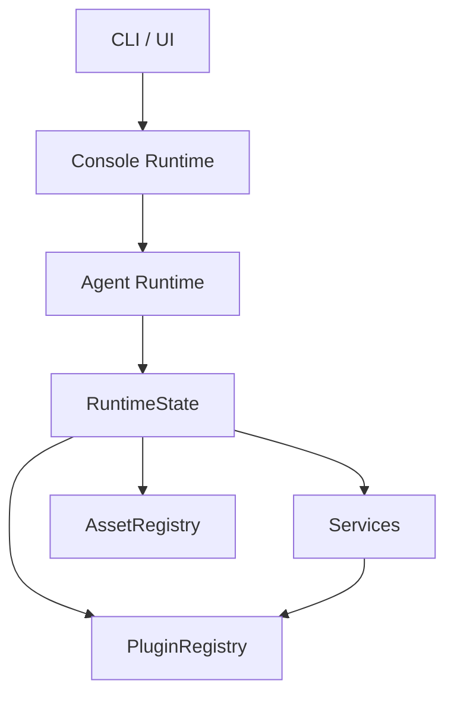
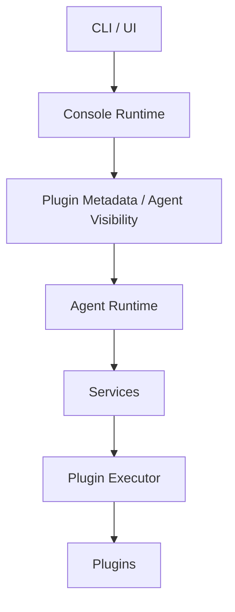

# Runtime 演进方向

这页不描述当前实现“已经是什么”，而是回答另一个问题：

**结合现在的 package 代码，后续应该往什么方向调，才能让 `console runtime`、`agent runtime`、`service`、`plugin` 的边界更顺。**

先给结论：

- `console runtime` 应该越来越像 control plane
- `agent runtime` 应该越来越像 execution plane
- `service` 只保留主流程所有权
- `plugin` 只保留增强逻辑与显式插件动作
- `asset` 不再作为 agent 侧一级架构概念暴露，而只作为 plugin 的依赖事实存在

## 为什么需要演进

当前实现已经完成了很多正确的收敛，例如：

- plugin 统一到 `pipeline / guard / effect / resolve`
- `PluginRegistry` 已经支持 `actions`
- `service` 已经通过 `ServiceRuntime` 拿统一端口

但仍然有几处边界不够顺。

### 1. `skills` 虽然已经迁到 `plugin`，但控制面语义还没有彻底拉开

当前已经完成的收敛是：

- `skill` 已迁到 plugin
- `skill` 通过 plugin actions 提供 `find / install / list / lookup`
- skills overview 文本也通过 `plugin.system` 注入

但更上层的“plugin 管理语义属于谁”这件事，还没有完全收干净。

### 2. plugin 的“管理”和“执行”还没有彻底拆开

当前现状更接近：

- CLI / Console UI 通过 console 进入 plugin 管理命令
- plugin registry 的真实实例仍在 agent runtime 里创建
- builtin plugin 也在 agent runtime 初始化阶段注册

这在当前阶段是能跑的，但会让“控制面”和“执行面”混在一起。

### 3. `asset` 仍然作为 agent 侧显式 runtime 端口出现

这在当前实现上是务实的，但从长期架构看会让：

- service 误以为自己需要直接理解 asset
- plugin 依赖和业务能力边界重新混在一起

## 理论优化架构

理论上更顺的结构应该是下面这样：



这张图里有几个关键判断。

### `console runtime`

它应该只管控制面：

- 管 plugin 的存在与配置
- 管 plugin 的安装与启用
- 管 agent 与 plugin 的关系
- 管 CLI / Console UI 的命令入口与路由

它不应该承担某个 agent 的真实业务执行。

### `agent runtime`

它应该只管执行面：

- 加载当前项目 config / env / session / systems
- 拿到当前 agent 可用的 plugin 集合
- 初始化 service
- 在 service workflow 里执行 plugin

它不应该成为插件生态的“管理后台”。

### `service`

它只负责主流程：

- 定义 workflow
- 定义 action
- 定义 plugin points
- 决定调用时机

### `plugin`

它只负责增强逻辑：

- hook
- guard
- resolve
- effect
- 显式 plugin action

它没有生命周期，不拥有主流程，也不维护独立 runtime。

### `asset`

在理论优化架构里，`asset` 不再是 agent 侧一级架构名词。

更准确地说：

- asset 是 plugin 的依赖事实
- plugin 执行时，由中间件自动拿到当前 agent runtime
- plugin 如需依赖某些资源，运行时已经把环境准备好了

也就是说，agent 不需要显式暴露一整套“asset registry 心智模型”给 service 或上层业务。

## 最关键的执行语义

理论优化架构里，plugin 的调用方式可以非常简单：

```ts
type PluginHandler<T> = (params: {
  runtime: AgentRuntime;
  value: T;
  plugin: string;
}) => Promise<T> | T;
```

这背后的原则是：

- plugin 自己不持有 runtime
- agent 在调用 plugin 时，通过中间件自动注入当前 runtime

也就是说，plugin 不需要“自己拥有 runtime”，只需要“被执行时拿到 runtime 上下文”。

## 当前实现和目标之间的差距

### 现状



当前实现里的关键点：

- `PluginRegistry` 在 agent runtime 内实例化
- builtin plugin 在 agent runtime 初始化时注册
- `skill` 已经属于 plugin
- `plugin.system` 已接入主 system 装配链路
- `AssetRegistry` 仍然在 agent runtime 内显式建模

### 目标



核心变化不是“彻底重写一切”，而是三条：

1. plugin 的管理语义往 console 侧收
2. plugin 的执行语义留在 agent 侧
3. asset 从 agent 一级心智模型里继续淡出

## 建议的分阶段迁移

### Phase 1：先修语义边界（已完成）

第一阶段不要重做 runtime，只做最值当的一步：

- 把 `skills` 从 `service` 迁到 `plugin`

原因：

- `PluginRegistry` 已支持 actions
- `skills` 没有 lifecycle
- `skills` 没有主流程
- `skills` 的 `find/install/list/lookup` 更像 plugin action

这一阶段已经完成：

- `SERVICES` 已不再包含 `skill`
- 已新增 `skill plugin`
- `skill` 的 CLI/API 已通过 plugin action 提供

### Phase 2：补齐 `plugin.system`（已完成）

第二阶段已经完成：

- system domain 已正式收集 plugin.system
- `skill plugin` 的 skills overview 文本已走 plugin.system
- `service.system` 已回到更贴近 service 的语义

### Phase 3：把 plugin 的控制面语义往 console 侧收

第三阶段再做更深一点的结构收敛：

- builtin plugin 清单保持为 console 侧单一事实源
- agent runtime 启动时拿到当前应激活的 plugin 集合
- agent 继续负责本地注册与执行

注意，这一步不是把 `PluginRegistry` 实例整个搬去 console，而是：

- console 管清单和可见性
- agent 管执行注册表

这样改动更稳，也更符合 control plane / execution plane 的分工。

## 不建议现在就做的事

### 1. 不要一开始就重做整个 runtime 拓扑

当前系统已经有：

- `RuntimeState`
- `ServiceRuntime`
- `PluginRegistry`
- `HookRegistry`

这些基础设施都已经能工作。  
现阶段最重要的是纠正边界，而不是推翻它们。

### 2. 不要把 service / plugin 合并成一个词

实现层可以共用很多机制，但语义层还是应该保留：

- `service`：拥有主流程
- `plugin`：增强主流程

这个信号很重要，不能抹掉。

### 3. 不要让 asset 继续成为 service 的一级心智模型

从后续演进看，新逻辑应该尽量避免：

- service 直接理解 asset
- 业务代码到处拼 asset 依赖判断

更推荐的方向是：

- plugin 理解依赖
- runtime 在调用 plugin 时自动提供执行上下文

## 推荐落地顺序

如果按投入产出比排序，建议这样做：

1. 文档统一改口径
2. plugin 清单与可见性往 console 侧进一步收
3. asset 从 agent 一级 runtime 端口里继续淡出

## 一句话定稿

理论优化架构不是“把现在全部推翻”，而是把当前实现往更清晰的方向慢慢推：

- `console` 管存在与配置
- `agent` 管执行
- `service` 管流程
- `plugin` 管增强

而当前最该先落地的一步，就是：

**把 `skills` 从 service 迁到 plugin。**
