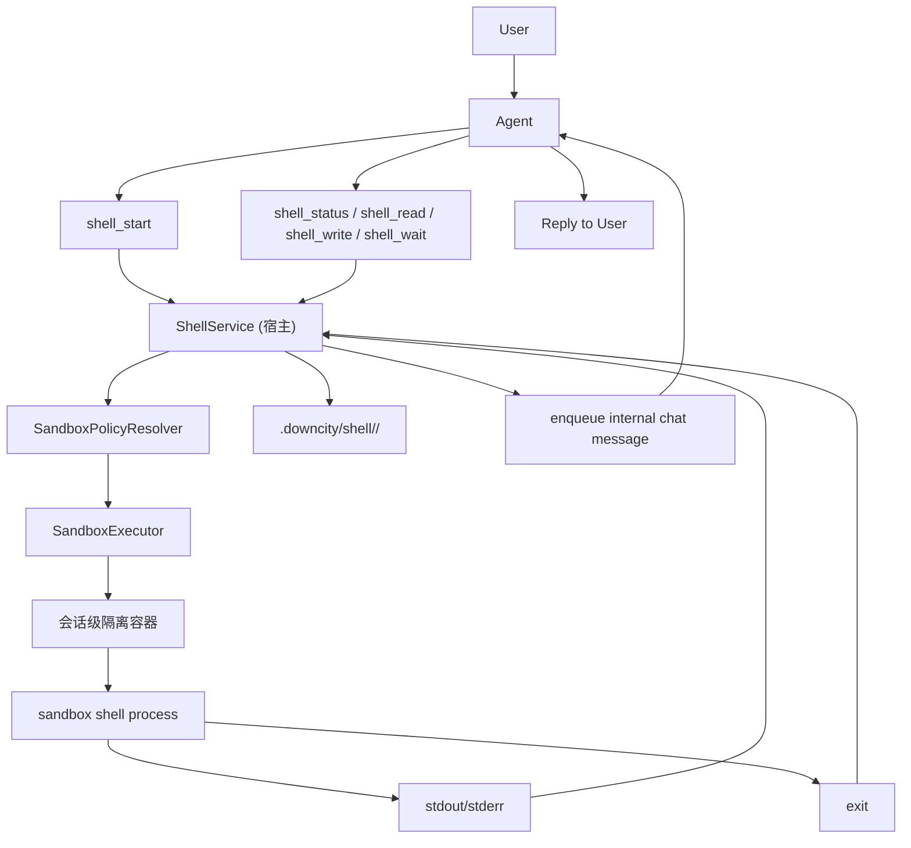
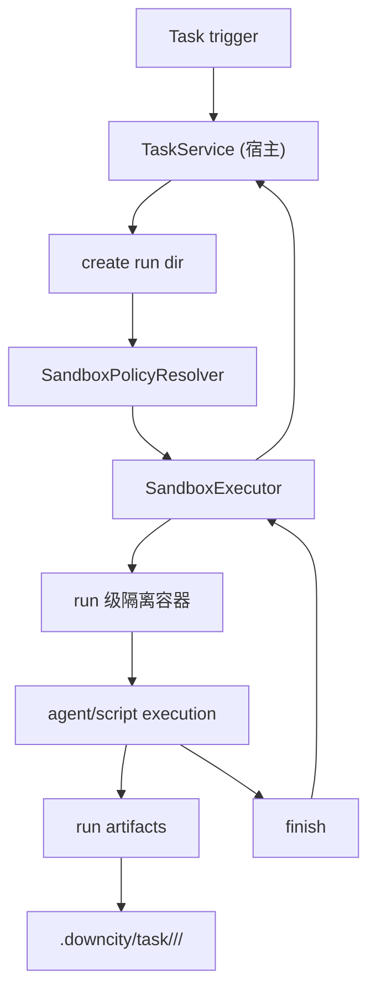

# 会话级沙箱执行设计

这页回答的是一个非常具体的问题：

- Downcity 后续如果要补回真正的本地执行隔离，默认方案应该是什么

先给结论：

- 默认方案应该是 **会话级隔离容器**
- `shell` 的执行边界应按 **shell session** 切
- `task` 的执行边界应按 **task run** 切
- `AgentState`、`SessionStore`、`Memory`、`Chat` 等宿主 runtime 状态不应该放进沙箱
- 高安全场景可以再加 `microVM` backend，但不应该作为默认执行后端

一句话：

```text
宿主 runtime 负责编排和持久化，沙箱只负责受控执行。
```

## 为什么不是“每个操作一个 microVM”

单看安全性，`microVM` 很强。

但结合当前 package 的真实协议，它不是默认方案。

原因不是抽象层面，而是现有 shell 语义本身就是 **有状态会话**：

- `shell_start`
- `shell_status`
- `shell_read`
- `shell_write`
- `shell_wait`
- `shell_close`

这意味着当前 shell 不是“执行一次命令然后立刻忘掉”，而是：

- 启动一个执行实例
- 保持状态
- 支持中途查询
- 支持 stdin 交互
- 结束后再回到主 agent

如果按“每个 tool call 一个 microVM”设计，会直接出现几个问题：

1. `shell_start` 和后续 `shell_write` / `shell_wait` 无法稳定绑定到同一个执行环境
2. 长任务会因为反复冷启动出现明显延迟
3. chat 场景里用户中途问进度时，体验会很怪
4. 协议会被基础设施形态反向扭曲

所以这里真正的执行单元不应该是：

- 单个 shell action

而应该是：

- 一个 `shell session`
- 一个 `task run`

## 为什么不是“整个 agent runtime 进沙箱”

也不应该把整个 `AgentState` 都塞进容器或 VM。

原因很简单：

- `AgentState` 是宿主 runtime 中心
- `SessionStore` 是统一执行主轴
- `Chat`、`Memory`、`PluginRegistry`、日志与审计都依赖宿主长期状态

如果把这些都搬进沙箱，会带来几个直接问题：

1. runtime 初始化会变重
2. 会话状态同步会变复杂
3. 沙箱销毁后，状态回收和持久化边界会变乱
4. 我们真正想隔离的是“副作用执行”，不是“全部思考与编排”

所以更合理的分层是：

```text
宿主侧保留 AgentState / Session / Chat / Memory / Logs
沙箱侧只承接 shell 或 task 的实际执行
```

## 为什么默认选择会话级隔离容器

先把几个候选方案摆清楚：

### 1. 长期活着的隔离容器

优点：

- 启动快
- 交互性好

问题：

- 状态污染风险高
- 容易慢慢退化成“第二台宿主机”
- 安全边界会越来越模糊

### 2. 会话级隔离容器

优点：

- 一个 `shell session` 或 `task run` 复用一个隔离环境
- 能支持 `stdin`、增量输出和中途查状态
- 生命周期明确，结束即可销毁
- 启动成本和隔离强度比较平衡

问题：

- 需要宿主 runtime 维护 `session -> sandbox` 绑定关系

### 3. 本地 jail

优点：

- 轻
- 启动快

问题：

- 平台依赖重
- 强度取决于实现
- 很容易变成“逻辑限制”，而不是真正的执行隔离

### 4. microVM

优点：

- 隔离最强

问题：

- 冷启动成本高
- 不适合默认 chat / shell 交互路径

## 默认决策

结合当前 shell 和 task 的真实工作方式，默认最稳的方案是：

- `shell_start` 创建一个 **会话级隔离容器**
- 同一个 `shell_id` 后续所有操作都复用这个容器
- 一个 `task run` 创建一个 **run 级隔离容器**
- `task run` 内部多轮执行复用这个容器

这比“长期容器”更干净，比“每步 microVM”更符合交互体验。

## 核心边界

### 宿主 runtime 负责什么

宿主侧继续负责：

- `AgentState`
- `ExecutionContext`
- `SessionStore`
- `ChatService`
- `MemoryService`
- `ShellService` 的协议和状态编排
- `TaskService` 的 run 编排
- 审计、落盘、回 chat、日志

### 沙箱负责什么

沙箱只负责：

- 启动 shell 或 script 进程
- 维护受控文件系统视图
- 执行命令
- 提供 stdout / stderr / exit code
- 暴露受控的 stdin 写入能力
- 在策略允许时访问网络和额外路径

一句话：

```text
ShellService 和 TaskService 仍然在宿主侧，沙箱只是它们的执行后端。
```

## 推荐的对象边界

建议新增三个核心对象：

### `SandboxExecutor`

负责：

- 创建沙箱
- 启动命令
- 写入 stdin
- 查询执行状态
- 读取输出
- 关闭沙箱

它是基础设施接口，不持有业务语义。

### `SandboxSessionRegistry`

负责：

- 维护 `shell_id -> sandbox`
- 维护 `task_run_id -> sandbox`
- 跟踪容器状态、生命周期和回收

### `SandboxPolicyResolver`

负责：

- 解析当前执行该拿到哪些路径
- 哪些 env 可以注入
- 是否允许联网
- 资源限制是多少

## 推荐的状态模型

这里需要区分两种状态。

### 1. 业务状态

例如 shell 的：

- `starting`
- `running`
- `completed`
- `failed`
- `killed`
- `expired`

### 2. 基础设施状态

例如 sandbox 的：

- `provisioning`
- `active`
- `stopping`
- `destroyed`
- `error`

这两个状态不要混成一套。

因为：

- shell 状态回答“这次命令执行得怎么样了”
- sandbox 状态回答“底层隔离环境是否还活着”

## shell 的完整链路

推荐链路如下：



关键点：

- `shell_id` 仍然由宿主侧生成和管理
- 容器不直接承担 chat 语义
- 中途状态查询仍然走 `ShellService`
- shell 结束后仍然回到主 agent 继续回复

## task 的完整链路

`task` 不应该按单步 shell 切，而应该按一次 run 切。

推荐链路如下：



关键点：

- 一个 run 内多轮执行复用同一个沙箱
- 不要一轮起一个容器
- 不要一个 shell step 起一个容器

## 路径访问模型

本地执行隔离真正关键的，不是“shell 能不能 `cd`”，而是：

- 哪些路径被挂进了沙箱

默认策略应该是：

- `projectRoot`：可读写
- `.downcity/shell`：可读写
- `.downcity/task`：可读写
- 受控缓存目录：按需挂载
- 宿主 `HOME`：不挂载
- 其他仓库目录：不挂载
- `~/.ssh` / `~/.aws` / `~/.config`：不挂载

结论就是：

```text
没挂进去的路径，沙箱内就看不到。
```

这也是为什么默认策略不应该依赖应用层“禁止访问某路径”的软校验，而应该依赖真正的挂载边界。

## env 访问模型

当前 shell 实现会合并：

- `process.env`
- global env
- agent env

如果后续接沙箱执行，这个口径就不能原样继承。

更稳的方向是：

- 默认不把宿主 `process.env` 全量注入
- 只按 allowlist 注入当前执行真正需要的变量
- chat 平台 token、SSH 凭据、云凭据默认不进沙箱

建议把 env 分成四类：

1. `runtime-required`
2. `tool-required`
3. `user-approved`
4. `never-export`

## 网络模型

默认建议只保留三档：

- `off`
- `restricted`
- `full`

默认策略：

- `shell` 默认 `off`
- `task` 默认 `restricted`
- 明确需要联网的执行再升到 `full`

`restricted` 应该走白名单，而不是模糊地“允许一部分网络”。

## 为什么不直接选 microVM 作为默认 backend

不是因为它不好，而是因为它更适合：

- 高风险执行
- 非强交互场景
- 企业高安全部署

它不适合作为当前 chat / shell 默认路径，原因是：

- 启动成本更高
- session 型 shell 交互不够顺
- 会把基础设施成本强行压到所有场景

所以更合理的方向是：

- 默认 backend：会话级隔离容器
- 高安全 backend：microVM

也就是说：

```text
microVM 应该是可选强化模式，而不是默认执行形态。
```

## 最小改造原则

如果后续真的实现这套设计，最重要的一条不是“重写一遍 shell”。

而是：

- 对外协议尽量不变
- 执行后端替换为 sandbox executor

优先保持：

- `shell_start/status/read/write/wait/close`
- `task run` 目录结构
- `.downcity` 审计口径

真正变化的应该是：

- `SessionStore.ts` 内部不再直接 `spawn`
- 改为调 `SandboxExecutor`

## 建议的实施顺序

### Phase 1：抽象执行接口

先引入：

- `SandboxExecutor`
- `SandboxSessionRegistry`
- `SandboxPolicyResolver`

先不改用户协议。

### Phase 2：先接 shell

先把 `shell_start` / `shell_exec` 接到会话级容器后端。

重点是：

- 路径挂载
- env allowlist
- shell 状态同步
- stdout/stderr 落盘

### Phase 3：再接 task

把 `task run` 切到 run 级容器。

重点是：

- run 生命周期
- 产物目录
- agent/script 两种执行模式的统一隔离口径

### Phase 4：补高安全 backend

在协议和对象边界稳定后，再考虑：

- `microVM` backend
- 更强的网络和资源策略

## 一句话总结

```text
对当前 Downcity 来说，最合理的默认本地执行隔离，不是每步起一个 microVM，也不是长期养一个容器，而是：宿主 runtime 继续编排，shell session 和 task run 各自绑定一个会话级隔离容器。
```
