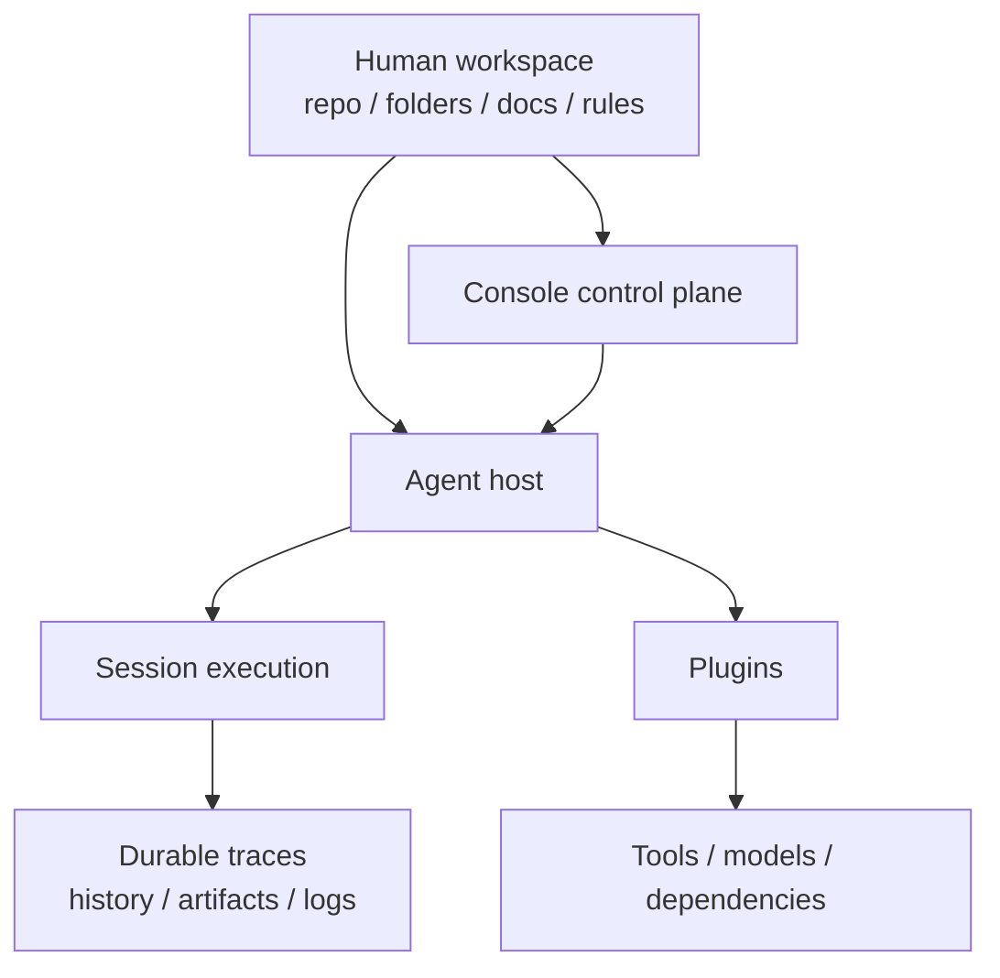

# 设计哲学与方法论

这页回答的是：为什么今天的架构会长成现在这样。

## 核心命题

Downcity 不是要把人迁进一个新的 Agent 平台。

它要做的是让 Agent 继承人已经在用的业务结构，在这个结构里高密度执行。

也就是：

- 人保留工作区
- Agent 在工作区里执行
- 关键状态继续留在人类可读的文件、日志与 session 历史中

## 它在反对什么

很多 Agent 系统默认先把业务状态抽离到新平台。

这通常会带来三种损耗：

- 上下文损耗
- 解释权损耗
- 治理抓手损耗

Downcity 把这种默认路线视为错误起点。

## 第一性原则

1. repo-native 结构优先
2. 人类保留解释权
3. 控制面与执行面分离
4. session 拥有执行权
5. plugin 拥有能力，不拥有这一轮执行本身

## 一个实用判断

每次设计新东西时，都先问：

- 这个设计是在把状态拉回真实工作区，还是在制造新的平台层？
- 它有没有让 session 执行主轴更清楚？
- 这项能力更适合做 plugin action、hook、system，还是托管 runtime？

## 从哲学到架构的映射

