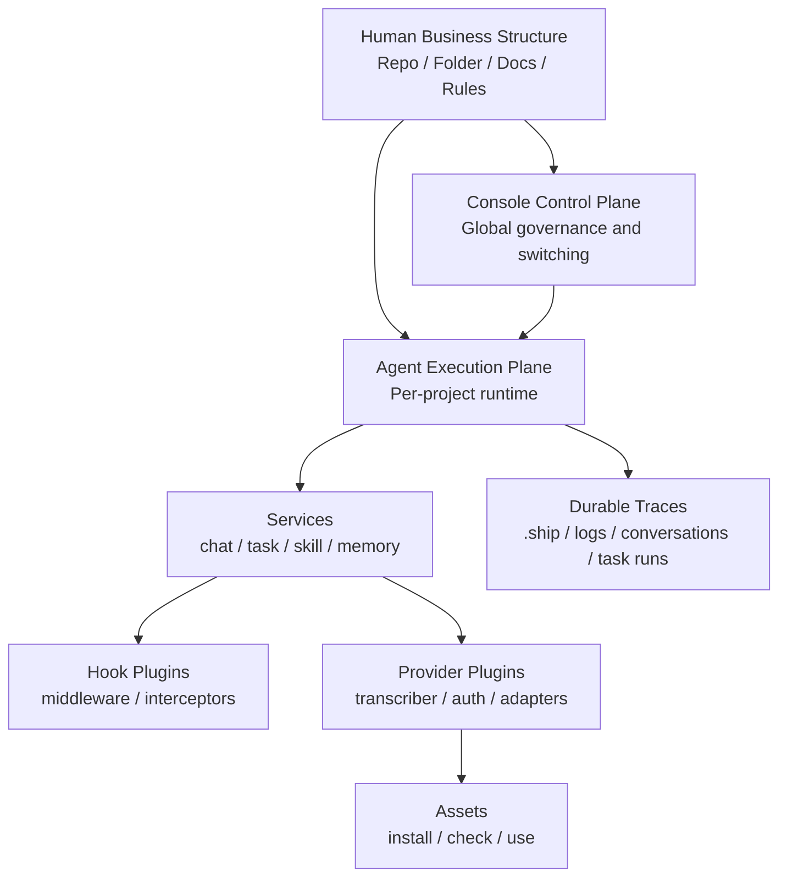

# 设计哲学与方法论

这页不是“品牌文案版介绍”，而是给协作者看的系统方法论。它回答三个问题：

1. Downcity 试图修正什么问题
2. 为什么它不是一个传统意义上的 Agent 平台
3. 为什么今天的代码结构会长成现在这样

## 一句话哲学

Downcity 的核心不是“替代人”，而是“让 Agent 继承人已经建立好的业务结构，在人定义的边界内高密度执行”。

也可以写成三句话：

- Human 不应该迁移到 Agent 平台
- Agent 应该降落到 Human 的原生工作区
- 管理目录、文档、配置与上下文，就是管理 Agent

## 它在反对什么

Downcity 反对的是一种很常见的默认路线：

- 先抽离业务状态
- 再迁入新的 AI 平台
- 再让人通过表单、节点和中台去“指挥” Agent

这条路线的问题不是不能跑 demo，而是它会持续放大三种损耗：

1. 上下文损耗
2. 解释权损耗
3. 治理抓手损耗

业务人员一旦被迫离开原有工作区，进入平台化控制台，本来已经沉淀在目录、文件、命名、流程里的隐性知识，就会被系统翻译层不断稀释。

## Downcity 的修正方向

Downcity 采用的是“Human with Agent”，不是“Human or Agent”。

意思不是机器能力更弱，而是责任分配更清楚：

- 人类定义环境、边界、规则、优先级与兜底责任
- Agent 读取这些结构化边界，在其中承担高频执行
- 所有重要状态都尽量保留在人类可读的文件、日志、目录与上下文里

## 第一性原则

### 1. 业务原生优先

最重要的资产不是额外建立的 AI 数据库，而是团队已经长期使用的工作区结构。

- repo 是上下文
- 文件夹是边界
- 文档是规则
- 配置是契约
- `.ship/` 是运行痕迹

### 2. 人类保留解释权

Agent 可以执行，但不应该垄断系统状态表达。  
所以 Downcity 强调：

- 对话落盘
- 日志落盘
- 任务与上下文有明确可追踪痕迹
- 配置与运行边界尽量文件化

### 3. 控制面与执行面分离

这是今天代码结构最重要的架构原则之一：

- `console` 负责管理、观察、切换、配置
- `agent` 负责在单个项目内实际运行

这样做的好处是：全局治理不侵入单项目执行，单项目执行也不会反过来污染全局控制面。

### 4. 工作流与增强分离

- `service` 是主业务流
- `plugin` 是增强能力

如果一个能力是用户的主路径，就应该是 service。  
如果它只是增强某个已有路径，或者提供一个可被调用的能力，就更适合成为 plugin。

但这里更准确的判断标准其实是：

- `service` 有生命周期，会主动参与 agent 的执行周期
- `plugin` 没有生命周期，只通过 hook / middleware / provider 的方式接入主流程

### 5. Service 定义扩展点，Plugin 只实现扩展点

扩展点的定义权应该在 service / runtime，而不是在 plugin 自己手里。

- `chat` 需要什么增强点，由 `chat service` 定义
- `task` 需要什么增强点，由 `task service` 定义
- plugin 只负责实现这些扩展点
- plugin 不应该反过来定义 runtime 的主语义

## 为什么“目录即界面”很重要

Downcity 其实是在做一次 HCI 方向的反转。

传统 Agent 平台的默认操作是：

- 去看节点图
- 去改 JSON
- 去填表单
- 去配运行时状态

Downcity 的目标是把这套认知成本降到最低：

- 新建目录，就是新建边界
- 修改规则文档，就是修改 Agent 行为约束
- 查看运行产物，就是查看 Agent 的真实工作痕迹

也就是说，系统状态表达尽量与你已经熟悉的文件系统心智同构。

## 从哲学到架构的映射

下面这张图是最核心的总图。

这张图表达的不是代码依赖，而是思想依赖：

- 顶层仍然是人类业务结构
- console 与 agent 都是围绕它服务
- service 定义主流程与扩展点
- plugin 只负责以 hook / provider 方式接入
- `.ship/` 不是附属缓存，而是可审计的运行痕迹层

## 你可以怎样用这套哲学判断设计取舍

当你在做实现选择时，可以反复问这几个问题：

1. 这个设计是在减少人机翻译损耗，还是在制造新的平台层？
2. 它是在增强人类对边界的解释权，还是把状态藏进黑盒？
3. 它应该是 service，还是应该是 plugin？
4. 它应该写进用户文档，还是开发文档？
5. 它留下的状态是否仍然是人类可接管、可审计、可迁移的？

如果答案偏向“平台化封装更多、文件化表达更少、解释权更黑盒”，那通常就不是 Downcity 想走的方向。
