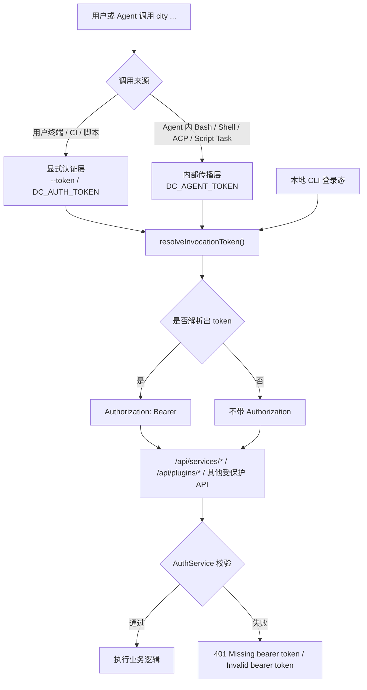
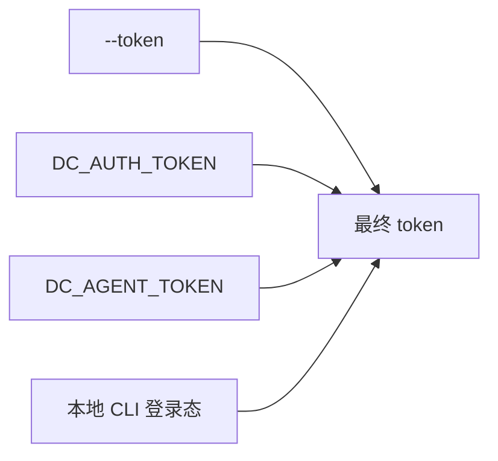
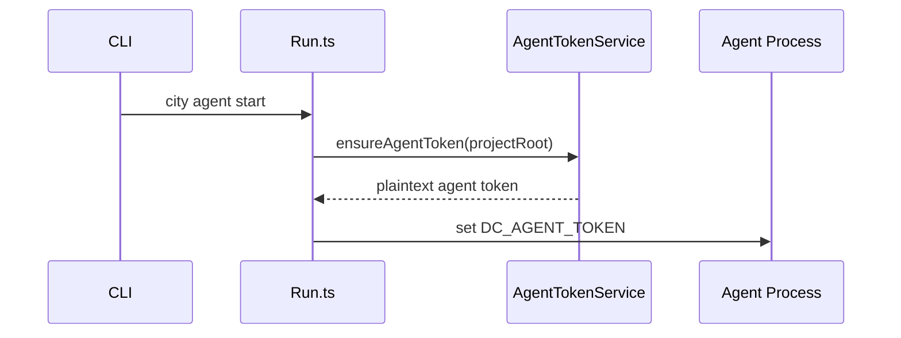
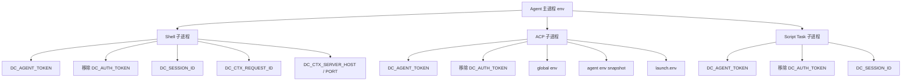
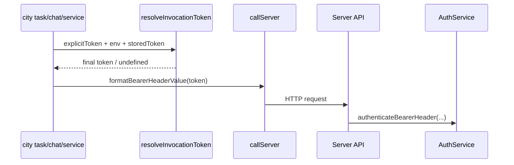
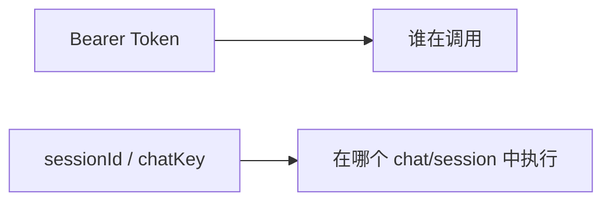

# 认证环境变量与 Token 调用链路

这一页只讲一个问题：

- 当仓库里执行 `city task`、`city chat`、`city service`、`city plugin` 时，认证 token 到底从哪里来
- `DC_AUTH_TOKEN` 和 `DC_AGENT_TOKEN` 分别在什么层次生效
- 为什么 `sessionId` 不能替代 Bearer Token
- 为什么会出现 `Missing bearer token`

对应当前实现的核心代码：

- `packages/downcity/src/main/auth/AuthEnv.ts`
- `packages/downcity/src/main/auth/CliAuthStateStore.ts`
- `packages/downcity/src/main/daemon/Client.ts`
- `packages/downcity/src/main/auth/AgentTokenService.ts`
- `packages/downcity/src/main/commands/Run.ts`
- `packages/downcity/src/main/daemon/Manager.ts`
- `packages/downcity/src/services/shell/runtime/ShellActionRuntimeSupport.ts`
- `packages/downcity/src/session/tools/shell/ShellToolFormatting.ts`
- `packages/downcity/src/session/execution/acp/AcpSessionExecutor.ts`

## 一句话结论

当前认证模型可以压缩成四条规则：

1. Bearer Token 只负责“谁在调用”
2. `sessionId` / `chatKey` 只负责“在哪个上下文里执行”
3. 用户显式覆盖走 `--token` / `DC_AUTH_TOKEN`
4. agent 内部自动传播走 `DC_AGENT_TOKEN`，并主动清理继承进来的 `DC_AUTH_TOKEN`

## 总体调用图

## 变量职责

### `DC_AUTH_TOKEN`

`DC_AUTH_TOKEN` 的语义是：

- 用户显式覆盖这一次 CLI/API 调用身份

适用场景：

- 你在终端里手动执行 `city task ...`
- CI / shell script 调用 `city ...`
- 你已经从登录接口或 token 管理接口拿到了一个 Bearer Token，想明确指定本次命令用它

它不是“agent 内部自动传播变量”，它更像：

- 外部显式输入

### `DC_AGENT_TOKEN`

`DC_AGENT_TOKEN` 的语义是：

- agent runtime 在内部传播调用身份

适用场景：

- agent 启动后，runtime 为该 agent 签发专用 token
- agent 内部再次执行 `city task`、`city chat`、`city service`
- Bash tool / shell service / ACP 子进程 / script task 子进程继续复用当前 agent 身份

它不是给外部集成长期手动配置的首选变量，它更像：

- agent 进程内部总线

## 为什么要同时保留两个变量

如果只有一个变量，会混淆“用户显式覆盖”和“runtime 自动传播”。

当前设计刻意把两者分开：

- `DC_AUTH_TOKEN`
  - 明确代表“用户说这次调用就用这个 token”
- `DC_AGENT_TOKEN`
  - 明确代表“runtime 自动把 agent 身份带给内部子进程”

这样做的好处是优先级清晰：

- 用户显式传入应该永远覆盖 runtime 默认值
- agent 内部自动化路径也不会意外继承宿主 shell 的用户 token

## 统一优先级

当前最终 token 解析顺序是：

1. `--token`
2. `DC_AUTH_TOKEN`
3. `DC_AGENT_TOKEN`
4. 本地 CLI 登录态

对应代码在：

- `packages/downcity/src/main/auth/AuthEnv.ts`
- `packages/downcity/src/main/auth/CliAuthStateStore.ts`

可以画成：

### 这意味着什么

- 只要传了 `--token`，永远优先
- 没有 `--token` 时，`DC_AUTH_TOKEN` 覆盖 `DC_AGENT_TOKEN`
- 没有显式覆盖时，agent 内部调用自动回退到 `DC_AGENT_TOKEN`
- 只有前面都没有时，才使用本地 CLI 登录态

当前实现还有一个细节：

- CLI resolver 会先检查 `--token` / `DC_AUTH_TOKEN` / `DC_AGENT_TOKEN`
- 只有这些都没有命中时，才会读取本地 CLI 登录态

这意味着显式 token 路径不会再为了兜底逻辑额外触发本地状态读取。

## Agent 启动时发生什么

### 前台模式

`city agent start --foreground` 或 daemon 子进程最终都会进入 `Run.ts`。

过程是：

1. 读取项目根目录
2. 调用 `ensureAgentToken(projectRoot)`
3. 拿到该 agent 的明文 token
4. 注入 `process.env.DC_AGENT_TOKEN`

### 后台 daemon 模式

后台模式在 `Manager.ts` 里做同样的事：

1. 启动 daemon 之前先签发/轮换 agent token
2. 给 daemon 子进程 env 注入 `DC_AGENT_TOKEN`

## 子进程传播逻辑

### Shell service / shell tool

这两条链路不再自己手写“把 `DC_AGENT_TOKEN` 复制成 `DC_AUTH_TOKEN`”。

现在统一做法是：

- 主动清理继承进来的 `DC_AUTH_TOKEN`
- 只传播 `DC_AGENT_TOKEN`
- 由 CLI 发请求前再统一解析优先级

对应位置：

- `ShellActionRuntimeSupport.ts`
- `ShellToolFormatting.ts`

### ACP 子进程

`execution.type = "acp"` 时，实际运行的是外部 Codex / Claude / Kimi 子进程。

Downcity 在拉起 ACP 子进程时会：

- 继承 `process.env`
- 合并 global env / agent env / launch.env
- 清理继承进来的 `DC_AUTH_TOKEN`
- 再统一注入 `DC_AGENT_TOKEN`

对应位置：

- `AcpSessionExecutor.ts`

### Script task 子进程

`kind = "script"` 的任务体通过 `sh task-script.sh` 执行。

Downcity 会在这条路径里显式注入：

- `DC_SESSION_ID`
- `DC_AGENT_TOKEN`

同时会清理继承进来的 `DC_AUTH_TOKEN`，避免 script task 意外使用外部用户 token。

对应位置：

- `TaskRunnerRound.ts`

## 环境变量分层

## 最终 HTTP 请求怎么产生 Authorization

无论调用入口是：

- 用户终端里的 `city task`
- agent 内部 Bash tool
- ACP 子进程里的 `city service`
- script task 里的 `city chat`

最终都收敛到：

1. `resolveInvocationToken(...)`
2. `formatBearerHeaderValue(...)`
3. `Authorization: Bearer <token>`

如果解析不出 token，请求就不会带 `Authorization`。

这时服务端就会返回：

- `Missing bearer token`

## `sessionId` 在哪里生效

这是另一个必须和 token 分开的概念。

所以：

- `sessionId` 不参与认证
- `chatKey` 不参与认证
- 它们都不能代替 Bearer Token

## 为什么会出现 `Missing bearer token`

只要最终 HTTP 请求没带 `Authorization`，就会出现这个错误。

典型原因：

1. 没传 `--token`
2. 当前 shell 没有 `DC_AUTH_TOKEN`
3. 当前 agent 子进程没继承到 `DC_AGENT_TOKEN`
4. 本地 CLI 登录态不存在

一个反过来的排查点：

- 如果你原本担心“外部 `DC_AUTH_TOKEN` 会不会污染 agent 内部自动化路径”，当前实现已经显式清理了这件事
- agent 内部链路现在强制只使用 `DC_AGENT_TOKEN`

它通常不是这些原因：

- `sessionId` 缺失
- `chatKey` 缺失
- task body 写错

这些通常会在业务层报别的错误。

## 当前设计的基础抽象

这次收敛后的基础抽象是：

### Auth 输入层

- `--token`
- `DC_AUTH_TOKEN`
- `DC_AGENT_TOKEN`
- 本地 CLI 登录态

### Auth 解析层

- `AuthEnv.ts`
- `CliAuthStateStore.ts`

### Auth 传播层

- `Run.ts`
- `Manager.ts`
- `ShellActionRuntimeSupport.ts`
- `ShellToolFormatting.ts`
- `AcpSessionExecutor.ts`
- `TaskRunnerRound.ts`

### Auth 输出层

- `Authorization: Bearer <token>`

## 推荐理解方式

如果要给新开发者一句话解释整个模型，推荐这样说：

- `DC_AUTH_TOKEN` 是“用户显式指定这次调用身份”
- `DC_AGENT_TOKEN` 是“runtime 自动传播 agent 身份”
- agent 内部路径会先 scrub `DC_AUTH_TOKEN`，防止外部覆盖渗透进内部链路
- CLI 发请求前统一做优先级解析
- `sessionId` 只是执行上下文，不是认证凭据
