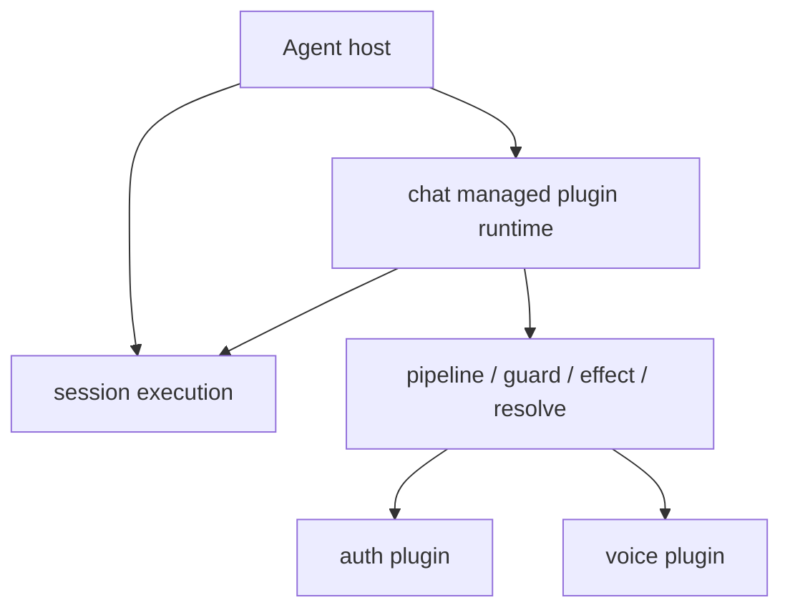

# 权限与插件实现整理

这页描述的是当前真实实现，不再沿用旧草案。

## 权限链路

权限流程横跨这些层面：

- UI 侧权限管理
- API 层 auth 状态读写
- chat ingress 里的运行时判定
- 存储层里的 principal 观测信息

高层链路可以概括为：

```text
平台消息进入
  -> chat ingress
    -> 记录 principal 观测信息
    -> 读取 auth 配置
    -> 执行 allow / block 判定
    -> 允许时把归一化消息入队
```

## auth 现在怎么接入

- `chat.observePrincipal`
- `chat.authorizeIncoming`
- `chat.resolveUserRole`

这意味着权限逻辑属于 chat runtime 行为的一部分，但具体策略由 auth plugin 提供。

## voice 现在怎么接入

- `chat.augmentInbound`

voice 现在的角色是入站消息增强，而不是独立的顶层工作流拥有者。

## 真实的 plugin 边界

- session 仍然负责执行
- 托管 plugin 可以拥有 runtime 模块
- hook 表达增强
- 显式 plugin action 对外暴露可调用能力

## 当前心智图



## 为什么这很重要

旧的分层对立语言会把真正的执行主轴藏起来。

现在更清楚的模型是：

- session 负责执行
- chat 拥有一个托管 runtime 路径
- plugin 负责增强或暴露能力
