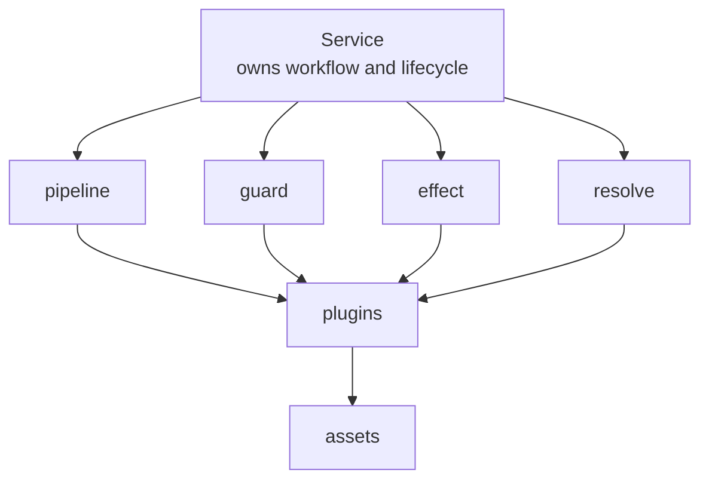

# 权限与插件实现整理

这一页不再讨论抽象草案，而是直接整理当前已落地实现。

## 权限链路

权限流程横跨以下层面：

- UI 侧的权限配置与分组管理
- API 层对权限配置与账户数据的读写
- chat channel 接入时的运行时判定
- 存储层里的配置与已观测 user/chat 元信息

高层链路可以概括为：

```text
平台消息进入
  -> channel adapter
    -> 记录权限观测信息
    -> 读取权限配置
    -> 执行 allow / block 判定
    -> 允许时把归一化消息入队
```

## auth plugin 现在怎么接入

- `chat.observePrincipal`
  auth 在这里记录 user/chat 观测信息
- `chat.authorizeIncoming`
  auth 在这里决定当前消息是否允许进入主流程
- `chat.resolveUserRole`
  auth 在这里返回当前用户角色

也就是说，权限逻辑现在是 chat service 工作流中的一部分，但具体授权实现由 auth plugin 插入。

## voice plugin 现在怎么接入

- `chat.augmentInbound`
  voice 在这里直接完成语音转写，并把结果补回入站正文或 plugin sections

所以 voice 现在就是一个处理消息内容的 middleware plugin，而不是额外的语音 provider 点。

## 当前插件系统真实边界

- service 负责定义流程和点位
- runtime 负责统一四种执行语义
- plugin 负责在这些点上提供实现
- asset 负责 plugin 背后的依赖

## 当前模型图



## 为什么现在不再用 capability 作为核心抽象

- 它会让 service 的真实生命周期点被隐藏掉
- 它会让 plugin 看起来像主动拥有调用语义
- 它会把“流程节点扩展”和“显式能力调用”混成一层
- 它不如现在这四种语义清晰

所以现在的更准确定义是：

- `pipeline` 用于改写
- `guard` 用于阻断
- `effect` 用于副作用
- `resolve` 用于单点解析

## 迁移判断规则

- 主动参与 agent 周期的，做 service
- 在 service 某个点位插逻辑的，做 plugin
- 给 plugin 提供底层依赖的，做 asset
- 用户看得见的行为变化，更新 `/docs`
- 实现、架构、迁移细节，更新 `/devdocs`
