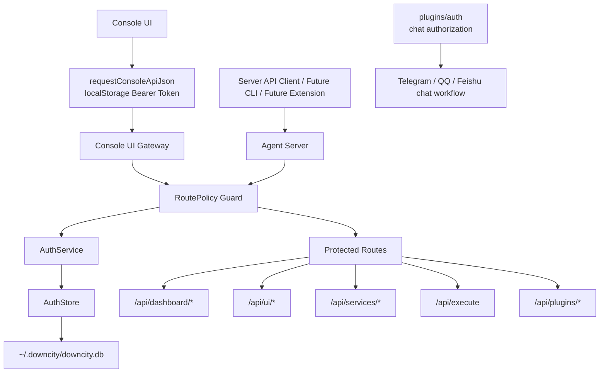
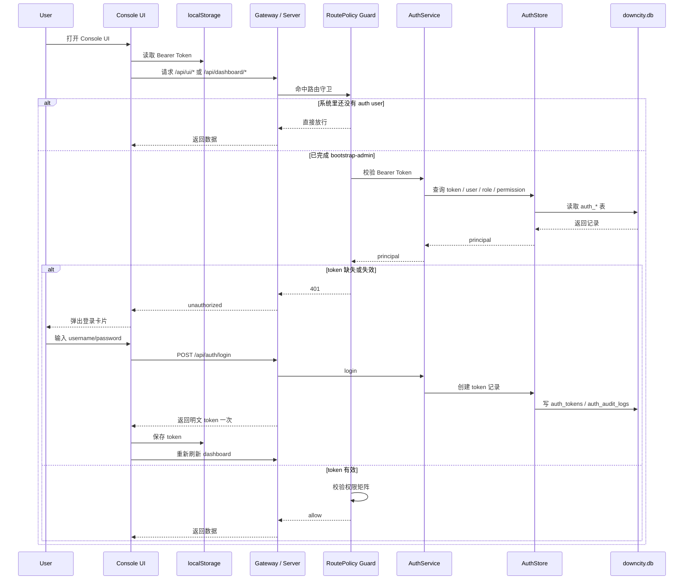

# 统一账户当前实现状态

这一页不讲目标设计，而是只讲当前仓库里已经落地的事实。

## 全链路总览

### 分层关系图

### 当前真实时序

## 已经落地的部分

- console SQLite 已有 `auth_users`、`auth_roles`、`auth_permissions`、`auth_user_roles`、`auth_role_permissions`、`auth_tokens`、`auth_audit_logs`
- `packages/downcity/src/main/auth/` 已建立，包含 `AuthStore`、`AuthService`、`AuthRoutes`、`AuthMiddleware`、`RoutePolicy`、`TokenService`
- 认证接口已可用：
  - `POST /api/auth/bootstrap-admin`
  - `POST /api/auth/login`
  - `GET /api/auth/me`
  - `GET /api/auth/token/list`
  - `POST /api/auth/token/create`
  - `POST /api/auth/token/revoke`
- server 与 console-ui gateway 已接入统一路由守卫
- console-ui 已接入登录态与 Bearer Token 注入

## 当前真实规则

当前系统不是“所有接口都无条件强制登录”，而是：

1. 如果系统里还没有任何统一账户用户，受保护接口默认放行
2. 一旦完成 `bootstrap-admin`，受保护接口开始要求 Bearer Token
3. 命中权限矩阵的接口会继续校验权限

这个“bootstrap 前放行”是当前实现中的重要过渡层，用来避免首次部署时把控制面锁死。

## 当前已经进入权限矩阵的接口

- `/api/execute` -> `agent.execute`
- `/api/services/list` -> `service.read`
- `/api/services/control` -> `service.write`
- `/api/services/command` -> `service.write`
- `/api/plugins/list` -> `plugin.read`
- `/api/plugins/availability` -> `plugin.read`
- `/api/plugins/action` -> `plugin.write`
- `/api/dashboard/authorization` -> `auth.read`
- `/api/dashboard/authorization/config` -> `auth.write`
- `/api/dashboard/authorization/action` -> `auth.write`

另外：

- `/api/dashboard/*`
- `/api/ui/*`

已经进入“需要登录”的受保护范围，但很多地方还只是粗粒度保护，不是完整的读写权限拆分。

## Console UI 当前状态

console-ui 现在已经可以：

- 从本地存储读取 Bearer Token
- 自动给请求加 `Authorization: Bearer ...`
- 在 `401` 时切到登录卡片
- 登录成功后写入 token 并继续刷新 dashboard
- 顶栏显示当前登录用户并支持退出

这说明控制面已经不再是假定匿名可信。

## 还没完成的部分

当前仍然缺这些关键部分：

- `/api/ui/*` 与 `/api/dashboard/*` 的细粒度权限矩阵还不完整
- CLI 还没有全面接入统一账户登录流
- Chrome Extension 还没有接入统一账户 token
- 用户/角色/权限/审计日志的管理面还没有真正做出来

## 一个必须分清的边界

仓库里现在同时存在两套 auth：

1. `packages/downcity/src/main/auth/`
   - 统一账户
   - 面向 console / server / ui / api client
2. `packages/downcity/src/plugins/auth/`
   - 聊天授权
   - 面向 Telegram / QQ / Feishu 用户是否能进入 chat workflow

它们现在是并存关系，不是同一套系统。

## 继续推进时的推荐顺序

1. 细化 `/api/ui/*` 权限矩阵
2. 细化 `/api/dashboard/*` 权限矩阵
3. 给 CLI 接统一登录与 token 存储
4. 给 Chrome Extension 接 token 注入
5. 再评估是否要把统一账户和聊天授权往更高层的权限模型收敛
