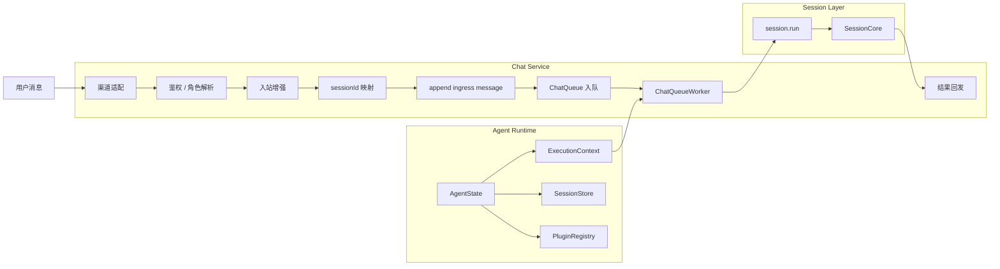

# Chat 设计原理

这页只解释一件事：

- 当前 `chat` service 到底怎么工作

先给结论：

- `chat` 不是 session runtime
- `chat` 是消息编排中心
- `chat` 左边接渠道输入，右边接 `SessionStore`
- `chat` 自己负责入站整理、排队、调用 session、回发结果

## 一句话模型

```text
用户消息先进入 chat service
chat service 把消息整理并归到 session
session 内核负责真正执行
chat service 再把结果发回聊天渠道
```

## Chat 的真实职责

`chat` service 负责：

1. 接住 Telegram / Feishu / QQ 等渠道消息
2. 做 principal 观测、鉴权、角色解析
3. 把渠道目标映射成内部 `sessionId`
4. 追加 chat ingress message
5. 把执行请求送进 queue
6. 调用 `session.run`
7. 把结果分发回渠道

不属于 `chat` 的事情：

- 持有 model
- 持有 session 执行内核
- 持有 persistor
- 持有 plugin registry 的全局生命周期

这些属于 agent runtime。

## Chat 和 Agent Runtime 的关系

当前 chat 不是通过旧文档里的 `ServiceRuntime.session.run()` 调用旧的 `SessionManager`。

现在更准确的关系是：

- agent 持有 `AgentState`
- `AgentState` 持有 `SessionStore`
- `ChatService` 通过 `ExecutionContext.session` 使用 `SessionStore`



## Chat 的主链

### 1. 渠道适配

渠道层负责：

- 接收平台原始事件
- 统一成 chat service 可消费的入站结构
- 处理平台特定字段、附件、reply context、去重

### 2. principal 观测、鉴权和角色解析

chat 会在入站早期调用 plugin 点：

- `chat.observePrincipal`
- `chat.authorizeIncoming`
- `chat.resolveUserRole`

它们解决的是：

- 当前消息是否允许执行
- 当前用户具备什么角色
- 当前消息需要带什么权限上下文

### 3. 入站增强

chat 会把渠道消息整理成适合模型理解的 user message。

这里会处理：

- 正文
- 附件说明
- reply context
- `chat.augmentInbound`

### 4. sessionId 映射

chat 会把渠道维度的目标映射成内部 `sessionId`。

这是 chat 和 session 的关键桥接点。

一句话：

- 渠道世界看的是 chat / thread / user
- session 世界看的是 `sessionId`

### 5. 入队

chat 不会让每条消息都直接同步打到 session 内核。

当前实现会：

- 先把执行项写入 chat queue
- 再由 `ChatQueueWorker` 按 lane 消费

lane 的关键语义是：

- 同一个 lane 内的消息按顺序消费
- 不同 lane 可以并发

### 6. worker 调用 session

`ChatQueueWorker` 是真正把 chat 消息送入 session 层的地方。

它会做：

- 追加 ingress message
- 合并 burst 消息
- 在需要时注册 step callback
- 调用 `ExecutionContext.session.run`

所以更准确的说法是：

- chat queue worker 围绕 `SessionStore.run` 编排，而不是自己拥有执行内核

### 7. 回复回发

session 执行结束后，chat 会把 assistant 结果整理成用户可见文本，再发回目标渠道。

回复前后还会调用 plugin 点：

- `chat.beforeReply`
- `chat.afterReply`

## Chat 的 plugin 点

当前 chat service 定义并使用这些稳定点名：

- `chat.augmentInbound`
- `chat.observePrincipal`
- `chat.authorizeIncoming`
- `chat.resolveUserRole`
- `chat.beforeEnqueue`
- `chat.afterEnqueue`
- `chat.beforeReply`
- `chat.afterReply`

关键点：

- 点名由 chat service 定义
- plugin 负责实现部分点
- chat 仍然拥有主流程骨架

## Chat 为什么是 service

因为它满足 service 的几个核心特征：

- 承接外部输入
- 拥有明确主流程
- 会决定何时进入 session
- 有生命周期
- 有 action 和运行时状态

所以 chat 不是“一个渠道工具箱”，而是：

- 一个实时消息型 service

## 一句话总结

```text
chat service 当前的真实职责，是把渠道消息整理、鉴权、入队并桥接到 SessionStore.run，再把执行结果回发到渠道。
```
