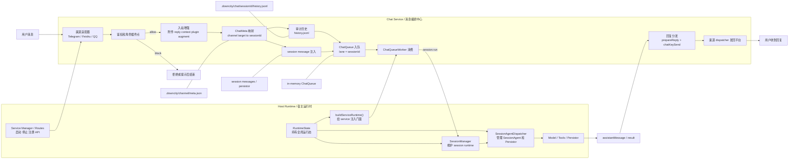
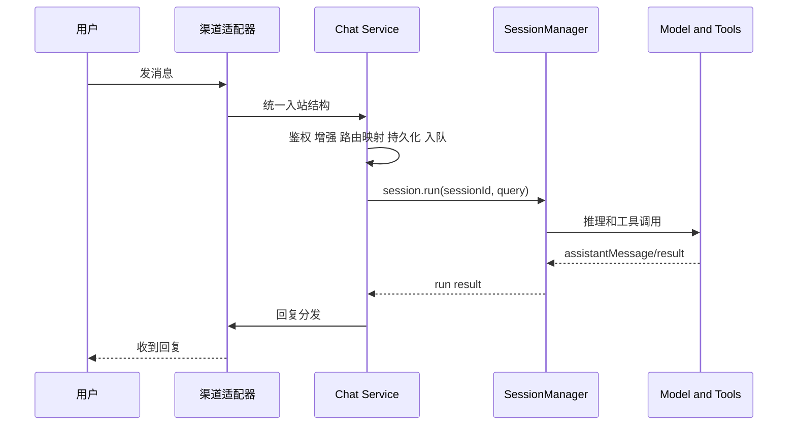

# Chat 设计原理

这页专门解释 `chat` service 怎么工作。

先给结论：

- `chat` 不是 session runtime
- `chat` 是消息编排中心
- `chat` 左边接渠道输入，右边接宿主侧 `SessionManager`
- `chat` 自己负责入站整理、路由映射、排队、回发

## 一句话模型

```text
用户消息先进入 chat service
chat service 把消息整理并归到 session
宿主运行时负责真正执行 session.run
chat service 再把结果送回聊天渠道
```

## Chat 的真实职责

`chat` service 负责：

1. 接住不同渠道的用户消息
2. 做鉴权、用户角色解析和入站增强
3. 把渠道目标映射成内部 `sessionId`
4. 写审计历史
5. 给 session 注入 user message
6. 把执行请求送进队列
7. 调用宿主侧 `session.run`
8. 把结果分发回渠道

不属于 `chat` 的事情：

- 维护 `SessionManager`
- 创建 `SessionAgent`
- 持有 model
- 持有 persistor

这些都属于宿主运行时。

## Chat 和宿主运行时的关系

`chat` 并不直接拥有 session runtime。  
它通过 `ServiceRuntime.session.run()` 去调用宿主侧的 `SessionManager.run()`。

所以正确的关系应该这样理解：



## 图中每个节点分别做什么

下面按图里的节点逐个解释。

### Host Runtime / 宿主运行时

#### H1 `RuntimeState`

这是宿主进程里的全局运行态拥有者。

它负责持有：

- 当前项目的 `config`
- `logger`
- `env`
- `SessionManager`
- model
- 其他运行时基础设施

`chat` service 不直接自己维护这些对象，而是依赖这里。

#### H2 `SessionManager`

这是 session 执行入口。

它负责：

- 维护 `sessionId -> agent/persistor` 的执行入口
- 绑定本轮请求的 `RequestContext`
- 调用真正的 `SessionAgent.run`
- 追加 user message 和 assistant message

对 `chat` 来说，它最重要的能力就是：

- `session.run(sessionId, query)`

#### H3 `SessionAgentDispatcher`

这是 session agent 的分发和缓存层。

它负责：

- 按 `sessionId` 获取或创建 `SessionAgent`
- 按 `sessionId` 获取或创建 `Persistor`
- 维护这些对象的复用和缓存

所以 `SessionManager` 不需要自己直接 new 每个 agent，而是把这件事交给它。

#### H4 `Model / Tools / Persistor`

这是实际执行面。

它负责：

- 模型推理
- 工具调用
- session message 落盘和读取

也就是说，真正的 LLM 执行、工具循环和上下文持久化都在这里完成。

#### H5 `buildServiceRuntime()`

这是给 service 注入统一能力门面的构造函数。

它负责把宿主侧已有能力整理成 `ServiceRuntime`，暴露给 service 使用，例如：

- `session`
- `invoke`
- `services`
- `plugins`
- `config`
- `logger`
- `env`

所以它不是另一套 runtime，而是“宿主能力的 service 视图”。

#### H6 `Service Manager / Routes`

这是宿主的 service 控制面。

它负责：

- 启动和停止 `chat` service
- 注册 `/service/chat/*` action API
- 通过 console 路由把请求转到 `chatService.actions`

它主要处理控制面，不处理用户聊天消息的主执行链。

### Chat Service / 消息编排中心

#### C1 `渠道适配器`

这是聊天消息真正进入系统的入口层。

它负责：

- 接收 Telegram / Feishu / QQ 原始事件
- 解析平台字段
- 统一成 chat service 可处理的入站消息结构

它还会做一些平台特定工作，例如：

- 提取附件
- 识别 reply 上下文
- 做平台级去重
- 发送轻量 ack reaction

#### C2 `鉴权和角色插件点`

这是 chat 的权限入口。

它负责调用 plugin 点：

- `chat.observePrincipal`
- `chat.authorizeIncoming`
- `chat.resolveUserRole`

它解决的是：

- 这个消息是否允许执行
- 当前用户属于什么角色
- 当前消息应该带什么权限上下文

如果不允许执行，流程就在这里结束。

#### C3 `入站增强`

这是把原始消息整理成“可以进入 session 的文本”的地方。

它负责：

- 拼正文
- 拼附件描述
- 拼 `reply_context`
- 调用 `chat.augmentInbound`

最后会得到一段更适合模型理解的 user message。

#### C4 `ChatMeta 映射`

这是 chat 路由层。

它负责把：

- `channel + chatId + targetType + threadId`

映射成内部稳定的：

- `sessionId`

这层映射的意义是：

- 下次同一个聊天目标还能回到同一个 session
- 回复时可以从 `sessionId` 反查真实聊天目标

#### C5 `审计历史`

这是 chat 自己维护的审计事实流。

它负责把入站和出站事件写入：

- `.downcity/chat/<sessionId>/history.jsonl`

这层数据不是模型上下文，而是业务审计数据。

它主要解决：

- 可追溯
- 可回看
- 能区分 inbound / outbound / audit / exec

#### C6 `session message 注入`

这是把用户消息真正送进 session 上下文的地方。

它负责：

- 调用 `context.session.appendUserMessage(...)`
- 让这条消息进入后续模型可见的 session 消息流

它和审计历史是两条线：

- `C5` 面向 chat 审计
- `C6` 面向 agent 上下文

#### C7 `ChatQueue 入队`

这是 chat 的消息调度入口。

它负责：

- 把当前消息变成 `ChatQueueItem`
- 按 `sessionId` 放入对应 lane
- 保证同一 lane 后续串行消费

这个设计让 `chat` 不是“消息到达即立刻跑模型”，而是“先进入统一调度”。

#### C8 `ChatQueueWorker 消费`

这是 chat 的执行编排器。

它负责：

- 消费队列
- 合并 burst 消息
- 处理控制消息，例如 `clear`
- 在执行期间发送 typing 心跳
- 调用 `ServiceRuntime.session.run()`
- 在执行结束后做回复分发和兜底

从业务角度看，这里是 `chat` service 最核心的 orchestrator。

#### C9 `回复分发`

这是执行结果进入渠道前的最后一层业务逻辑。

它负责：

- 提取用户可见文本
- 区分 `direct` 和 `cmd`
- 调用 `chat.beforeReply`
- 根据 `chatKey` 找到真实回复目标
- 必要时做兜底回发

它解决的是：

- 模型结果怎么变成真正的聊天回复
- 如果工具没发出去，系统怎么兜底

#### C10 `渠道 dispatcher 发回平台`

这是实际出站发送层。

它负责：

- 按渠道调用 `sendText` / `sendAction`
- 使用 `chatKey` 反查出来的目标参数发送消息
- 把文本真正发回 Telegram / Feishu / QQ

这里已经不是模型逻辑，而是平台 IO。

### 其他节点

#### U `用户消息`

这是整个链路的起点。

它代表：

- 用户在某个聊天渠道发出的一条真实消息

#### B `拒绝或提示后结束`

这是权限拒绝分支。

它代表：

- 消息在鉴权阶段被拦下
- 私聊场景可能给出提示
- 群聊场景可能静默结束

#### R `assistantMessage / result`

这是宿主侧 session 执行结束后回到 chat 的结果对象。

它通常包含：

- assistant message
- success / failure
- 可能的工具调用结果

它不是最终渠道文本，而是 chat service 后续分发的输入。

#### O `用户收到回复`

这是整条链路的终点。

它代表：

- 真实聊天渠道已经收到 bot 发回去的消息

### 存储和中间状态节点

#### M1 `.downcity/channel/meta.json`

这是 chat 路由元信息存储。

它负责保存：

- `sessionId`
- `channel`
- `chatId`
- `threadId`
- `messageId`
- `actorId`
- `chatTitle`

它主要服务于：

- 路由映射
- 出站反查

#### M2 `.downcity/chat/sessionId/history.jsonl`

这是 chat 审计历史文件。

它负责记录：

- inbound 事件
- outbound 事件
- audit / exec 类型

它主要服务于：

- 审计
- 调试
- 历史回看

#### M3 `session messages / persistor`

这是宿主侧 session 消息事实源。

它负责保存：

- user message
- assistant message
- 后续 run 会读取的上下文消息

它主要服务于：

- 模型上下文连续性
- session 持久化

#### M4 `in-memory ChatQueue`

这是 chat service 进程内队列。

它负责：

- 暂存待执行消息
- 维护 lane 串行语义
- 让 `ChatQueueWorker` 有统一消费入口

## 用户消息的传递链路

如果只从消息流角度看，可以压成下面这条链：



## Chat 内部最关键的三条数据线

### 1. 路由线

聊天渠道不会天然等于内部 session。  
所以 `chat` 需要先维护一层映射：

- `channel + target(chatId/thread/type)` -> `sessionId`

这层映射落到：

- `.downcity/channel/meta.json`

它解决的是：

- 同一个聊天目标下次还能回到同一个 session
- 出站时可以从 `chatKey/sessionId` 反查真实渠道目标

### 2. 审计线

`chat` 还会把入站和出站事件写到独立的审计历史：

- `.downcity/chat/<sessionId>/history.jsonl`

这一层不是模型上下文，而是聊天审计事实流。  
它解决的是：

- 回看真实渠道消息
- 区分 inbound 和 outbound
- 保留 chat 业务侧元信息

### 3. session 上下文线

除了审计历史，`chat` 还要把真正参与模型上下文的 user message 注入 session。

这条线最终进入宿主侧 persistor。  
它解决的是：

- 本轮 run 能看到用户输入
- 下一轮 run 还能从同一个 session 继续

## 为什么 ChatQueue 很重要

`chat` 不是“消息一到就立刻直接跑模型”，而是先进入 `ChatQueue`。

这样做是为了保证：

- 同一个 `sessionId` 串行
- 不同 `sessionId` 可以并行
- 同一会话里的 burst 消息可以合并
- 中途可以插入 `clear` 之类的控制消息

也就是说，`chat` service 真正拥有的是消息编排权，而不是模型执行权。

## direct 和 cmd 的区别

`chat` 在回复阶段还有一个重要设计：

- `direct`：直接把 assistant 文本当成最终回复发送
- `cmd`：更多依赖工具调用，例如 `chat_send`

但无论是 `direct` 还是 `cmd`，如果最后没有真正把用户可见文本送到渠道，`chat` 都会做兜底回发。

这保证了：

- 执行失败时用户仍然能看到错误
- 即使工具链没有成功发消息，渠道也不会完全静默

## 设计口径

如果以后再讨论 `chat`，建议统一用下面这句话：

```text
chat service 是消息编排中心。
它负责把渠道消息整理、路由、持久化、排队，并调用宿主侧 session runtime 执行，再把结果回发到渠道。
```
